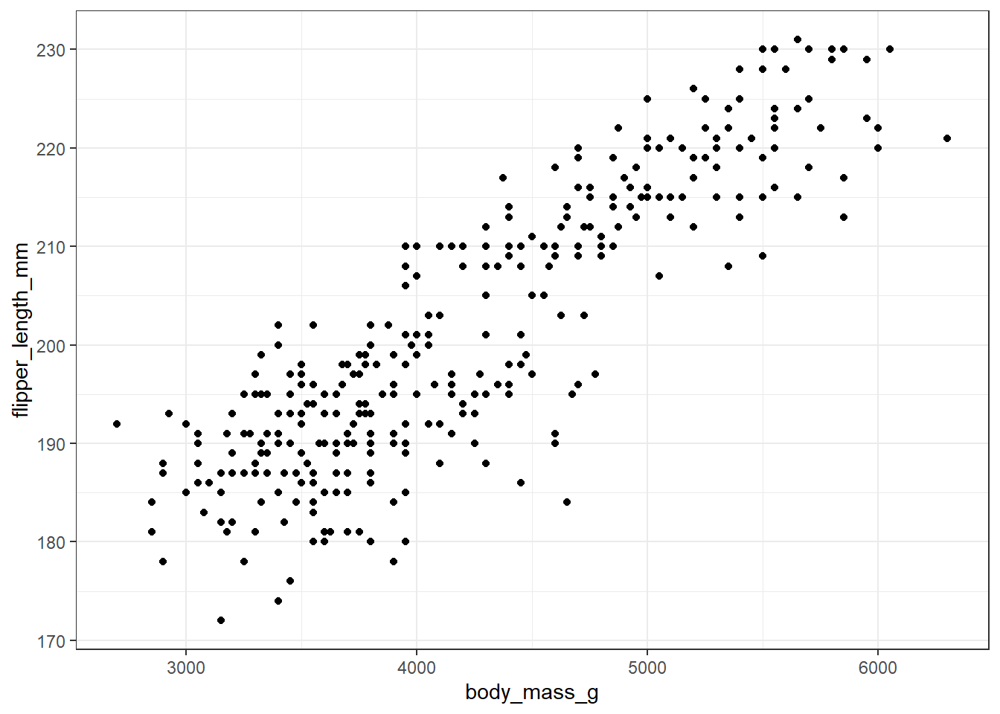
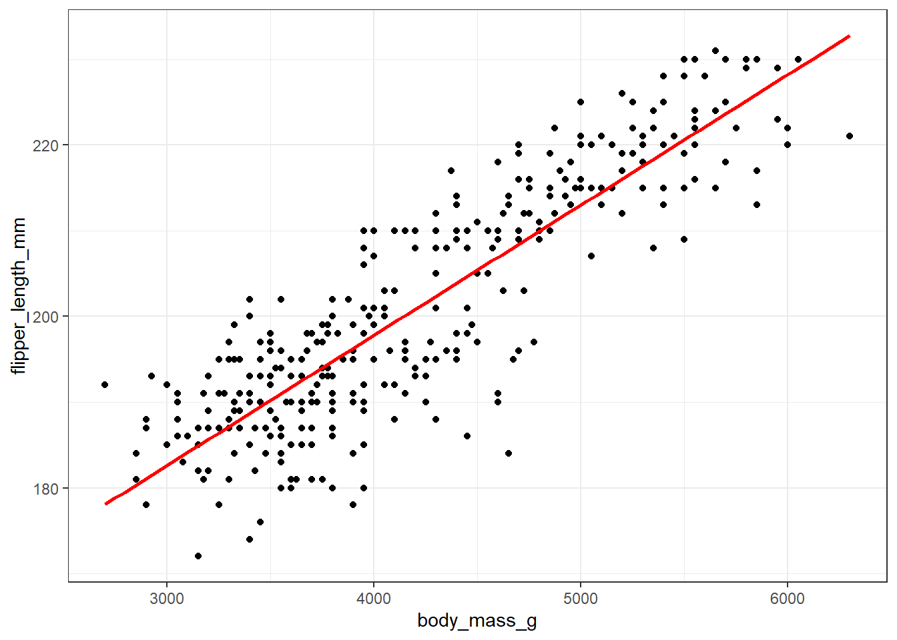
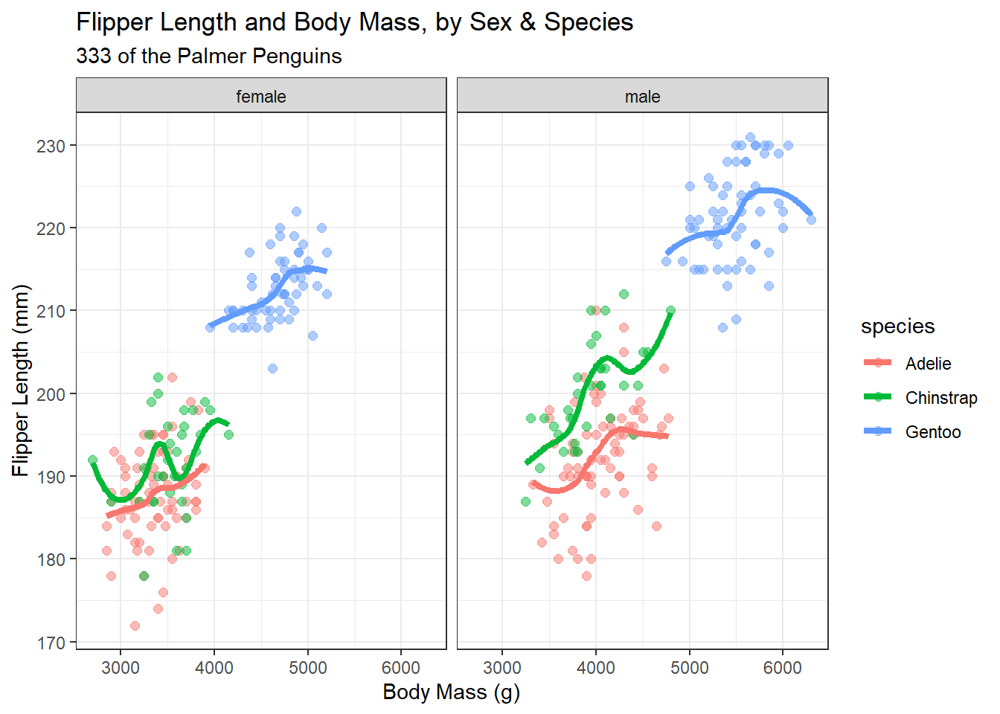

# (PART\*) Part A. Exploring Data {-}

# The Palmer Penguins

The data in the `palmerpenguins` package in R include size measurements, clutch observations, and blood isotope ratios for adult foraging Adelie, Chinstrap, and Gentoo penguins observed on islands in the Palmer Archipelago near Palmer Station, Antarctica^[Two fun facts: (1) Male Gentoo and Adelie penguins "propose" to females by giving them a pebble. (2) The Adelie penguin was named for his wife by Jules Dumont d'Urville, who also rediscovered the Venus de Milo.]. The data were collected and made available by Dr. Kristen Gorman and the Palmer Station Long Term Ecological Research (LTER) Program.  

For more on the `palmerpenguins` package, visit https://allisonhorst.github.io/palmerpenguins/.

## Package Loading, then Dealing with Missing Data

To start, let's load up the necessary R packages to manage the data and summarize it in a small table, and a plot. We've actually done this previously, but we'll repeat the steps here, because it's worth seeing what R is doing.

In this case, we'll load up five packages.


```r
library(palmerpenguins)  # source for the data set
library(janitor)         # some utilities for cleanup and simple tables
library(magrittr)        # provides us with the pipe %>% for code management
library(dplyr)           # part of the tidyverse: data management tools
library(ggplot2)         # part of the tidyverse: tools for plotting data
```

It's worth remembering that everything after the `#` on each line above is just a comment for the reader, and is ignored by R. We'll see later that the loading of a single package (called `tidyverse`) gives us both the `dplyr` and `ggplot2` packages, as well as several other useful things.

Next, let's take the `penguins` data from the `palmerpenguins` package, and identify those observations which have complete data (so, no missing values) in four variables of interest. We'll store that result in a new data frame (think of this as a data set) called `new_penguins` and then take a look at that result using the following code.


```r
new_penguins <- penguins %>%
    filter(complete.cases(flipper_length_mm, body_mass_g, species, sex))

new_penguins
```

```
# A tibble: 333 x 8
   species island    bill_length_mm bill_depth_mm
   <fct>   <fct>              <dbl>         <dbl>
 1 Adelie  Torgersen           39.1          18.7
 2 Adelie  Torgersen           39.5          17.4
 3 Adelie  Torgersen           40.3          18  
 4 Adelie  Torgersen           36.7          19.3
 5 Adelie  Torgersen           39.3          20.6
 6 Adelie  Torgersen           38.9          17.8
 7 Adelie  Torgersen           39.2          19.6
 8 Adelie  Torgersen           41.1          17.6
 9 Adelie  Torgersen           38.6          21.2
10 Adelie  Torgersen           34.6          21.1
# ... with 323 more rows, and 4 more variables:
#   flipper_length_mm <int>, body_mass_g <int>, sex <fct>,
#   year <int>
```

## Counting Things and Making Tables

So, how many penguins are in our `new_penguins` data? When we printed out the result, we got an answer, but (as with many things in R) there are many ways to get the same result.


```r
nrow(new_penguins)
```

```
[1] 333
```

How do our `new_penguins` data break down by sex and species?


```r
new_penguins %>% 
    tabyl(sex, species) # tabyl comes from the janitor package
```

```
    sex Adelie Chinstrap Gentoo
 female     73        34     58
   male     73        34     61
```

Note the strange spelling of `tabyl` here. The output is reasonably clear, but could we make that table a little prettier, and while we're at it, can we add the row and column totals to it?


```r
new_penguins %>% 
    tabyl(sex, species) %>%
    adorn_totals(where = c("row", "col")) %>% # add row, column totals
    kable  # one convenient way to make the table prettier
```


|sex    | Adelie| Chinstrap| Gentoo| Total|
|:------|------:|---------:|------:|-----:|
|female |     73|        34|     58|   165|
|male   |     73|        34|     61|   168|
|Total  |    146|        68|    119|   333|

## Visualizing the Data in a Graph (or a few...)

Now, let's look at the other two variables of interest. Let's create a graph showing the association of body mass with flipper length across the complete set of 333 penguins.


```r
ggplot(new_penguins, aes(x = body_mass_g, y = flipper_length_mm)) +
    geom_point() 
```



Some of you may want to include a straight-line model (fit by a classical linear regression) to this plot. One way to do that in R involves the addition of a single line of code, like this:


```r
ggplot(new_penguins, aes(x = body_mass_g, y = flipper_length_mm)) +
    geom_point() +
    geom_smooth(method = "lm", formula = y ~ x,
                col = "red", se = FALSE)
```



Whenever we build a graph for ourselves, these default choices may be sufficient. But I'd like to see a prettier version if I was going to show it to someone else. So, I might use a different color for each species, and I might neaten up the theme (to get rid of the default grey background) and add a title, like this.


```r
ggplot(new_penguins, aes(x = body_mass_g, y = flipper_length_mm, col = species)) +
    geom_point() + 
    theme_bw() + 
    labs(title = "Flipper Length and Body Mass for 333 of the Palmer Penguins")
```


## Six Ways To "Improve" This Graph

Now, let's build a new graph. Here, I want to:

1. plot the relationship between body mass and flipper length in light of both Sex and Species
2. increase the size of the points and add a little transparency so we can see if points overlap, 
3. add some smooth curves to summarize the relationships between the two quantities (body mass and flipper length) within each combination of species and sex,
4. split the graph into two "facets" (one for each sex),
5. improve the axis labels,
6. improve the titles by adding a subtitle, and also adding in some code to count the penguins (rather than hard-coding in the total number.)


```r
ggplot(new_penguins, aes(x = body_mass_g, y = flipper_length_mm, 
                         col = species)) +
    geom_point(size = 2, alpha = 0.5) + 
    geom_smooth(method = "loess", formula = y ~ x, 
                se = FALSE, size = 1.5) +
    facet_grid(~ sex) +
    theme_bw() + 
    labs(title = "Flipper Length and Body Mass, by Sex & Species",
         subtitle = paste0(nrow(new_penguins), " of the Palmer Penguins"),
         x = "Body Mass (g)", 
         y = "Flipper Length (mm)")
```



## A Little Reflection

What can we learn from these plots and their construction? In particular, 

- What do these plots suggest about the center of the distribution of each quantity (body mass and flipper length) overall, and within each combination of Sex and Species?
- What does the final plot suggest about the spread of the distribution of each of those quantities in each combination of Sex and Species?
- What do the plots suggest about the association of body mass and flipper length across the complete set of penguins? 
- How does the shape and nature of this body mass - flipper length relationship change based on Sex and Species?
- Do you think it would be helpful to plot a straight-line relationship (rather than a smooth curve) within each combination of Sex and Species in the final plot? Why or why not? (Also, what would we have to do to the code to accomplish this?)
- How was the R code for the plot revised to accomplish each of the six "wants" specified above?

