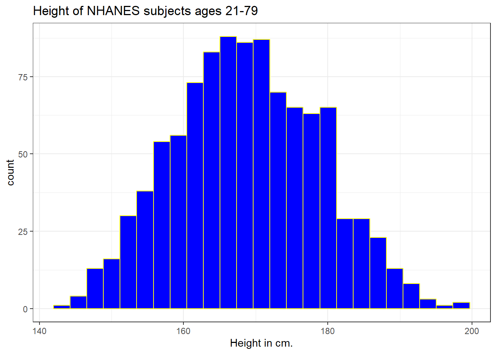
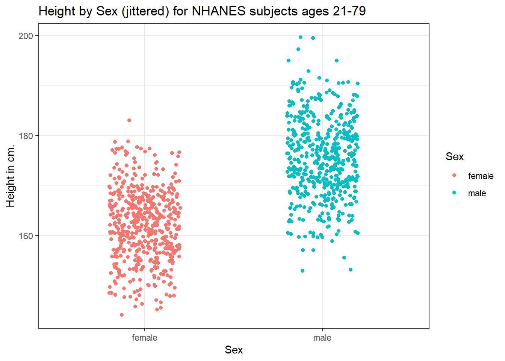
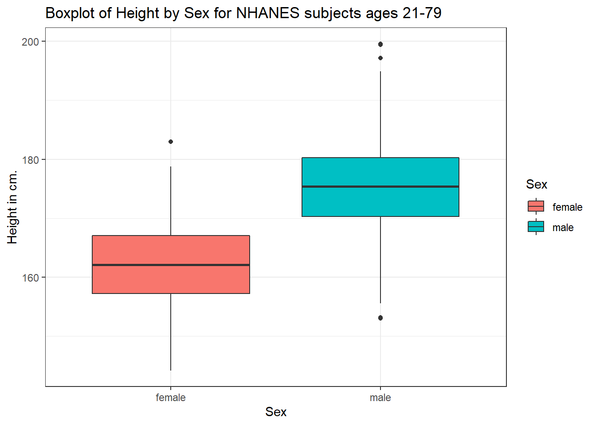
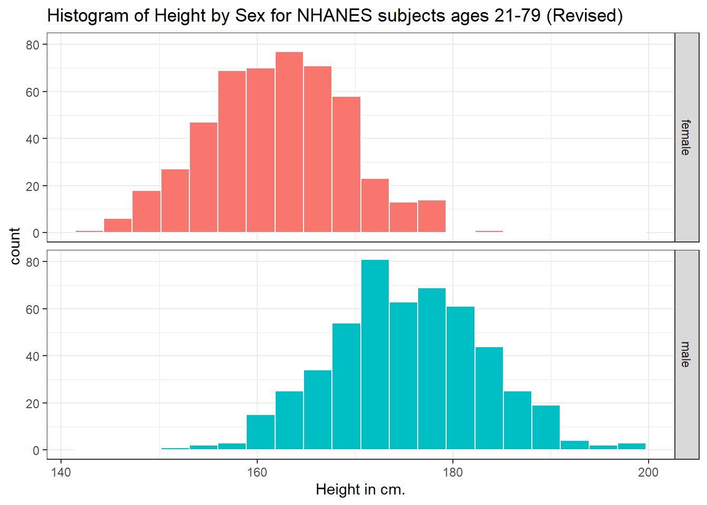
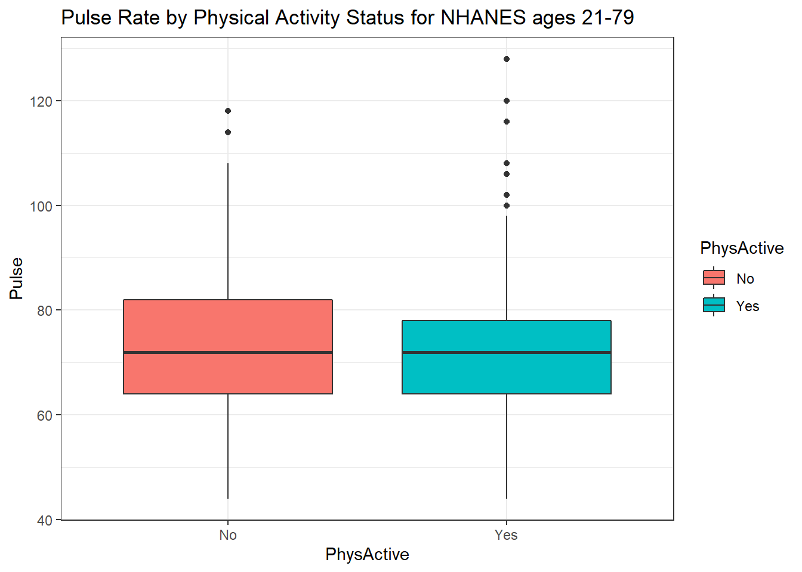
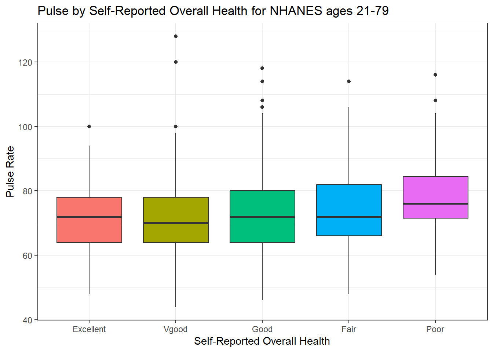
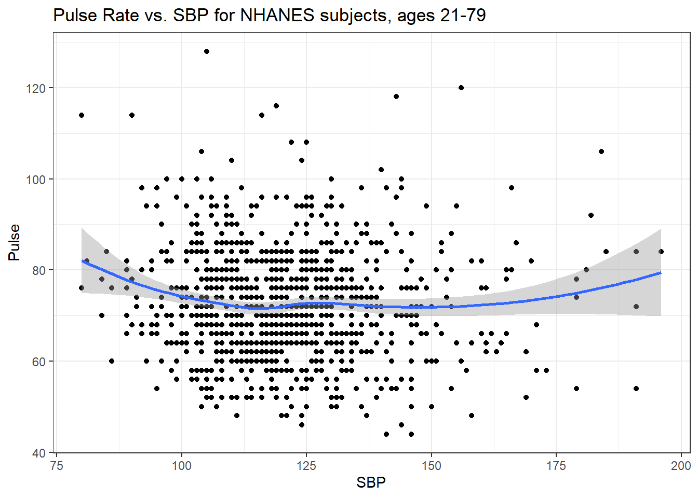
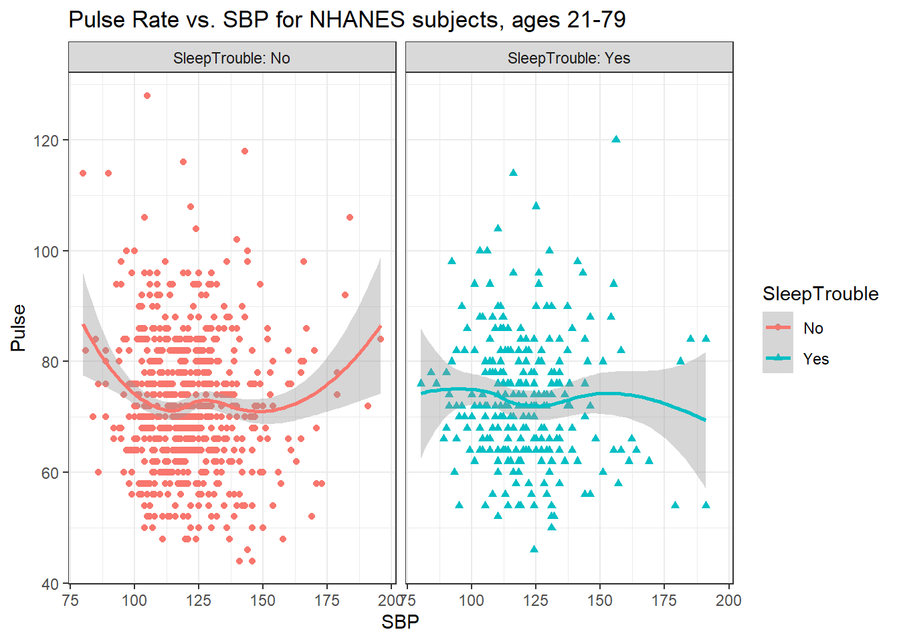
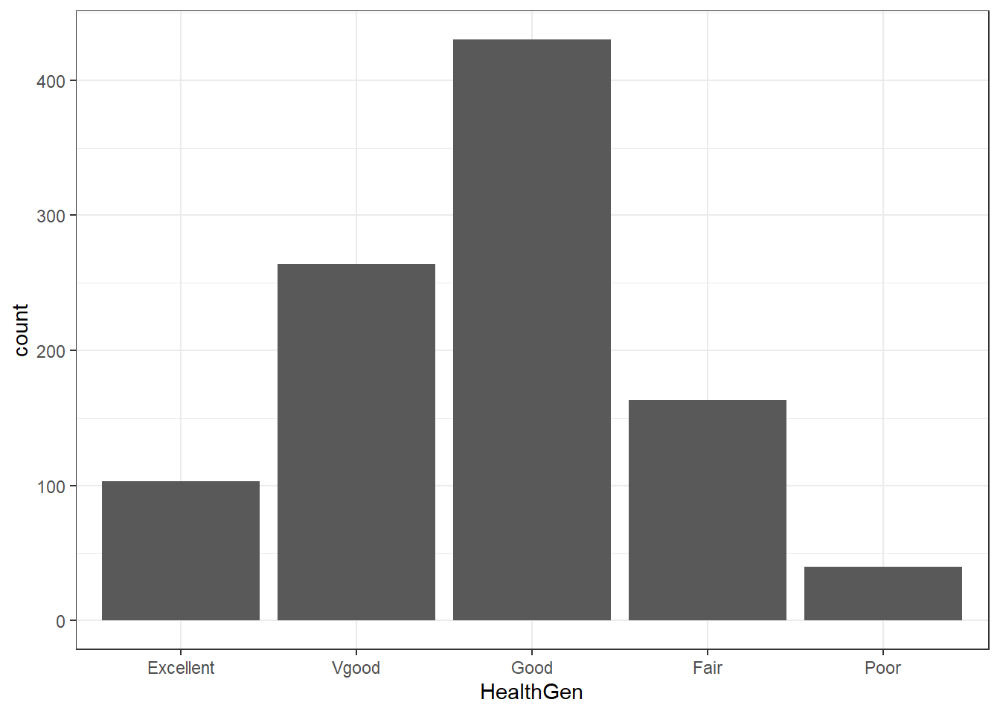
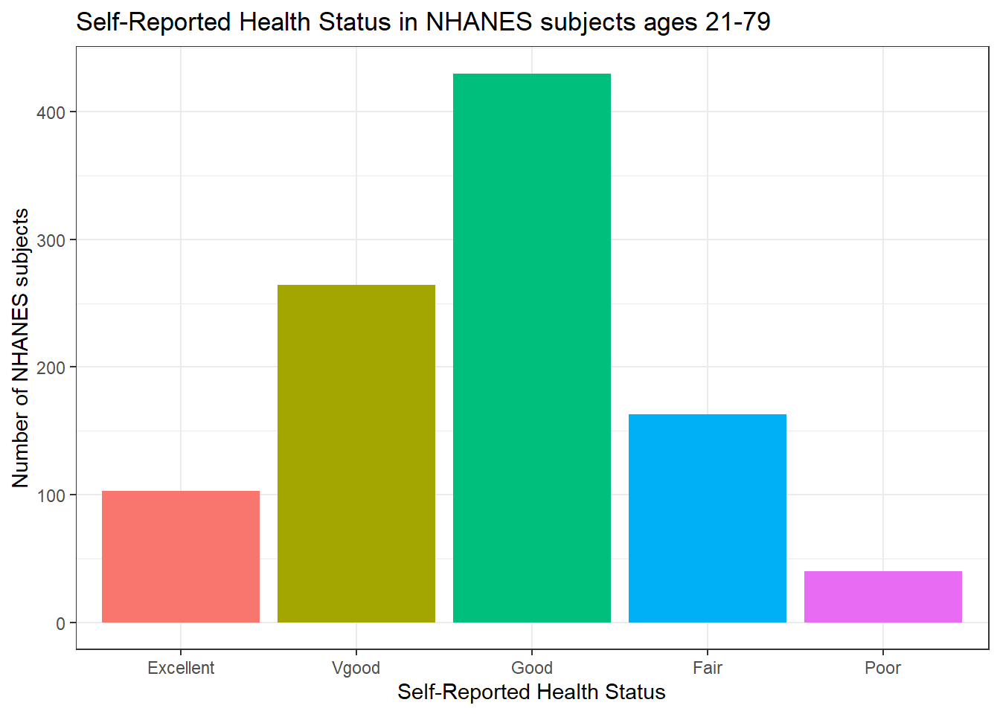

# NHANES: A New Sample 

## Creating A New Subset, Carefully

Suppose we wanted to select a new sample from the `NHANES` data, but now, we'll have some additional requirements.

1. We want to start by looking only at subjects whose Age is at least 21 and at most 79, so we avoid some of the problems we saw in the previous samples with children and adults being included together in a study of height, as well as the use of Age = 80 for all subjects ages 80 and older.
2. We want to look at some of the additional variables available in the NHANES data.
    - `ID` and `SurveyYr` to identify the participants and the survey period for each response.
    - `Age` as we've seen before, in years.
    - `Height` as we've seen before, in centimeters.
    - `Gender` which we'll rename as `Sex` again.
    - `Pulse` = 60 second pulse rate (in beats per minute).
    - `BPSysAve` = Systolic Blood Pressure, in mm Hg (and we'll rename this `SBP`).
    - `SleepTrouble` = Yes means the subject has told a health professional that they had trouble sleeping.
    - `PhysActive` = Yes means the subject does moderate or vigorous-intensity sports, fitness or recreational activity.
    - `MaritalStatus` = one of Married, Widowed, Divorced, Separated, NeverMarried or LivePartner (living with partner.)
    - `HealthGen` = self-reported rating of general health, one of Excellent, Vgood (Very Good), Good, Fair or Poor.
3. Next, we'll deal with missing data by omitting from our sample any subjects with missingness on *any* of the variables we've selected. 
4. Next, we only want to include unique subjects, with distinct values across the variables we are interested in. (The original `NHANES` data frame contains numerous repeated rows, where individuals from under-represented sociodemographic groups are included several times so as to mirror the characteristics of the US population in 2009-10 and 2011-12 more closely.)

Once we've identified the complete set of responses that meet the four requirements above, we will then take a random sample of 1,000 observations, without replacement, from that group.

Can you see how the code below accomplishes these tasks?


```r
set.seed(431004)

nh_4 <- NHANES %>%
    filter(Age > 20 & Age < 80) %>%
    select(ID, SurveyYr, Gender, Age, Height, 
           Pulse, BPSysAve, SleepTrouble, PhysActive,
           MaritalStatus, HealthGen) %>%
    rename(Sex = Gender, SBP = BPSysAve) %>%
    filter(complete.cases(.)) %>%
    distinct() %>%
    slice_sample(n = 1000, replace = FALSE)

nh_4
```

```
# A tibble: 1,000 x 11
      ID SurveyYr Sex      Age Height Pulse   SBP
   <int> <fct>    <fct>  <int>  <dbl> <int> <int>
 1 54401 2009_10  male      52   171.   100   106
 2 52249 2009_10  male      43   190.    78   120
 3 63461 2011_12  female    21   161     86   111
 4 68429 2011_12  male      27   190.    86   113
 5 52661 2009_10  male      71   170.    66   120
 6 55949 2009_10  female    78   160.    58   157
 7 53913 2009_10  female    75   161.    58   124
 8 63852 2011_12  male      50   174.    50   104
 9 68833 2011_12  male      41   160.    62   116
10 61941 2009_10  male      22   172     88   112
# ... with 990 more rows, and 4 more variables:
#   SleepTrouble <fct>, PhysActive <fct>,
#   MaritalStatus <fct>, HealthGen <fct>
```

## Numerical Summary of `nh_4`


```r
summary(nh_4)
```

```
       ID           SurveyYr       Sex           Age       
 Min.   :51630   2009_10:516   female:495   Min.   :21.00  
 1st Qu.:56374   2011_12:484   male  :505   1st Qu.:34.00  
 Median :61578                              Median :47.00  
 Mean   :61669                              Mean   :47.27  
 3rd Qu.:66927                              3rd Qu.:60.00  
 Max.   :71915                              Max.   :79.00  
     Height          Pulse             SBP       
 Min.   :144.2   Min.   : 44.00   Min.   : 80.0  
 1st Qu.:161.5   1st Qu.: 64.00   1st Qu.:109.0  
 Median :168.4   Median : 72.00   Median :119.0  
 Mean   :168.8   Mean   : 72.66   Mean   :120.9  
 3rd Qu.:176.1   3rd Qu.: 80.00   3rd Qu.:129.2  
 Max.   :199.6   Max.   :128.00   Max.   :196.0  
 SleepTrouble PhysActive      MaritalStatus     HealthGen  
 No :733      No :489    Divorced    :120   Excellent:103  
 Yes:267      Yes:511    LivePartner : 83   Vgood    :264  
                         Married     :527   Good     :430  
                         NeverMarried:183   Fair     :163  
                         Separated   : 34   Poor     : 40  
                         Widowed     : 53                  
```


## Distribution of Heights

What is the distribution of height in this new sample?


```r
ggplot(data = nh_4, aes(x = Height)) + 
    geom_histogram() 
```

```
`stat_bin()` using `bins = 30`. Pick better value with
`binwidth`.
```


We can do several things to clean this up. 

1. We'll change the color of the lines for each bar of the histogram.
2. We'll change the fill inside each bar to make them stand out a bit more.
3. We'll add a title and relabel the horizontal (x) axis to include the units of measurement.
4. We'll avoid the warning by selecting a number of bins (we'll use 25 here) into which we'll group the heights before drawing the histogram.


```r
ggplot(data = nh_4, aes(x = Height)) + 
    geom_histogram(bins = 25, col = "yellow", fill = "blue") + 
    labs(title = "Height of NHANES subjects ages 21-79",
         x = "Height in cm.")
```



### Changing a Histogram's Fill and Color

The CWRU color guide (https://case.edu/umc/our-brand/visual-guidelines/) lists the HTML color schemes for CWRU blue and CWRU gray. Let's match that color scheme.


```r
cwru.blue <- '#0a304e'
cwru.gray <- '#626262'

ggplot(data = nh_4, aes(x = Height)) + 
    geom_histogram(binwidth = 2, col = cwru.gray, fill = cwru.blue) + 
    labs(title = "Height of NHANES subjects ages 21-79",
         x = "Height in cm.") +
    theme_bw()
```


Note the other changes to the graph above.

1. We changed the theme to replace the gray background.
2. We changed the bins for the histogram, to gather observations into groups of 2 cm. each.


## Height and Sex


```r
ggplot(data = nh_4, aes(x = Sex, y = Height, color = Sex)) + 
    geom_point() + 
    labs(title = "Height by Sex for NHANES subjects ages 21-79",
         y = "Height in cm.")
```


This plot isn't so useful. We can improve things a little by jittering the points horizontally, so that the overlap is reduced.


```r
ggplot(data = nh_4, aes(x = Sex, y = Height, color = Sex)) + 
    geom_jitter(width = 0.2) + 
    labs(title = "Height by Sex (jittered) for NHANES subjects ages 21-79",
         y = "Height in cm.")
```



Perhaps it might be better to summarise the distribution in a different way. We might consider a boxplot of the data.

### A Boxplot of Height by Sex


```r
ggplot(data = nh_4, aes(x = Sex, y = Height, fill = Sex)) + 
    geom_boxplot() + 
    labs(title = "Boxplot of Height by Sex for NHANES subjects ages 21-79",
         y = "Height in cm.")
```



Or perhaps we'd like to see a pair of histograms?

### Histograms of Height by Sex


```r
ggplot(data = nh_4, aes(x = Height, fill = Sex)) + 
    geom_histogram(color = "white", bins = 20) + 
    labs(title = "Histogram of Height by Sex for NHANES subjects ages 21-79",
         x = "Height in cm.") + 
    facet_wrap(~ Sex)
```


Can we redraw these histograms so that they are a little more comparable, and to get rid of the unnecessary legend?


```r
ggplot(data = nh_4, aes(x = Height, fill = Sex)) + 
    geom_histogram(color = "white", bins = 20) + 
    labs(title = "Histogram of Height by Sex for NHANES subjects ages 21-79 (Revised)",
         x = "Height in cm.") + 
    guides(fill = "none") +
    facet_grid(Sex ~ .)
```



## Looking at Pulse Rate

Let's look at a different outcome, the *pulse rate* for our subjects.

Here's a histogram, again with CWRU colors, for the pulse rates in our sample.


```r
ggplot(data = nh_4, aes(x = Pulse)) + 
    geom_histogram(binwidth = 1, fill = cwru.blue, col = cwru.gray) + 
    labs(title = "Histogram of Pulse Rate: NHANES subjects ages 21-79",
         x = "Pulse Rate (beats per minute)")
```


Suppose we instead bin up groups of 5 beats per minute together as we plot the Pulse rates. 


```r
ggplot(data = nh_4, aes(x = Pulse)) + 
    geom_histogram(binwidth = 5, fill = cwru.blue, col = cwru.gray) + 
    labs(title = "Histogram of Pulse Rate: NHANES subjects ages 21-79",
         x = "Pulse Rate (beats per minute)")
```


Which is the more useful representation will depend a lot on what questions you're trying to answer.

### Pulse Rate and Physical Activity

We can also split up our data into groups based on whether the subjects are physically active. Let's try a boxplot.


```r
ggplot(data = nh_4, aes(y = Pulse, x = PhysActive, fill = PhysActive)) + 
    geom_boxplot() + 
    labs(title = "Pulse Rate by Physical Activity Status for NHANES ages 21-79")
```



As an accompanying numerical summary, we might ask how many people fall into each of these `PhysActive` categories, and what is their "average" `Pulse` rate.


```r
nh_4 %>%
    group_by(PhysActive) %>%
    summarise(count = n(), mean(Pulse), median(Pulse)) %>%
    knitr::kable(digits = 2) 
```


|PhysActive | count| mean(Pulse)| median(Pulse)|
|:----------|-----:|-----------:|-------------:|
|No         |   489|       73.36|            72|
|Yes        |   511|       71.98|            72|

The `knitr::kable(digits = 2)` piece of this command tells R Markdown to generate a table with some attractive formatting, and rounding any decimals to two figures.

### Pulse by Sleeping Trouble


```r
ggplot(data = nh_4, aes(x = Pulse, fill = SleepTrouble)) + 
    geom_histogram(color = "white", bins = 20) + 
    labs(title = "Histogram of Pulse Rate by Sleep Trouble for NHANES subjects ages 21-79",
         x = "Pulse Rate (beats per minute)") + 
    guides(fill = "none") +
    facet_grid(SleepTrouble ~ ., labeller = "label_both")
```


How many people fall into each of these `SleepTrouble` categories, and what is their "average" Pulse rate?


```r
nh_4 %>%
    group_by(SleepTrouble) %>%
    summarise(count = n(), mean(Pulse), median(Pulse)) %>%
    knitr::kable(digits = 2) 
```


|SleepTrouble | count| mean(Pulse)| median(Pulse)|
|:------------|-----:|-----------:|-------------:|
|No           |   733|       72.41|            72|
|Yes          |   267|       73.32|            72|


### Pulse and HealthGen

We can compare the distribution of Pulse rate across groups by the subject's self-reported overall health (`HealthGen`), as well.


```r
ggplot(data = nh_4, aes(x = HealthGen, y = Pulse, fill = HealthGen)) + 
    geom_boxplot() +
    labs(title = "Pulse by Self-Reported Overall Health for NHANES ages 21-79",
         x = "Self-Reported Overall Health", y = "Pulse Rate") + 
    guides(fill = "none") 
```



How many people fall into each of these `HealthGen` categories, and what is their "average" Pulse rate?


```r
nh_4 %>%
    group_by(HealthGen) %>%
    summarise(count = n(), mean(Pulse), median(Pulse)) %>%
    knitr::kable(digits = 2) 
```


|HealthGen | count| mean(Pulse)| median(Pulse)|
|:---------|-----:|-----------:|-------------:|
|Excellent |   103|       71.30|            72|
|Vgood     |   264|       71.15|            70|
|Good      |   430|       72.70|            72|
|Fair      |   163|       74.23|            72|
|Poor      |    40|       79.15|            76|

### Pulse Rate and Systolic Blood Pressure


```r
ggplot(data = nh_4, aes(x = SBP, y = Pulse)) +
    geom_point() +
    geom_smooth(method = "loess", formula = y ~ x) +
    labs(title = "Pulse Rate vs. SBP for NHANES subjects, ages 21-79")
```




### Sleep Trouble vs. No Sleep Trouble?

Could we see whether subjects who have described `SleepTrouble` show different SBP-pulse rate patterns than the subjects who haven't? 

- Let's try doing this by changing the shape *and* the color of the points based on `SleepTrouble`.


```r
ggplot(data = nh_4, 
       aes(x = SBP, y = Pulse, 
           color = SleepTrouble, shape = SleepTrouble)) +
    geom_point() +
    geom_smooth(method = "loess", formula = y ~ x) +
    labs(title = "Pulse Rate vs. SBP for NHANES subjects, ages 21-79")
```


This plot might be easier to interpret if we faceted by `SleepTrouble`, as well.


```r
ggplot(data = nh_4, 
       aes(x = SBP, y = Pulse, 
           color = SleepTrouble, shape = SleepTrouble)) +
    geom_point() +
    geom_smooth(method = "loess", formula = y ~ x) +
    labs(title = "Pulse Rate vs. SBP for NHANES subjects, ages 21-79") +
    facet_wrap(~ SleepTrouble, labeller = "label_both")
```



## General Health Status

Here's a Table of the General Health Status results. Again, this is a self-reported rating of each subject's health on a five point scale (Excellent, Very Good, Good, Fair, Poor.) 


```r
nh_4 %>%
    tabyl(HealthGen) 
```

```
 HealthGen   n percent
 Excellent 103   0.103
     Vgood 264   0.264
      Good 430   0.430
      Fair 163   0.163
      Poor  40   0.040
```

The HealthGen data are categorical, which means that summarizing them with averages isn't as appealing as looking at percentages, proportions and rates.

Another, somewhat simpler way to get a table of this sort of information uses the `tabyl` function from the `janitor` package in R.


```r
# tabyl is part of the janitor package
# already loaded: library(janitor)

nh_4 %>%
    tabyl(HealthGen) 
```

```
 HealthGen   n percent
 Excellent 103   0.103
     Vgood 264   0.264
      Good 430   0.430
      Fair 163   0.163
      Poor  40   0.040
```

I don't actually like the title of `percent` here, as it's really a proportion, but that can be adjusted, and we can add a total.


```r
nh_4 %>%
    tabyl(HealthGen) %>%
    adorn_totals() %>%
    adorn_pct_formatting()
```

```
 HealthGen    n percent
 Excellent  103   10.3%
     Vgood  264   26.4%
      Good  430   43.0%
      Fair  163   16.3%
      Poor   40    4.0%
     Total 1000  100.0%
```

When working with an unordered categorical variable, like `MaritalStatus`, the same approach can work.


```r
nh_4 %>%
    tabyl(MaritalStatus) %>%
    adorn_totals() %>%
    adorn_pct_formatting()
```

```
 MaritalStatus    n percent
      Divorced  120   12.0%
   LivePartner   83    8.3%
       Married  527   52.7%
  NeverMarried  183   18.3%
     Separated   34    3.4%
       Widowed   53    5.3%
         Total 1000  100.0%
```

### Bar Chart for Categorical Data

Usually, a **bar chart** is the best choice for a graphing a variable made up of categories.


```r
ggplot(data = nh_4, aes(x = HealthGen)) + 
    geom_bar()
```



There are lots of things we can do to make this plot fancier.


```r
ggplot(data = nh_4, aes(x = HealthGen, fill = HealthGen)) + 
    geom_bar() + 
    guides(fill = "none") +
    labs(x = "Self-Reported Health Status",
         y = "Number of NHANES subjects",
         title = "Self-Reported Health Status in NHANES subjects ages 21-79")
```



Or, we can really go crazy...


```r
nh_4 %>%
    count(HealthGen) %>%
    mutate(pct = round(prop.table(n) * 100, 1)) %>%
    ggplot(aes(x = HealthGen, y = pct, fill = HealthGen)) + 
    geom_bar(stat = "identity", position = "dodge") +
    scale_fill_viridis_d() +
    guides(fill = "none") +
    geom_text(aes(y = pct + 1,    # nudge above top of bar
                  label = paste0(pct, '%')),  # prettify
              position = position_dodge(width = .9), 
              size = 4) +
    labs(x = "Self-Reported Health Status",
         y = "Percentage of NHANES subjects",
         title = "Self-Reported Health Status in NHANES subjects ages 21-79") +
    theme_bw()
```


### Working with Tables

We can add both row and column marginal totals, and compare subjects by Sex, as follows...


```r
nh_4 %>%
    tabyl(Sex, HealthGen) %>%
    adorn_totals(c("row", "col")) 
```

```
    Sex Excellent Vgood Good Fair Poor Total
 female        54   132  205   81   23   495
   male        49   132  225   82   17   505
  Total       103   264  430  163   40  1000
```

If we like, we can make this look a little more polished with the `knitr::kable` function...


```r
nh_4 %>%
    tabyl(Sex, HealthGen) %>%
    adorn_totals(c("row", "col")) %>%
    knitr::kable()
```


|Sex    | Excellent| Vgood| Good| Fair| Poor| Total|
|:------|---------:|-----:|----:|----:|----:|-----:|
|female |        54|   132|  205|   81|   23|   495|
|male   |        49|   132|  225|   82|   17|   505|
|Total  |       103|   264|  430|  163|   40|  1000|

Or, we can get a complete cross-tabulation, including (in this case) the percentages of people within each Sex that fall in each HealthGen category (percentages within each row) like this.


```r
nh_4 %>%
    tabyl(Sex, HealthGen) %>%
    adorn_totals("row") %>%
    adorn_percentages("row") %>%
    adorn_pct_formatting() %>%
    adorn_ns() %>%
    knitr::kable()
```


|Sex    |Excellent   |Vgood       |Good        |Fair        |Poor      |
|:------|:-----------|:-----------|:-----------|:-----------|:---------|
|female |10.9%  (54) |26.7% (132) |41.4% (205) |16.4%  (81) |4.6% (23) |
|male   |9.7%  (49)  |26.1% (132) |44.6% (225) |16.2%  (82) |3.4% (17) |
|Total  |10.3% (103) |26.4% (264) |43.0% (430) |16.3% (163) |4.0% (40) |

And, if we wanted the column percentages, to determine which sex had the higher rate of each HealthGen status level, we can get that by changing the adorn_percentages to describe results at the column level:


```r
nh_4 %>%
    tabyl(Sex, HealthGen) %>%
    adorn_totals("col") %>%
    adorn_percentages("col") %>%
    adorn_pct_formatting() %>%
    adorn_ns() %>%
    knitr::kable()
```


|Sex    |Excellent  |Vgood       |Good        |Fair       |Poor       |Total       |
|:------|:----------|:-----------|:-----------|:----------|:----------|:-----------|
|female |52.4% (54) |50.0% (132) |47.7% (205) |49.7% (81) |57.5% (23) |49.5% (495) |
|male   |47.6% (49) |50.0% (132) |52.3% (225) |50.3% (82) |42.5% (17) |50.5% (505) |

### SBP by General Health Status

Let's consider now the relationship between self-reported overall health and systolic blood pressure.


```r
ggplot(data = nh_4, aes(x = HealthGen, y = SBP, fill = HealthGen)) + 
    geom_boxplot() + 
    labs(title = "SBP by Health Status, Overall Health for NHANES ages 21-79",
         y = "Systolic Blood Pressure", x = "Self-Reported Overall Health") + 
    guides(fill = "none") 
```


We can see that not too many people self-identify with the "Poor" health category.


```r
nh_4 %>%
    group_by(HealthGen) %>%
    summarise(count = n(), mean(SBP), median(SBP)) %>%
    knitr::kable() 
```


|HealthGen | count| mean(SBP)| median(SBP)|
|:---------|-----:|---------:|-----------:|
|Excellent |   103|  118.4854|       116.0|
|Vgood     |   264|  118.1250|       116.0|
|Good      |   430|  121.2209|       119.5|
|Fair      |   163|  124.1840|       123.0|
|Poor      |    40|  129.6000|       125.5|

### SBP by Physical Activity and General Health Status

We'll build a panel of boxplots to try to understand the relationships between Systolic Blood Pressure, General Health Status and Physical Activity. Note the use of `coord_flip` to rotate the graph 90 degrees, and the use of `labeller` within `facet_wrap` to include both the name of the (Physical Activity) variable and its value.


```r
ggplot(data = nh_4, aes(x = HealthGen, y = SBP, fill = HealthGen)) + 
    geom_boxplot() + 
    labs(title = "SBP by Health Status, Overall Health for NHANES ages 21-79",
         y = "Systolic BP", x = "Self-Reported Overall Health") + 
    guides(fill = "none") +
    facet_wrap(~ PhysActive, labeller = "label_both") + 
    coord_flip()
```


### SBP by Sleep Trouble and General Health Status

Here's a plot of faceted histograms, which might be used to address similar questions related to the relationship between Overall Health, Systolic Blood Pressure and Sex.


```r
ggplot(data = nh_4, aes(x = SBP, fill = Sex)) + 
    geom_histogram(color = "white", bins = 20) + 
    labs(title = "SBP by Sex, Overall Health for NHANES ages 21-79",
         x = "Systolic BP") + 
    guides(fill = "none") +
    facet_grid(HealthGen ~ Sex)
```


## Conclusions

This is just a small piece of the toolbox for visualizations that we'll create in this class. Many additional tools are on the way, but the main idea won't change. Using the `ggplot2` package, we can accomplish several critical tasks in creating a visualization, including:

- Identifying (and labeling) the axes and titles
- Identifying a type of `geom` to use, like a point, bar or histogram
- Changing fill, color, shape, size to facilitate comparisons
- Building "small multiples" of plots with faceting

Good data visualizations make it easy to see the data, and `ggplot2`'s tools make it relatively difficult to make a really bad graph.
