# Visualizing NHANES Data

## Loading in the "Complete Cases" Sample

Let's begin by loading into the `nh_500cc` data frame the information from the `nh_adult500cc.Rds` file we created in Section \@ref(nh_cc).


```r
nh_500cc <- read_rds("data/nh_adult500cc.Rds")
```

One obvious hurdle we'll avoid for the moment is what to do about missing data, since the `nh_500cc` data are specifically drawn from complete responses. Working with complete cases only can introduce bias to our estimates and visualizations, so it will be necessary in time to address what we should do when a complete-case analysis isn't a good choice. We'll return to this issue in a few chapters.

## Distribution of Heights

What is the distribution of height in this new sample?


```r
ggplot(data = nh_500cc, aes(x = Height)) + 
    geom_histogram() 
```

```
`stat_bin()` using `bins = 30`. Pick better value with
`binwidth`.
```

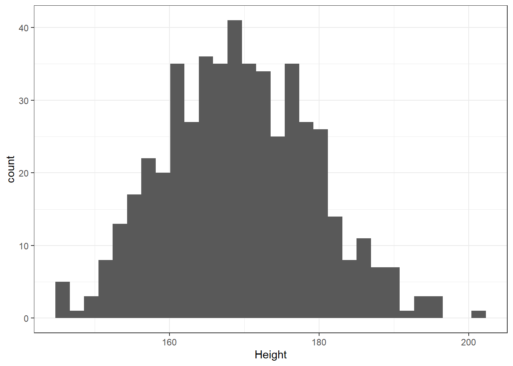

We can do several things to clean this up. 

1. We'll change the color of the lines for each bar of the histogram.
2. We'll change the fill inside each bar to make them stand out a bit more.
3. We'll add a title and relabel the horizontal (x) axis to include the units of measurement.
4. We'll avoid the warning by selecting a number of bins (we'll use 25 here) into which we'll group the heights before drawing the histogram.


```r
ggplot(data = nh_500cc, aes(x = Height)) + 
    geom_histogram(bins = 25, col = "yellow", fill = "blue") + 
    labs(title = "Height of NHANES subjects ages 21-64",
         x = "Height in cm.")
```

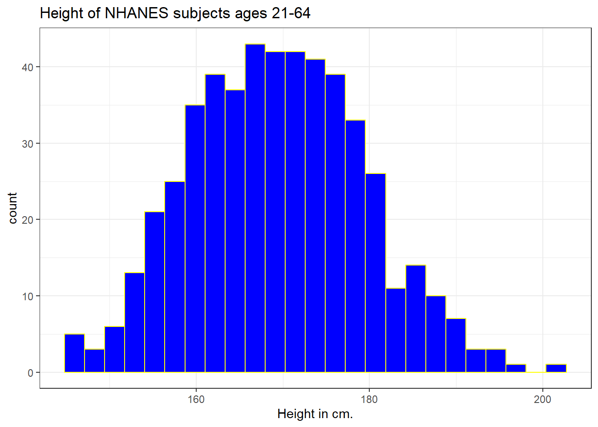

### Changing a Histogram's Fill and Color

The CWRU color guide (https://case.edu/umc/our-brand/visual-guidelines/) lists the HTML color schemes for CWRU blue and CWRU gray. Let's match that color scheme. We will also change the bins for the histogram, to gather observations into groups of 2 cm. each, by specifying the width of the bins, rather than the number of bins.


```r
cwru.blue <- '#0a304e'
cwru.gray <- '#626262'

ggplot(data = nh_500cc, aes(x = Height)) + 
    geom_histogram(binwidth = 2, 
                   col = cwru.gray, fill = cwru.blue) + 
    labs(title = "Height of NHANES subjects ages 21-64",
         x = "Height in cm.") 
```

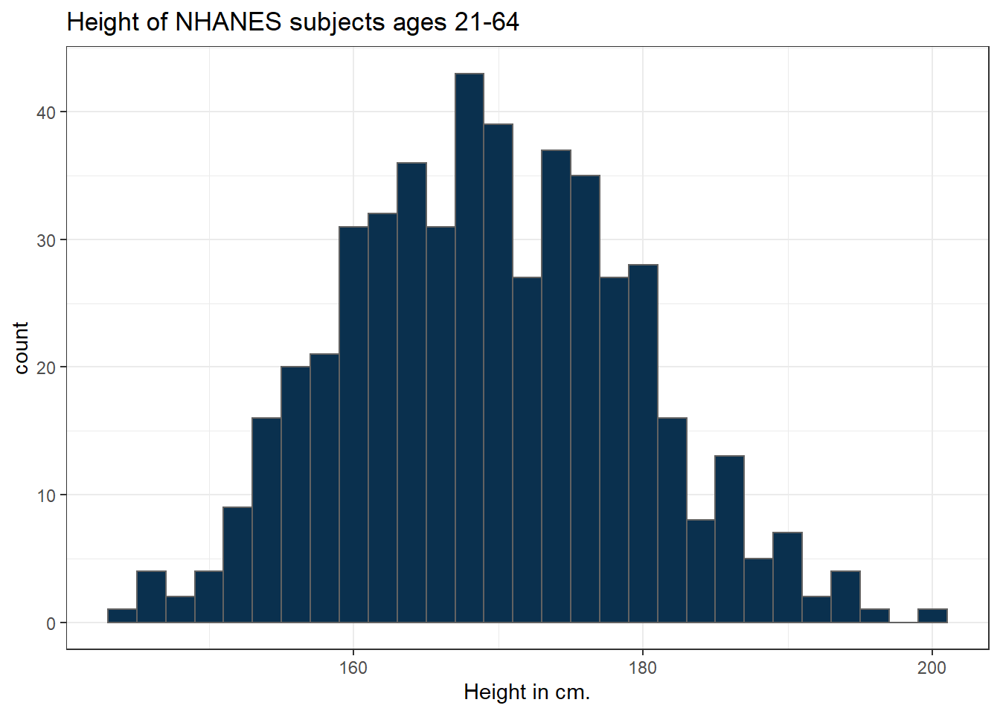

### Using a frequency polygon

A frequency polygon essentially smooths out the top of the histogram, and can also be used to show the distribution of `Height`.


```r
ggplot(data = nh_500cc, aes(x = Height)) +
    geom_freqpoly(bins = 20) +
    labs(title = "Height of NHANES subjects ages 21-64",
         x = "Height in cm.")
```


### Using a dotplot

A dotplot can also be used to show the distribution of a variable like `Height`, and produces a somewhat more granular histogram, depending on the settings for `binwidth` and `dotsize`.


```r
ggplot(data = nh_500cc, aes(x = Height)) +
    geom_dotplot(dotsize = 0.75, binwidth = 1) +
    scale_y_continuous(NULL, breaks = NULL) + # hide y axis
    labs(title = "Height of NHANES subjects ages 21-64",
         x = "Height in cm.")
```

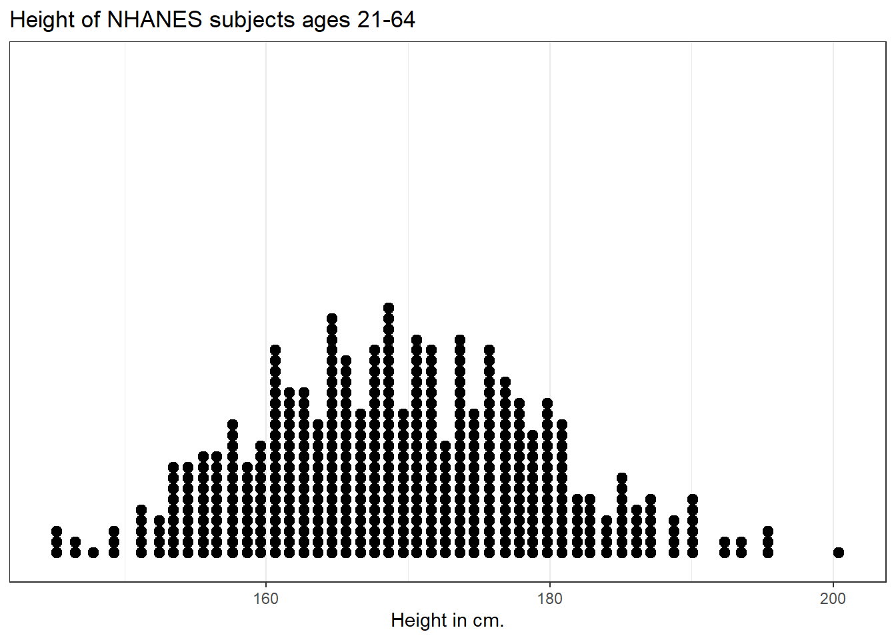

## Height and Sex

Let's look again at the impact of a respondent's sex on their height, but now within our sample of adults.


```r
ggplot(data = nh_500cc, 
       aes(x = Sex, y = Height, color = Sex)) + 
    geom_point() + 
    labs(title = "Height by Sex for NHANES subjects ages 21-64",
         y = "Height in cm.")
```

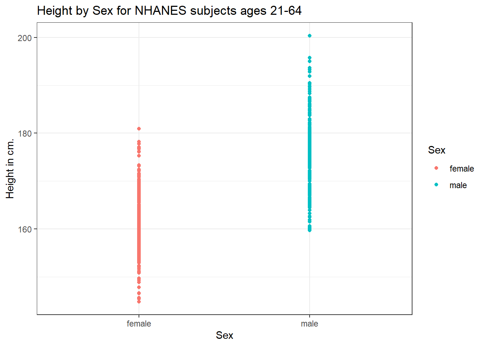

This plot isn't so useful. We can improve things a little by jittering the points horizontally, so that the overlap is reduced.


```r
ggplot(data = nh_500cc, aes(x = Sex, y = Height, color = Sex)) + 
    geom_jitter(width = 0.2) + 
    labs(title = "Height by Sex (jittered) for NHANES subjects ages 21-64",
         y = "Height in cm.")
```

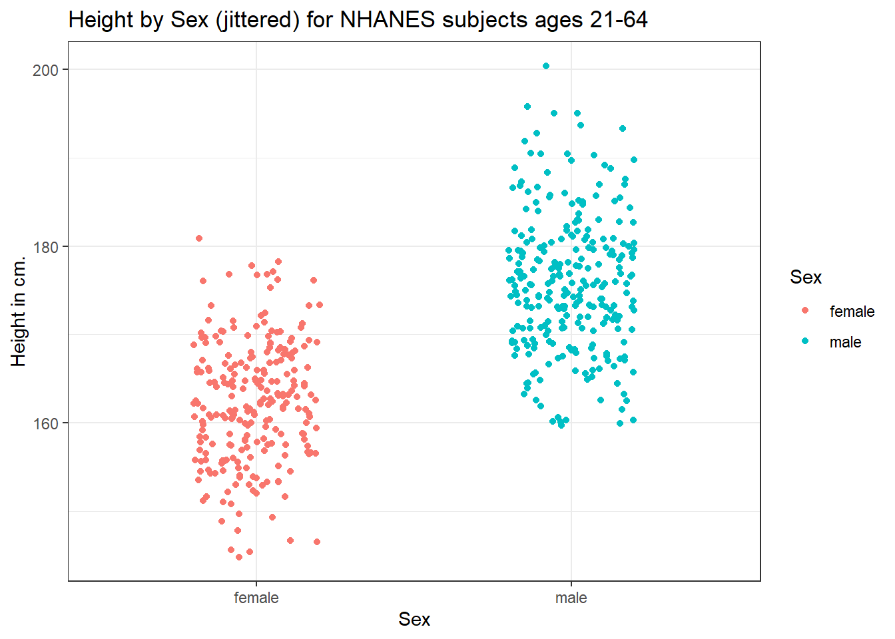

Perhaps it might be better to summarise the distribution in a different way. We might consider a boxplot of the data.

### A Boxplot of Height by Sex


```r
ggplot(data = nh_500cc, aes(x = Sex, y = Height, fill = Sex)) + 
    geom_boxplot() + 
    labs(title = "Boxplot of Height by Sex for NHANES subjects ages 21-64",
         y = "Height in cm.")
```

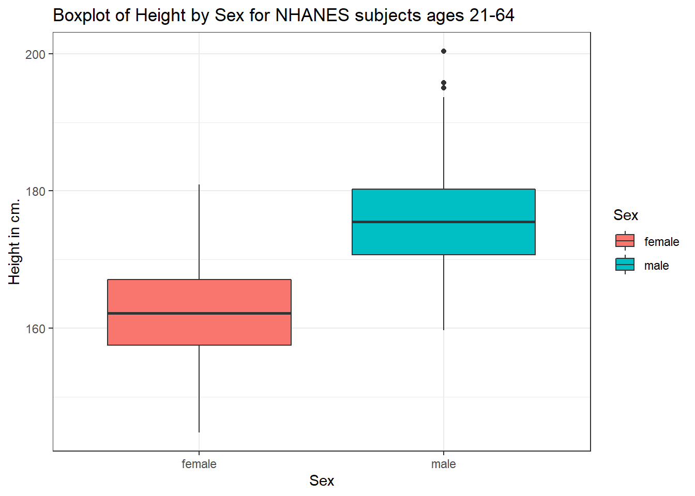

The boxplot shows some summary statistics based on percentiles. The boxes in the middle of the line show the data values that include the middle half of the data once its been sorted. The 25th percentile (value that exceeds 1/4 of the data) is indicated by the bottom of the box, while the top of the box is located at the 75th percentile. The solid line inside the box indicates the median (also called the 50th percentile) of the Heights for that Sex.

### Adding a violin plot

A boxplot is often supplemented with a *violin plot* to better show the shape of the distribution.


```r
ggplot(data = nh_500cc, aes(x = Sex, y = Height, fill = Sex)) +
    geom_violin() +
    geom_boxplot(width = 0.3) +
    labs(title = "Boxplot of Height by Sex for NHANES subjects ages 21-64",
         y = "Height in cm.")
```

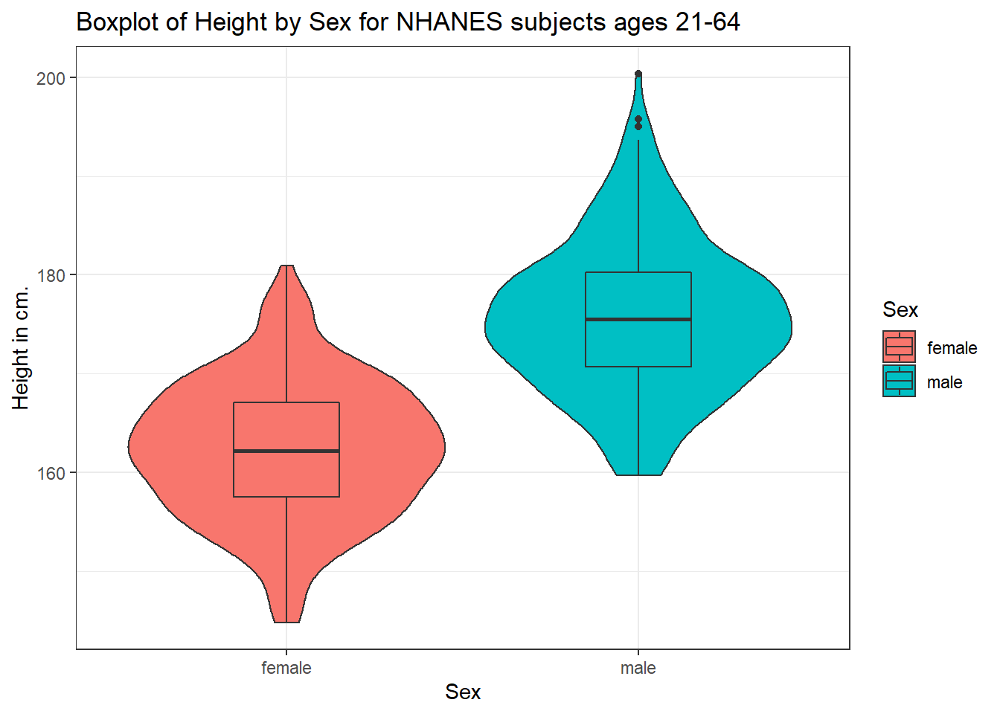

This usually works better if the boxes are given a different fill than the violins, as shown in the following figure.


```r
ggplot(data = nh_500cc, aes(x = Sex, y = Height)) +
    geom_violin(aes(fill = Sex)) +
    geom_boxplot(width = 0.3) +
    labs(title = "Boxplot of Height by Sex for NHANES subjects ages 21-64",
         y = "Height in cm.")
```

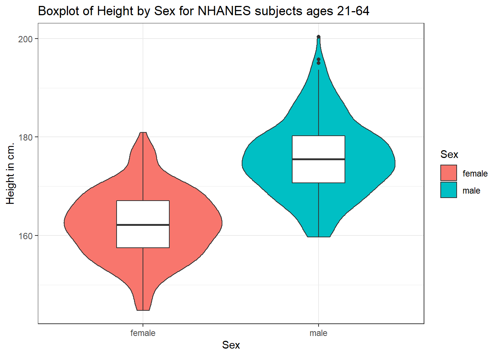

We can also flip the boxplots on their side, using `coord_flip()`.


```r
ggplot(data = nh_500cc, aes(x = Sex, y = Height)) +
    geom_violin() +
    geom_boxplot(aes(fill = Sex), width = 0.3) +
    labs(title = "Boxplot of Height by Sex for NHANES subjects ages 21-64",
         y = "Height in cm.") +
    coord_flip()
```


### Histograms of Height by Sex

Or perhaps we'd like to see a pair of histograms?


```r
ggplot(data = nh_500cc, aes(x = Height, fill = Sex)) + 
    geom_histogram(color = "white", bins = 20) + 
    labs(title = "Histogram of Height by Sex for NHANES subjects ages 21-64",
         x = "Height in cm.") + 
    facet_wrap(~ Sex)
```

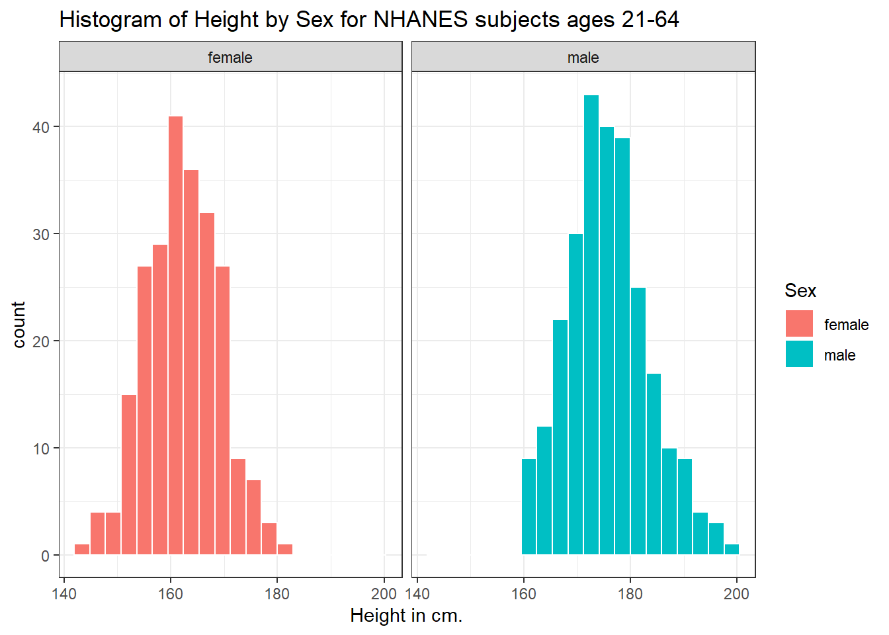

Can we redraw these histograms so that they are a little more comparable, and to get rid of the unnecessary legend?


```r
ggplot(data = nh_500cc, aes(x = Height, fill = Sex)) + 
    geom_histogram(color = "white", bins = 20) + 
    labs(title = "Histogram of Height by Sex for NHANES subjects ages 21-64 (Revised)",
         x = "Height in cm.") + 
    guides(fill = "none") +
    facet_grid(Sex ~ .)
```


## Looking at Pulse Rate

Let's look at a different outcome, the *pulse rate* for our subjects.

Here's a histogram, again with CWRU colors, for the pulse rates in our sample.


```r
ggplot(data = nh_500cc, aes(x = Pulse)) + 
    geom_histogram(binwidth = 1, 
                   fill = cwru.blue, col = cwru.gray) + 
    labs(title = "Histogram of Pulse Rate: NHANES subjects ages 21-64",
         x = "Pulse Rate (beats per minute)")
```


Suppose we instead bin up groups of 5 beats per minute together as we plot the Pulse rates. 


```r
ggplot(data = nh_500cc, aes(x = Pulse)) + 
    geom_histogram(binwidth = 5, 
                   fill = cwru.blue, col = cwru.gray) + 
    labs(title = "Histogram of Pulse Rate: NHANES subjects ages 21-64",
         x = "Pulse Rate (beats per minute)")
```

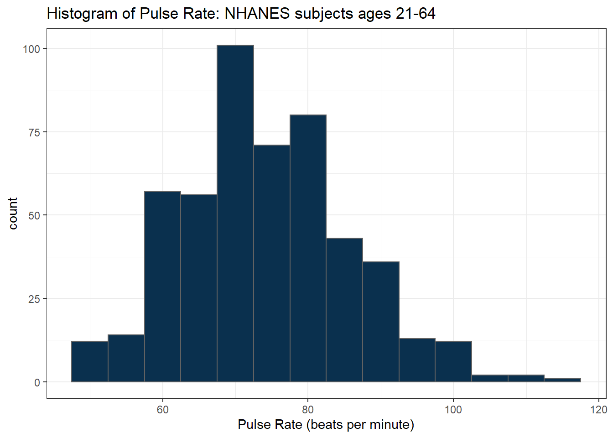

Which is the more useful representation will depend a lot on what questions you're trying to answer.

### Pulse Rate and Physical Activity

We can also split up our data into groups based on whether the subjects are physically active. Let's try a boxplot.


```r
ggplot(data = nh_500cc, 
       aes(y = Pulse, x = PhysActive, fill = PhysActive)) + 
    geom_boxplot() + 
    labs(title = "Pulse Rate by Physical Activity Status for NHANES ages 21-64")
```


As an accompanying numerical summary, we might ask how many people fall into each of these `PhysActive` categories, and what is their "average" `Pulse` rate.


```r
nh_500cc %>%
    group_by(PhysActive) %>%
    summarise(count = n(), mean(Pulse), median(Pulse)) %>%
    knitr::kable(digits = 2) 
```


|PhysActive | count| mean(Pulse)| median(Pulse)|
|:----------|-----:|-----------:|-------------:|
|No         |   216|       74.44|            74|
|Yes        |   284|       73.96|            74|

The `knitr::kable(digits = 2)` piece of this command tells R Markdown to generate a table with some attractive formatting, and rounding any decimals to two figures.

### Pulse by Sleeping Trouble


```r
ggplot(data = nh_500cc, aes(x = Pulse, fill = SleepTrouble)) + 
    geom_histogram(color = "white", bins = 20) + 
    labs(title = "Histogram of Pulse Rate by Sleep Trouble for NHANES subjects ages 21-64",
         x = "Pulse Rate (beats per minute)") + 
    guides(fill = "none") +
    facet_grid(SleepTrouble ~ ., labeller = "label_both")
```

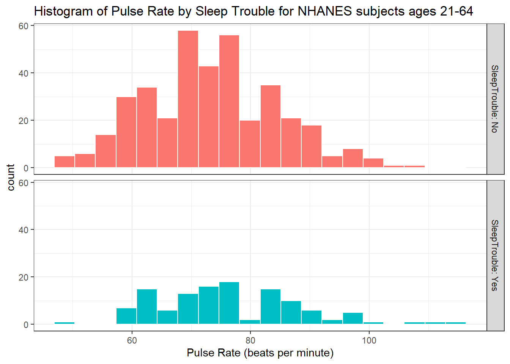


How many people fall into each of these `SleepTrouble` categories, and what is their "average" Pulse rate?


```r
nh_500cc %>%
    group_by(SleepTrouble) %>%
    summarise(count = n(), mean(Pulse), median(Pulse)) %>%
    knitr::kable(digits = 2) 
```


|SleepTrouble | count| mean(Pulse)| median(Pulse)|
|:------------|-----:|-----------:|-------------:|
|No           |   380|       73.45|            73|
|Yes          |   120|       76.43|            76|


### Pulse and HealthGen

We can compare the distribution of Pulse rate across groups by the subject's self-reported overall health (`HealthGen`), as well.


```r
ggplot(data = nh_500cc, aes(x = HealthGen, y = Pulse, fill = HealthGen)) + 
    geom_boxplot() +
    labs(title = "Pulse by Self-Reported Overall Health for NHANES ages 21-64",
         x = "Self-Reported Overall Health", y = "Pulse Rate") + 
    guides(fill = "none") 
```

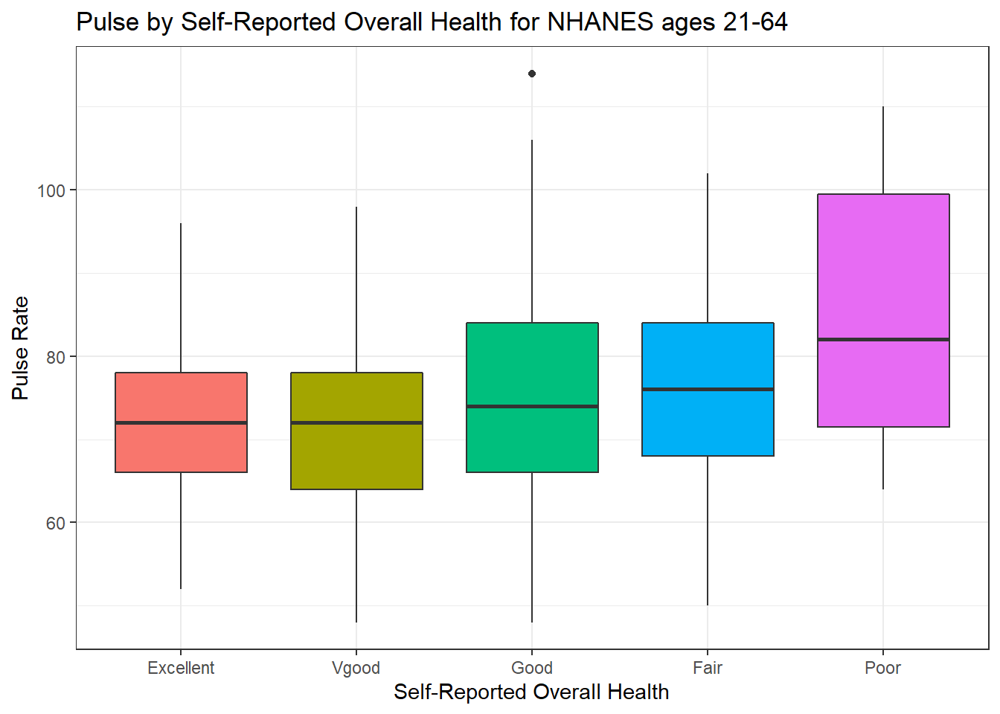

How many people fall into each of these `HealthGen` categories, and what is their "average" Pulse rate?


```r
nh_500cc %>%
    group_by(HealthGen) %>%
    summarise(count = n(), mean(Pulse), median(Pulse)) %>%
    knitr::kable(digits = 2) 
```


|HealthGen | count| mean(Pulse)| median(Pulse)|
|:---------|-----:|-----------:|-------------:|
|Excellent |    52|       72.08|            72|
|Vgood     |   167|       71.78|            72|
|Good      |   204|       75.22|            74|
|Fair      |    65|       76.55|            76|
|Poor      |    12|       85.50|            82|

### Pulse Rate and Systolic Blood Pressure


```r
ggplot(data = nh_500cc, aes(x = SBP, y = Pulse)) +
    geom_point() +
    geom_smooth(method = "loess", formula = y ~ x) +
    labs(title = "Pulse Rate vs. SBP for NHANES subjects, ages 21-64")
```


### Sleep Trouble vs. No Sleep Trouble?

Could we see whether subjects who have described `SleepTrouble` show different SBP-pulse rate patterns than the subjects who haven't? 

- Let's try doing this by changing the shape *and* the color of the points based on `SleepTrouble`.


```r
ggplot(data = nh_500cc, 
       aes(x = SBP, y = Pulse, 
           color = SleepTrouble, shape = SleepTrouble)) +
    geom_point() +
    geom_smooth(method = "loess", formula = y ~ x) +
    labs(title = "Pulse Rate vs. SBP for NHANES subjects, ages 21-64")
```


This plot might be easier to interpret if we faceted by `SleepTrouble`, as well.


```r
ggplot(data = nh_500cc, 
       aes(x = SBP, y = Pulse, 
           color = SleepTrouble, shape = SleepTrouble)) +
    geom_point() +
    geom_smooth(method = "loess", formula = y ~ x) +
    labs(title = "Pulse Rate vs. SBP for NHANES subjects, ages 21-64") +
    facet_wrap(~ SleepTrouble, labeller = "label_both")
```


## General Health Status

Here's a Table of the General Health Status results. Again, this is a self-reported rating of each subject's health on a five point scale (Excellent, Very Good, Good, Fair, Poor.) 


```r
nh_500cc %>%
    tabyl(HealthGen) 
```

```
 HealthGen   n percent
 Excellent  52   0.104
     Vgood 167   0.334
      Good 204   0.408
      Fair  65   0.130
      Poor  12   0.024
```

The HealthGen data are categorical, which means that summarizing them with averages isn't as appealing as looking at percentages, proportions and rates. The `tabyl` function comes from the `janitor` package in R.

- I don't actually like the title of `percent` here, as it's really a proportion, but that can be adjusted, and we can add a total.


```r
nh_500cc %>%
    tabyl(HealthGen) %>%
    adorn_totals() %>%
    adorn_pct_formatting()
```

```
 HealthGen   n percent
 Excellent  52   10.4%
     Vgood 167   33.4%
      Good 204   40.8%
      Fair  65   13.0%
      Poor  12    2.4%
     Total 500  100.0%
```

When working with an unordered categorical variable, like `MaritalStatus`, the same approach can work.


```r
nh_500cc %>%
    tabyl(MaritalStatus) %>%
    adorn_totals() %>%
    adorn_pct_formatting()
```

```
 MaritalStatus   n percent
      Divorced  47    9.4%
   LivePartner  46    9.2%
       Married 256   51.2%
  NeverMarried 125   25.0%
     Separated  17    3.4%
       Widowed   9    1.8%
         Total 500  100.0%
```

### Bar Chart for Categorical Data

Usually, a **bar chart** is the best choice for graphing a variable made up of categories.


```r
ggplot(data = nh_500cc, aes(x = HealthGen)) + 
    geom_bar()
```


There are lots of things we can do to make this plot fancier.


```r
ggplot(data = nh_500cc, aes(x = HealthGen, fill = HealthGen)) + 
    geom_bar() + 
    guides(fill = "none") +
    labs(x = "Self-Reported Health Status",
         y = "Number of NHANES subjects",
         title = "Self-Reported Health Status in NHANES subjects ages 21-64")
```


Or, we can really go crazy...


```r
nh_500cc %>%
    count(HealthGen) %>%
    mutate(pct = round_half_up(prop.table(n) * 100, 1)) %>%
    ggplot(aes(x = HealthGen, y = pct, fill = HealthGen)) + 
    geom_bar(stat = "identity", position = "dodge") +
    scale_fill_viridis_d() +
    guides(fill = "none") +
    geom_text(aes(y = pct + 1,    # nudge above top of bar
                  label = paste0(pct, '%')),  # prettify
              position = position_dodge(width = .9), 
              size = 4) +
    labs(x = "Self-Reported Health Status",
         y = "Percentage of NHANES subjects",
         title = "Self-Reported Health Status in NHANES subjects ages 21-64") +
    theme_bw()
```

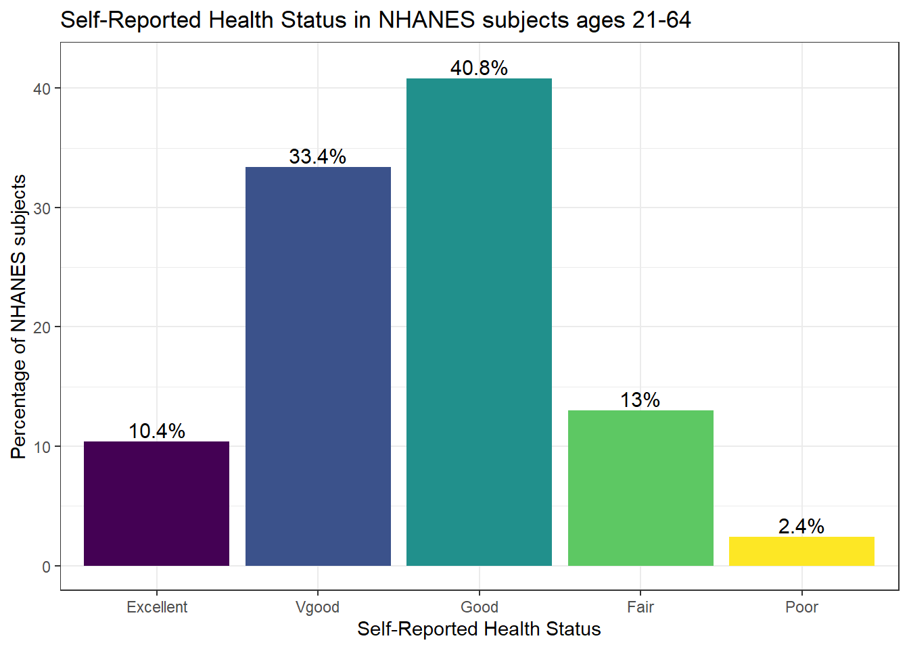


### Two-Way Tables

We can create cross-classifications of two categorical variables (for example HealthGen and Smoke100), adding both row and column marginal totals, and compare subjects by Sex, as follows...


```r
nh_500cc %>%
    tabyl(Smoke100, HealthGen) %>%
    adorn_totals(c("row", "col")) 
```

```
 Smoke100 Excellent Vgood Good Fair Poor Total
       No        44   108  105   29    5   291
      Yes         8    59   99   36    7   209
    Total        52   167  204   65   12   500
```

If we like, we can make this look a little more polished with the `knitr::kable` function...


```r
nh_500cc %>%
    tabyl(Smoke100, HealthGen) %>%
    adorn_totals(c("row", "col")) %>%
    knitr::kable()
```


|Smoke100 | Excellent| Vgood| Good| Fair| Poor| Total|
|:--------|---------:|-----:|----:|----:|----:|-----:|
|No       |        44|   108|  105|   29|    5|   291|
|Yes      |         8|    59|   99|   36|    7|   209|
|Total    |        52|   167|  204|   65|   12|   500|

Or, we can get a complete cross-tabulation, including (in this case) the percentages of people within each of the two categories of `Smoke100` that fall in each `HealthGen` category (percentages within each row) like this.


```r
nh_500cc %>%
    tabyl(Smoke100, HealthGen) %>%
    adorn_totals("row") %>%
    adorn_percentages("row") %>%
    adorn_pct_formatting() %>%
    adorn_ns() %>%
    knitr::kable()
```


|Smoke100 |Excellent  |Vgood       |Good        |Fair       |Poor      |
|:--------|:----------|:-----------|:-----------|:----------|:---------|
|No       |15.1% (44) |37.1% (108) |36.1% (105) |10.0% (29) |1.7%  (5) |
|Yes      |3.8%  (8)  |28.2%  (59) |47.4%  (99) |17.2% (36) |3.3%  (7) |
|Total    |10.4% (52) |33.4% (167) |40.8% (204) |13.0% (65) |2.4% (12) |

And, if we wanted the column percentages, to determine which sex had the higher rate of each HealthGen status level, we can get that by changing the adorn_percentages to describe results at the column level:


```r
nh_500cc %>%
    tabyl(Sex, HealthGen) %>%
    adorn_totals("col") %>%
    adorn_percentages("col") %>%
    adorn_pct_formatting() %>%
    adorn_ns() %>%
    knitr::kable()
```


|Sex    |Excellent  |Vgood      |Good        |Fair       |Poor      |Total       |
|:------|:----------|:----------|:-----------|:----------|:---------|:-----------|
|female |63.5% (33) |44.3% (74) |43.6%  (89) |47.7% (31) |75.0% (9) |47.2% (236) |
|male   |36.5% (19) |55.7% (93) |56.4% (115) |52.3% (34) |25.0% (3) |52.8% (264) |

### SBP by General Health Status

Let's consider now the relationship between self-reported overall health and systolic blood pressure.


```r
ggplot(data = nh_500cc, aes(x = HealthGen, y = SBP, 
                            fill = HealthGen)) + 
    geom_boxplot() + 
    labs(title = "SBP by Health Status, Overall Health for NHANES ages 21-64",
         y = "Systolic Blood Pressure", 
         x = "Self-Reported Overall Health") + 
    guides(fill = "none") 
```


We can see that not too many people self-identify with the "Poor" health category.


```r
nh_500cc %>%
    group_by(HealthGen) %>%
    summarise(count = n(), mean(SBP), median(SBP)) %>%
    knitr::kable() 
```


|HealthGen | count| mean(SBP)| median(SBP)|
|:---------|-----:|---------:|-----------:|
|Excellent |    52|  113.9231|         113|
|Vgood     |   167|  117.5928|         118|
|Good      |   204|  121.5931|         120|
|Fair      |    65|  120.3846|         118|
|Poor      |    12|  122.8333|         124|

### SBP by Physical Activity and General Health Status

We'll build a panel of boxplots to try to understand the relationships between Systolic Blood Pressure, General Health Status and Physical Activity. Note the use of `coord_flip` to rotate the graph 90 degrees, and the use of `labeller` within `facet_wrap` to include both the name of the (Physical Activity) variable and its value.


```r
ggplot(data = nh_500cc, aes(x = HealthGen, y = SBP, fill = HealthGen)) + 
    geom_boxplot() + 
    labs(title = "SBP by Health Status, Overall Health for NHANES ages 21-64",
         y = "Systolic BP", x = "Self-Reported Overall Health") + 
    guides(fill = "none") +
    facet_wrap(~ PhysActive, labeller = "label_both") + 
    coord_flip()
```


### SBP by Sleep Trouble and General Health Status

Here's a plot of faceted histograms, which might be used to address similar questions related to the relationship between Overall Health, Systolic Blood Pressure and whether someone has trouble sleeping.


```r
ggplot(data = nh_500cc, aes(x = SBP, fill = HealthGen)) + 
    geom_histogram(color = "white", bins = 20) + 
    labs(title = "SBP by Overall Health and Sleep Trouble for NHANES ages 21-64",
         x = "Systolic BP") + 
    guides(fill = "none") +
    facet_grid(SleepTrouble ~ HealthGen, labeller = "label_both")
```


## Conclusions

This is just a small piece of the toolbox for visualizations that we'll create in this class. Many additional tools are on the way, but the main idea won't change. Using the `ggplot2` package, we can accomplish several critical tasks in creating a visualization, including:

- Identifying (and labeling) the axes and titles
- Identifying a type of `geom` to use, like a point, bar or histogram
- Changing fill, color, shape, size to facilitate comparisons
- Building "small multiples" of plots with faceting

Good data visualizations make it easy to see the data, and `ggplot2`'s tools make it relatively difficult to make a really bad graph.

