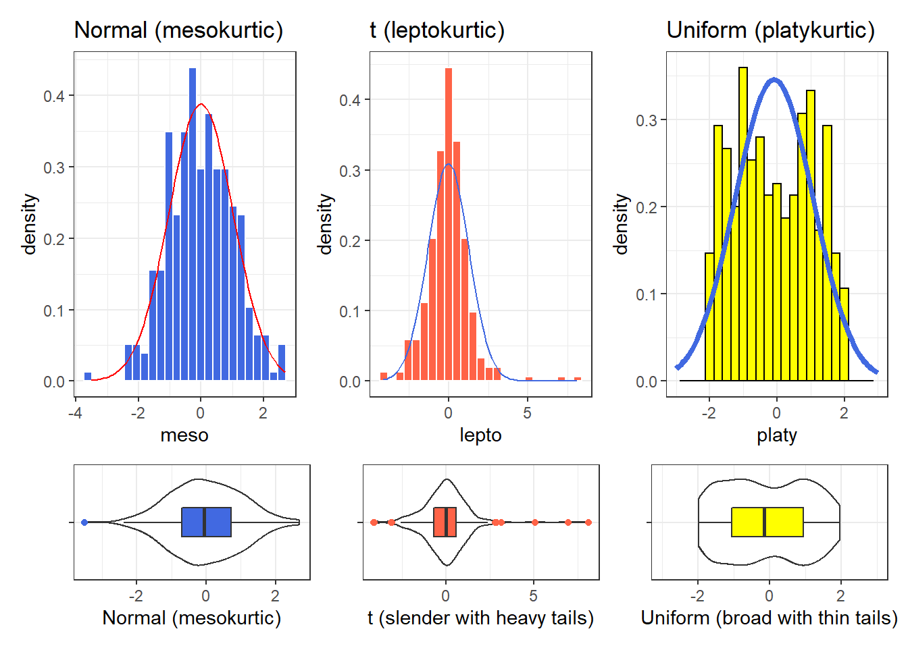

# Summarizing Quantitative Variables {#summarizing_quantities}

Most numerical summaries that might be new to you are applied most appropriately to quantitative variables. The measures that will interest us relate to:

- the **center** of our distribution,
- the **spread** of our distribution, and
- the **shape** of our distribution.

To demonstrate key ideas in this Chapter, we will consider our sample of 750 adults ages 21-64 from NHANES 2011-12 which includes some missing values. We'll load into the `nh_750` data frame the information from the `nh_adult750.Rds` file we created in Section \@ref(newNHANES).


```r
nh_750 <- read_rds("data/nh_adult750.Rds")
```

## The `summary` function for Quantitative data

R provides a small sampling of numerical summaries with the `summary` function, for instance.


```r
nh_750 %>%
  select(Age, BMI, SBP, DBP, Pulse) %>%
  summary()
```

```
      Age             BMI             SBP       
 Min.   :21.00   Min.   :16.70   Min.   : 83.0  
 1st Qu.:30.00   1st Qu.:24.20   1st Qu.:108.0  
 Median :40.00   Median :27.90   Median :118.0  
 Mean   :40.82   Mean   :29.08   Mean   :118.8  
 3rd Qu.:51.00   3rd Qu.:32.10   3rd Qu.:127.0  
 Max.   :64.00   Max.   :80.60   Max.   :209.0  
                 NA's   :5       NA's   :33     
      DBP             Pulse       
 Min.   :  0.00   Min.   : 40.00  
 1st Qu.: 66.00   1st Qu.: 66.00  
 Median : 73.00   Median : 72.00  
 Mean   : 72.69   Mean   : 73.53  
 3rd Qu.: 80.00   3rd Qu.: 80.00  
 Max.   :108.00   Max.   :124.00  
 NA's   :33       NA's   :32      
```

This basic summary includes a set of five **quantiles**^[The quantiles (sometimes referred to as percentiles) can also be summarised with a boxplot.], plus the sample's **mean**.

- `Min.` = the **minimum** value for each variable, so, for example, the youngest subject's Age was 21.
- `1st Qu.` = the **first quartile** (25^th^ percentile) for each variable - for example, 25% of the subjects were Age 30 or younger.
- `Median` = the **median** (50^th^ percentile) - half of the subjects were Age 40 or younger.
- `Mean` = the **mean**, usually what one means by an *average* - the sum of the Ages divided by 750 is 40.8,
- `3rd Qu.` = the **third quartile** (75^th^ percentile) - 25% of the subjects were Age 51 or older.
- `Max.` = the **maximum** value for each variable, so the oldest subject was Age 64.

The summary also specifies the number of missing values for each variable. Here, we are missing 5 of the BMI values, for example.

## Measuring the Center of a Distribution

### The Mean and The Median

The **mean** and **median** are the most commonly used measures of the center of a distribution for a quantitative variable. The median is the more generally useful value, as it is relevant even if the data have a shape that is not symmetric. We might also collect the **sum** of the observations, and the **count** of the number of observations, usually symbolized with *n*. 

For variables without missing values, like `Age`, this is pretty straightforward.


```r
nh_750 %>%
    summarise(n = n(), Mean = mean(Age), Median = median(Age), Sum = sum(Age))
```

```
# A tibble: 1 x 4
      n  Mean Median   Sum
  <int> <dbl>  <dbl> <int>
1   750  40.8     40 30616
```

And again, the Mean is just the Sum (30616), divided by the number of non-missing values of Age (750), or 40.8213333.

The Median is the middle value when the data are sorted in order. When we have an odd number of values, this is sufficient. When we have an even number, as in this case, we take the mean of the two middle values. We could sort and list all 500 Ages, if we wanted to do so.


```r
nh_750 %>% select(Age) %>% 
    arrange(Age)
```

```
# A tibble: 750 x 1
     Age
   <int>
 1    21
 2    21
 3    21
 4    21
 5    21
 6    21
 7    21
 8    21
 9    21
10    21
# ... with 740 more rows
```

But this data set figures we don't want to output more than 10 observations to a table like this.

If we really want to see all of the data, we can use `View(nh_750)` to get a spreadsheet-style presentation, or use the `sort` command...


```r
sort(nh_750$Age)
```

```
  [1] 21 21 21 21 21 21 21 21 21 21 21 21 21 21 21 21 21 21
 [19] 21 21 21 21 22 22 22 22 22 22 22 22 22 22 22 22 22 22
 [37] 22 22 22 22 22 22 22 22 23 23 23 23 23 23 23 23 23 23
 [55] 23 23 23 23 23 23 23 23 23 23 23 23 24 24 24 24 24 24
 [73] 24 24 24 24 24 24 24 24 24 24 24 24 24 24 24 24 24 25
 [91] 25 25 25 25 25 25 25 25 25 25 25 25 25 26 26 26 26 26
[109] 26 26 26 26 26 26 26 26 26 27 27 27 27 27 27 27 27 27
[127] 27 27 27 27 28 28 28 28 28 28 28 28 28 28 28 28 28 28
[145] 28 28 28 28 28 28 29 29 29 29 29 29 29 29 29 29 29 29
[163] 29 29 29 29 29 29 29 29 30 30 30 30 30 30 30 30 30 30
[181] 30 30 30 30 30 30 30 30 30 30 30 30 30 30 31 31 31 31
[199] 31 31 31 31 31 31 31 31 31 31 31 31 31 31 31 32 32 32
[217] 32 32 32 32 32 32 32 32 32 32 32 32 32 32 32 32 32 32
[235] 32 32 32 32 32 32 32 33 33 33 33 33 33 33 33 33 33 33
[253] 33 33 33 33 33 33 33 33 33 33 33 33 33 34 34 34 34 34
[271] 34 34 34 34 34 34 34 34 34 35 35 35 35 35 35 35 35 35
[289] 35 35 36 36 36 36 36 36 36 36 36 36 36 36 36 36 36 36
[307] 36 36 36 36 36 36 36 36 36 36 37 37 37 37 37 37 37 37
[325] 37 37 37 37 37 37 37 37 37 37 38 38 38 38 38 38 38 38
[343] 38 38 38 38 38 38 38 38 39 39 39 39 39 39 39 39 39 39
[361] 39 39 39 39 39 39 39 39 39 40 40 40 40 40 40 40 40 40
[379] 40 40 40 40 40 40 40 40 40 41 41 41 41 41 41 41 41 41
[397] 41 41 41 41 42 42 42 42 42 42 42 42 42 42 42 42 42 42
[415] 42 42 42 42 42 43 43 43 43 43 43 43 43 43 43 43 43 43
[433] 43 43 43 43 43 44 44 44 44 44 44 44 44 44 44 44 44 44
[451] 44 44 44 45 45 45 45 45 45 45 45 45 45 45 45 45 45 45
[469] 45 45 46 46 46 46 46 46 46 46 46 46 46 46 46 46 47 47
[487] 47 47 47 47 47 47 47 47 47 47 47 47 47 47 47 48 48 48
[505] 48 48 48 48 48 48 48 48 49 49 49 49 49 49 49 49 49 49
[523] 49 49 49 50 50 50 50 50 50 50 50 50 50 50 50 50 50 50
[541] 50 50 50 50 50 50 50 50 50 50 50 51 51 51 51 51 51 51
[559] 51 51 51 51 51 51 51 51 51 51 51 51 51 52 52 52 52 52
[577] 52 52 52 52 52 52 52 53 53 53 53 53 53 53 53 53 53 53
[595] 53 53 53 53 54 54 54 54 54 54 54 54 54 54 54 54 54 54
[613] 54 54 55 55 55 55 55 55 55 55 55 55 56 56 56 56 56 56
[631] 56 56 56 56 56 56 56 56 56 56 56 56 56 57 57 57 57 57
[649] 57 57 57 57 58 58 58 58 58 58 58 58 58 58 58 58 58 58
[667] 58 58 58 58 59 59 59 59 59 59 59 59 59 59 59 59 59 60
[685] 60 60 60 60 60 60 60 60 60 60 60 60 61 61 61 61 61 61
[703] 61 61 61 61 61 61 61 61 62 62 62 62 62 62 62 62 62 62
[721] 62 62 62 63 63 63 63 63 63 63 63 63 63 63 63 63 64 64
[739] 64 64 64 64 64 64 64 64 64 64 64 64
```

Again, to find the median, we would take the mean of the middle two observations in this sorted data set. That would be the 250^th^ and 251^st^ largest Ages.


```r
sort(nh_750$Age)[250:251]
```

```
[1] 33 33
```

### Dealing with Missingness

When calculating a mean, you may be tempted to try something like this...


```r
nh_750 %>%
    summarise(mean(Pulse), median(Pulse))
```

```
# A tibble: 1 x 2
  `mean(Pulse)` `median(Pulse)`
          <dbl>           <int>
1            NA              NA
```

This fails because we have some missing values in the Pulse data. We can address this by either omitting the data with missing values before we run the summarise function, or tell the mean and median summary functions to remove missing values^[We could also use `!is.na` in place of `complete.cases` to accomplish the same thing.].


```r
nh_750 %>%
    filter(complete.cases(Pulse)) %>%
    summarise(count = n(), mean(Pulse), median(Pulse))
```

```
# A tibble: 1 x 3
  count `mean(Pulse)` `median(Pulse)`
  <int>         <dbl>           <dbl>
1   718          73.5              72
```

Or, we could tell the summary functions themselves to remove NA values.


```r
nh_750 %>%
    summarise(mean(Pulse, na.rm=TRUE), median(Pulse, na.rm=TRUE))
```

```
# A tibble: 1 x 2
  `mean(Pulse, na.rm = TRUE)` `median(Pulse, na.rm = TRUE)`
                        <dbl>                         <dbl>
1                        73.5                            72
```

While we eventually discuss the importance of **imputation** when dealing with missing data, this doesn't apply to providing descriptive summaries of actual, observed values.

### The Mode of a Quantitative Variable

One other less common measure of the center of a quantitative variable's distribution is its most frequently observed value, referred to as the **mode**. This measure is only appropriate for discrete variables, be they quantitative or categorical. To find the mode, we usually tabulate the data, and then sort by the counts of the numbers of observations.


```r
nh_750 %>%
    group_by(Age) %>%
    summarise(count = n()) %>%
    arrange(desc(count)) 
```

```
# A tibble: 44 x 2
     Age count
   <int> <int>
 1    32    28
 2    36    26
 3    50    26
 4    30    24
 5    33    24
 6    24    23
 7    21    22
 8    22    22
 9    23    22
10    28    20
# ... with 34 more rows
```

Note the use of three different "verbs" in our function there - for more explanation of this strategy, visit @R4DS.

As an alternative, the `modeest` package's `mfv` function calculates the sample mode (or most frequent value) ^[See the documentation for the `modeest` package's `mlv` function to look at other definitions of the mode.].

## Measuring the Spread of a Distribution

Statistics is all about variation, so spread or dispersion is an important fundamental concept in statistics. Measures of spread like the inter-quartile range and range (maximum - minimum) can help us understand and compare data sets. If the values in the data are close to the center, the spread will be small. If many of the values in the data are scattered far away from the center, the spread will be large.

### The Range and the Interquartile Range (IQR) {#rangeandiqr}

The **range** of a quantitative variable is sometimes interpreted as the difference between the maximum and the minimum, even though R presents the actual minimum and maximum values when you ask for a range...


```r
nh_750 %>% 
    select(Age) %>% 
    range()
```

```
[1] 21 64
```

And, for a variable with missing values, we can use...


```r
nh_750 %>% 
    select(BMI) %>% 
    range(., na.rm=TRUE)
```

```
[1] 16.7 80.6
```

A more interesting and useful statistic is the **inter-quartile range**, or IQR, which is the range of the middle half of the distribution, calculated by subtracting the 25^th^ percentile value from the 75^th^ percentile value.


```r
nh_750 %>%
    summarise(IQR(Age), quantile(Age, 0.25), quantile(Age, 0.75))
```

```
# A tibble: 1 x 3
  `IQR(Age)` `quantile(Age, 0.25)` `quantile(Age, 0.75)`
       <dbl>                 <dbl>                 <dbl>
1         21                    30                    51
```

We can calculate the range and IQR nicely from the summary information on quantiles, of course:


```r
nh_750 %>%
    select(Age, BMI, SBP, DBP, Pulse) %>%
    summary()
```

```
      Age             BMI             SBP       
 Min.   :21.00   Min.   :16.70   Min.   : 83.0  
 1st Qu.:30.00   1st Qu.:24.20   1st Qu.:108.0  
 Median :40.00   Median :27.90   Median :118.0  
 Mean   :40.82   Mean   :29.08   Mean   :118.8  
 3rd Qu.:51.00   3rd Qu.:32.10   3rd Qu.:127.0  
 Max.   :64.00   Max.   :80.60   Max.   :209.0  
                 NA's   :5       NA's   :33     
      DBP             Pulse       
 Min.   :  0.00   Min.   : 40.00  
 1st Qu.: 66.00   1st Qu.: 66.00  
 Median : 73.00   Median : 72.00  
 Mean   : 72.69   Mean   : 73.53  
 3rd Qu.: 80.00   3rd Qu.: 80.00  
 Max.   :108.00   Max.   :124.00  
 NA's   :33       NA's   :32      
```

### The Variance and the Standard Deviation

The IQR is always a reasonable summary of spread, just as the median is always a reasonable summary of the center of a distribution. Yet, most people are inclined to summarise a batch of data using two numbers: the **mean** and the **standard deviation**.  This is really only a sensible thing to do if you are willing to assume the data follow a Normal distribution: a bell-shaped, symmetric distribution without substantial outliers. 

But **most data do not (even approximately) follow a Normal distribution**. Summarizing by the median and quartiles (25th and 75th percentiles) is much more robust, explaining R's emphasis on them.  

### Obtaining the Variance and Standard Deviation in R

Here are the variances of the quantitative variables in the `nh_750` data. Note the need to include `na.rm = TRUE` to deal with the missing values in some variables.


```r
nh_750 %>%
    select(Age, BMI, SBP, DBP, Pulse) %>%
    summarise_all(var, na.rm = TRUE)
```

```
# A tibble: 1 x 5
    Age   BMI   SBP   DBP Pulse
  <dbl> <dbl> <dbl> <dbl> <dbl>
1  157.  52.4  229.  128.  136.
```

And here are the standard deviations of those same variables.


```r
nh_750 %>%
    select(Age, BMI, SBP, DBP, Pulse) %>%
    summarise_all(sd, na.rm = TRUE)
```

```
# A tibble: 1 x 5
    Age   BMI   SBP   DBP Pulse
  <dbl> <dbl> <dbl> <dbl> <dbl>
1  12.5  7.24  15.1  11.3  11.6
```

### Defining the Variance and Standard Deviation

@BockVD have lots of useful thoughts here, which are lightly edited here. 

In thinking about spread, we might consider how far each data value is from the mean. Such a difference is called a *deviation*. We could just average the deviations, but the positive and negative differences always cancel out, leaving an average deviation of zero, so that's not helpful. Instead, we *square* each deviation to obtain non-negative values, and to emphasize larger differences. When we add up these squared deviations and find their mean (almost), this yields the **variance**.

$$
\mbox{Variance} = s^2 = \frac{\Sigma (y - \bar{y})^2}{n-1}
$$

Why almost? It would be the mean of the squared deviations only if we divided the sum by $n$, but instead we divide by $n-1$ because doing so produces an estimate of the true (population) variance that is *unbiased*^[When we divide by n-1 as we calculate the sample variance, the average of the sample variances for all possible samples is equal to the population variance. If we instead divided by n, the average sample variance across all possible samples would be a little smaller than the population variance.]. If you're looking for a more intuitive explanation, [this Stack Exchange link](http://stats.stackexchange.com/questions/3931/intuitive-explanation-for-dividing-by-n-1-when-calculating-standard-deviation) awaits your attention. 

- To return to the original units of measurement, we take the square root of $s^2$, and instead work with $s$, the **standard deviation**, also abbreviated SD.

$$
\mbox{Standard Deviation} = s = \sqrt{\frac{\Sigma (y - \bar{y})^2}{n-1}}
$$

### Interpreting the SD when the data are Normally distributed

For a set of measurements that follow a Normal distribution, the interval:

* Mean $\pm$ Standard Deviation contains approximately 68% of the measurements;
* Mean $\pm$ 2(Standard Deviation) contains approximately 95% of the measurements;
* Mean $\pm$ 3(Standard Deviation) contains approximately all (99.7%) of the measurements.

We often refer to the population or process mean of a distribution with $\mu$ and the standard deviation with $\sigma$, leading to the Figure below.

<div class="figure">

<p class="caption">(\#fig:c6_Emp_Rule)The Normal Distribution and the Empirical Rule</p>
</div>

But if the data are not from an approximately Normal distribution, then this Empirical Rule is less helpful.

### Chebyshev's Inequality: One Interpretation of the Standard Deviation

Chebyshev's Inequality tells us that for any distribution, regardless of its relationship to a Normal distribution, no more than 1/k^2^ of the distribution's values can lie more than k standard deviations from the mean. This implies, for instance, that for **any** distribution, at least 75% of the values must lie within two standard deviations of the mean, and at least 89% must lie within three standard deviations of the mean.

Again, most data sets do not follow a Normal distribution. We'll return to this notion soon. But first, let's try to draw some pictures that let us get a better understanding of the distribution of our data.

## Measuring the Shape of a Distribution

When considering the shape of a distribution, one is often interested in three key points.

- The number of modes in the distribution, which I always assess through plotting the data.
- The **skewness**, or symmetry that is present, which I typically assess by looking at a plot of the distribution of the data, but if required to, will summarise with a non-parametric measure of **skewness**.
- The **kurtosis**, or heavy-tailedness (outlier-proneness) that is present, usually in comparison to a Normal distribution. Again, this is something I nearly inevitably assess graphically, but there are measures.  

A Normal distribution has a single mode, is symmetric and, naturally, is neither heavy-tailed nor light-tailed as compared to a Normal distribution (we call this mesokurtic).

### Multimodal vs. Unimodal distributions

A unimodal distribution, on some level, is straightforward. It is a distribution with a single mode, or "peak" in the distribution. Such a distribution may be skewed or symmetric, light-tailed or heavy-tailed. We usually describe as multimodal distributions like the two on the right below, which have multiple local maxima, even though they have just a single global maximum peak.

<div class="figure">

<p class="caption">(\#fig:c6_modality-fig)Unimodal and Multimodal Sketches</p>
</div>

Truly multimodal distributions are usually described that way in terms of shape. For unimodal distributions, skewness and kurtosis become useful ideas.

### Skew

Whether or not a distribution is approximately symmetric is an important consideration in describing its shape. Graphical assessments are always most useful in this setting, particularly for unimodal data. My favorite measure of skew, or skewness if the data have a single mode, is:

$$
skew_1 = \frac{\mbox{mean} - \mbox{median}}{\mbox{standard deviation}}
$$

- Symmetric distributions generally show values of $skew_1$ near zero. If the distribution is actually symmetric, the mean should be equal to the median.
- Distributions with $skew_1$ values above 0.2 in absolute value generally indicate meaningful skew.
- Positive skew (mean > median if the data are unimodal) is also referred to as *right skew*.
- Negative skew (mean < median if the data are unimodal) is referred to as *left skew*.

<div class="figure">

<p class="caption">(\#fig:c6_negandposskew-fig)Negative (Left) Skew and Positive (Right) Skew</p>
</div>


### Kurtosis

When we have a unimodal distribution that is symmetric, we will often be interested in the behavior of the tails of the distribution, as compared to a Normal distribution with the same mean and standard deviation. High values of kurtosis measures (and there are several) indicate data which has extreme outliers, or is heavy-tailed.

- A mesokurtic distribution has similar tail behavior to what we would expect from a Normal distribution.
- A leptokurtic distribution is a thinner, more slender distribution, with heavier tails than we'd expect from a Normal distribution. One example is the t distribution.
- A platykurtic distribution is a broader, flatter distribution, with thinner tails than we'd expect from a Normal distribution. One example is a uniform distribution.


```r
set.seed(431)
sims_kurt <- tibble(meso = rnorm(n = 300, mean = 0, sd = 1),
                    lepto = rt(n = 300, df = 4),
                    platy = runif(n = 300, min = -2, max = 2))

p1 <- ggplot(sims_kurt, aes(x = meso)) +
  geom_histogram(aes(y = stat(density)), 
                 bins = 25, fill = "royalblue", col = "white") +
  stat_function(fun = dnorm, 
                args = list(mean = mean(sims_kurt$meso), 
                            sd = sd(sims_kurt$meso)),
                col = "red") +
  labs(title = "Normal (mesokurtic)")

p1a <- ggplot(sims_kurt, aes(x = meso, y = "")) +
  geom_violin() +
  geom_boxplot(fill = "royalblue", outlier.color = "royalblue", width = 0.3)

p2 <- ggplot(sims_kurt, aes(x = lepto)) +
  geom_histogram(aes(y = stat(density)), 
                 bins = 25, fill = "tomato", col = "white") +
  stat_function(fun = dnorm, 
                args = list(mean = mean(sims_kurt$lepto), 
                            sd = sd(sims_kurt$lepto)),
                col = "royalblue") +
  labs(title = "t (leptokurtic)")

p2a <- ggplot(sims_kurt, aes(x = lepto, y = "")) +
  geom_violin() +
  geom_boxplot(fill = "tomato", outlier.color = "tomato", width = 0.3) +
  labs(y = "", x = "t (slender with heavy tails)")

p3 <- ggplot(sims_kurt, aes(x = platy)) +
  geom_histogram(aes(y = stat(density)), 
                 bins = 25, fill = "yellow", col = "black") +
  stat_function(fun = dnorm, 
                args = list(mean = mean(sims_kurt$platy), 
                            sd = sd(sims_kurt$platy)),
                col = "royalblue", lwd = 1.5) +
  xlim(-3, 3) +
  labs(title = "Uniform (platykurtic)")

p3a <- ggplot(sims_kurt, aes(x = platy, y = "")) +
  geom_violin() +
  geom_boxplot(fill = "yellow", width = 0.3) + 
  xlim(-3, 3) +
  labs(y = "", x = "Uniform (broad with thin tails)")


(p1 + p2 + p3) / (p1a + p2a + p3a) + 
  plot_layout(heights = c(3, 1))
```

```
Warning: Removed 2 rows containing missing values
(geom_bar).
```



Graphical tools are in most cases the best way to identify issues related to kurtosis. 

## Numerical Summaries for Quantitative Variables

### `favstats` in the `mosaic` package

The `favstats` function adds the standard deviation, and counts of overall and missing observations to our usual `summary` for a continuous variable. Let's look at systolic blood pressure, because we haven't yet.


```r
mosaic::favstats(~ SBP, data = nh_750)
```

```
 min  Q1 median  Q3 max     mean       sd   n missing
  83 108    118 127 209 118.7908 15.14329 717      33
```

We could, of course, duplicate these results with a rather lengthy set of `summarise` pieces...


```r
nh_750 %>%
    filter(complete.cases(SBP)) %>%
    summarise(min = min(SBP), Q1 = quantile(SBP, 0.25), median = median(SBP), 
              Q3 = quantile(SBP, 0.75), max = max(SBP),  
              mean = mean(SBP), sd = sd(SBP), n = n(), missing = sum(is.na(SBP)))
```

```
# A tibble: 1 x 9
    min    Q1 median    Q3   max  mean    sd     n missing
  <int> <dbl>  <int> <dbl> <int> <dbl> <dbl> <int>   <int>
1    83   108    118   127   209  119.  15.1   717       0
```

The somewhat unusual structure of `favstats` (complete with an easy to forget `~`) is actually helpful. It allows you to look at some interesting grouping approaches, like this:


```r
mosaic::favstats(SBP ~ Education, data = nh_750)
```

```
       Education min     Q1 median     Q3 max     mean
1      8th Grade  96 110.25  119.5 129.75 167 122.4565
2 9 - 11th Grade  85 107.75  116.0 127.00 191 118.8026
3    High School  84 111.50  120.5 129.00 209 121.0882
4   Some College  85 108.00  117.0 126.00 186 118.6293
5   College Grad  83 107.00  117.0 125.00 171 116.8326
        sd   n missing
1 16.34993  46       4
2 15.79453  76       0
3 16.52853 136       7
4 14.32736 232       9
5 14.41202 227      13
```

Of course, we could accomplish the same comparison with `dplyr` commands, too, but the `favstats` approach has much to offer.


```r
nh_750 %>%
    filter(complete.cases(SBP, Education)) %>%
    group_by(Education) %>%
    summarise(min = min(SBP), Q1 = quantile(SBP, 0.25), median = median(SBP), 
              Q3 = quantile(SBP, 0.75), max = max(SBP),  
              mean = mean(SBP), sd = sd(SBP), n = n(), missing = sum(is.na(SBP)))
```

```
# A tibble: 5 x 10
  Education   min    Q1 median    Q3   max  mean    sd     n
  <fct>     <int> <dbl>  <dbl> <dbl> <int> <dbl> <dbl> <int>
1 8th Grade    96  110.   120.  130.   167  122.  16.3    46
2 9 - 11th~    85  108.   116   127    191  119.  15.8    76
3 High Sch~    84  112.   120.  129    209  121.  16.5   136
4 Some Col~    85  108    117   126    186  119.  14.3   232
5 College ~    83  107    117   125    171  117.  14.4   227
# ... with 1 more variable: missing <int>
```

### `describe` in the `psych` package

The `psych` package has a more detailed list of numerical summaries for quantitative variables that lets us look at a group of observations at once.


```r
psych::describe(nh_750 %>% select(Age, BMI, SBP, DBP, Pulse))
```

```
      vars   n   mean    sd median trimmed   mad  min   max
Age      1 750  40.82 12.54   40.0   40.53 14.83 21.0  64.0
BMI      2 745  29.08  7.24   27.9   28.31  5.93 16.7  80.6
SBP      3 717 118.79 15.14  118.0  117.88 13.34 83.0 209.0
DBP      4 717  72.69 11.34   73.0   72.65 10.38  0.0 108.0
Pulse    5 718  73.53 11.65   72.0   73.11 11.86 40.0 124.0
      range  skew kurtosis   se
Age    43.0  0.16    -1.15 0.46
BMI    63.9  1.72     6.16 0.27
SBP   126.0  0.96     3.10 0.57
DBP   108.0 -0.28     2.59 0.42
Pulse  84.0  0.48     0.73 0.43
```

The additional statistics presented here are:

- `trimmed` = a trimmed mean (by default in this function, this removes the top and bottom 10% from the data, then computes the mean of the remaining values - the middle 80% of the full data set.)
- `mad` = the median absolute deviation (from the median), which can be used in a manner similar to the standard deviation or IQR to measure spread. 
    + If the data are $Y_1, Y_2, ..., Y_n$, then the `mad` is defined as $median(|Y_i - median(Y_i)|)$. 
    + To find the `mad` for a set of numbers, find the median, subtract the median from each value and find the absolute value of that difference, and then find the median of those absolute differences.
    + For non-normal data with a skewed shape but tails well approximated by the Normal, the `mad` is likely to be a better (more robust) estimate of the spread than is the standard deviation.
- a measure of `skew`, which refers to how much asymmetry is present in the shape of the distribution. The measure is not the same as the *nonparametric skew* measure that we will usually prefer. The [Wikipedia page on skewness][https://en.wikipedia.org/wiki/Skewness] is very detailed.
- a measure of excess `kurtosis`, which refers to how outlier-prone, or heavy-tailed the shape of the distribution is, as compared to a Normal distribution. 
- `se` = the standard error of the sample mean, equal to the sample sd divided by the square root of the sample size.

### The `Hmisc` package's version of `describe`


```r
Hmisc::describe(nh_750 %>% select(Age, BMI, SBP, DBP, Pulse))
```

```
nh_750 %>% select(Age, BMI, SBP, DBP, Pulse) 

 5  Variables      750  Observations
------------------------------------------------------------
Age 
       n  missing distinct     Info     Mean      Gmd 
     750        0       44    0.999    40.82    14.46 
     .05      .10      .25      .50      .75      .90 
      22       24       30       40       51       59 
     .95 
      62 

lowest : 21 22 23 24 25, highest: 60 61 62 63 64
------------------------------------------------------------
BMI 
       n  missing distinct     Info     Mean      Gmd 
     745        5      250        1    29.08    7.538 
     .05      .10      .25      .50      .75      .90 
   20.22    21.30    24.20    27.90    32.10    37.60 
     .95 
   41.28 

lowest : 16.7 17.6 17.8 17.9 18.0, highest: 59.1 62.8 63.3 69.0 80.6
------------------------------------------------------------
SBP 
       n  missing distinct     Info     Mean      Gmd 
     717       33       81    0.999    118.8    16.36 
     .05      .10      .25      .50      .75      .90 
    98.0    102.0    108.0    118.0    127.0    137.0 
     .95 
   144.2 

lowest :  83  84  85  86  89, highest: 171 179 186 191 209
------------------------------------------------------------
DBP 
       n  missing distinct     Info     Mean      Gmd 
     717       33       66    0.999    72.69    12.43 
     .05      .10      .25      .50      .75      .90 
      55       59       66       73       80       86 
     .95 
      91 

lowest :   0  25  41  42  44, highest: 104 105 106 107 108
------------------------------------------------------------
Pulse 
       n  missing distinct     Info     Mean      Gmd 
     718       32       37    0.997    73.53    12.95 
     .05      .10      .25      .50      .75      .90 
      56       60       66       72       80       88 
     .95 
      94 

lowest :  40  44  46  48  50, highest: 108 112 114 118 124
------------------------------------------------------------
```

The `Hmisc` package's version of `describe` for a distribution of data presents three new ideas, in addition to a more comprehensive list of quartiles (the 5^th^, 10^th^, 25^th^, 50^th^, 75^th^, 90^th^ and 95^th^ are shown) and the lowest and highest few observations. These are:

- `distinct` - the number of different values observed in the data. 
- `Info` - a measure of how "continuous" the variable is, related to how many "ties" there are in the data, with Info taking a higher value (closer to its maximum of one) if the data are more continuous.
- `Gmd` - the Gini mean difference - a robust measure of spread that is calculated as the mean absolute difference between any pairs of observations. Larger values of Gmd indicate more spread-out distributions. (Gini is pronounced as either "Genie" or "Ginny".)

### Other options

The package [`summarytools` has a function called `dfSummary`](https://cran.r-project.org/web/packages/summarytools/vignettes/Introduction.html) which I like and Dominic Comtois has also published [Recommendations for Using summarytools with R Markdown](https://cran.r-project.org/web/packages/summarytools/vignettes/Recommendations-rmarkdown.html). Note that this isn't really for Word documents.

The [`naniar` package](http://naniar.njtierney.com/) is helpful for wrangling and visualizing missing values, and checking imputations.

[`DataExplorer`](https://boxuancui.github.io/DataExplorer/) can be used for more automated exploratory data analyses (and some people also like [`skimr`](https://github.com/ropensci/skimr)) and [`visdat`](http://visdat.njtierney.com/), as well.

The `df_stats` function available when the `mosaic` package is loaded allows you to run `favstats` for multiple outcome variables simultaneously.


