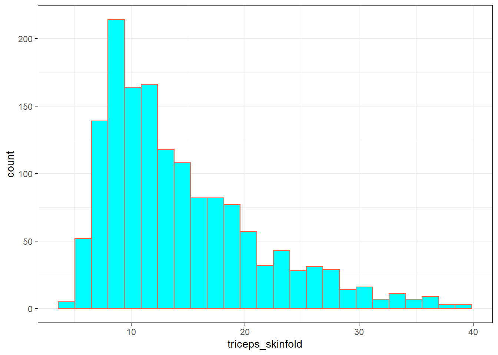
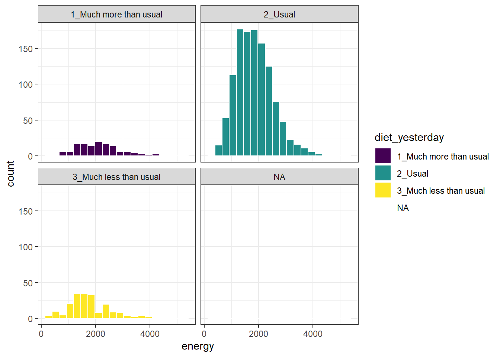
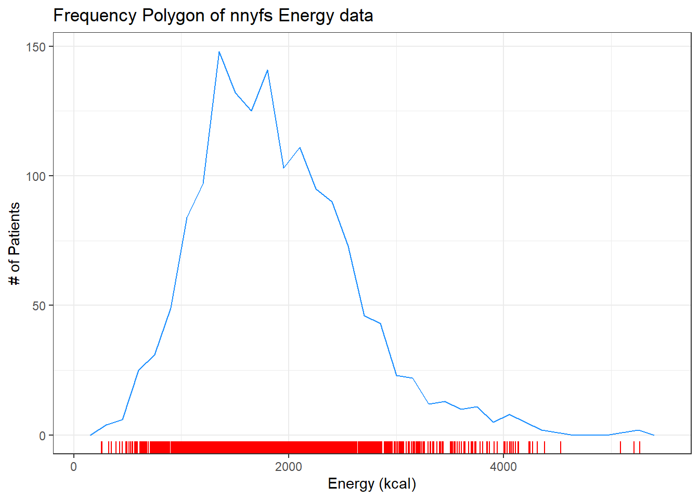

# National Youth Fitness Survey {#NYFS-Study}

The `nnyfs.csv` and the `nnyfs.Rds` data files were built by Professor Love using data from the [2012 National Youth Fitness Survey](http://www.cdc.gov/Nchs/Nnyfs.htm). 

> The NHANES National Youth Fitness Survey (NNYFS) was conducted in 2012 to collect data on physical activity and fitness levels in order to provide an evaluation of the health and fitness of children in the U.S. ages 3 to 15. The NNYFS collected data on physical activity and fitness levels of our youth through interviews and fitness tests.

In the `nnyfs` data file (either `.csv` or `.Rds`), I'm only providing a modest fraction of the available information. More on the NNYFS (including information I'm not using) is available at https://wwwn.cdc.gov/nchs/nhanes/search/nnyfs12.aspx.

The data elements I'm using fall into four main groups, or components:

- [Demographics](https://wwwn.cdc.gov/nchs/nhanes/search/nnyfsdata.aspx?Component=Demographics)
- [Dietary](https://wwwn.cdc.gov/nchs/nhanes/search/nnyfsdata.aspx?Component=Dietary)
- [Examination](http://wwwn.cdc.gov/nchs/nhanes/search/nnyfsdata.aspx?Component=Examination) and
- [Questionnaire](https://wwwn.cdc.gov/nchs/nhanes/search/nnyfsdata.aspx?Component=Questionnaire)

What I did was merge a few elements from each of the available components of the NHANES National Youth Fitness Survey, reformulated (and in some cases simplified) some variables, and restricted the sample to kids who had completed elements of each of the four components.

## The Variables included in `nnyfs`

This section tells you where the data come from, and briefly describe what is collected.

### From the [NNYFS Demographic Component](https://wwwn.cdc.gov/nchs/nhanes/search/nnyfsdata.aspx?Component=Demographics)

All of these come from the `Y_DEMO` file.

In `nnyfs` | In `Y_DEMO` | Description 
-------------: | ----------: | :--------------------------------------
`SEQN` | `SEQN` | Subject ID, connects all of the files
`sex` | `RIAGENDR` | Really, this is sex, not gender
`age_child` | `RIDAGEYR` | Age in years at screening
`race_eth` | `RIDRETH1` | Race/Hispanic origin (collapsed to 4 levels)
`educ_child` | `DMDEDUC3` | Education Level (for children ages 6-15). 0 = Kindergarten, 9 = Ninth grade or higher
`language` | `SIALANG` | Language in which the interview was conducted
`sampling_wt` | `WTMEC` | Full-sample MEC exam weight (for inference)
`income_pov` | `INDFMPIR` | Ratio of family income to poverty (ceiling is 5.0)
`age_adult` | `DMDHRAGE` | Age of adult who brought child to interview
`educ_adult` | `DMDHREDU` | Education level of adult who brought child

### From the [NNYFS Dietary Component](https://wwwn.cdc.gov/nchs/nhanes/search/nnyfsdata.aspx?Component=Dietary)

From the `Y_DR1TOT` file, we have a number of variables related to the child's diet, with the following summaries mostly describing consumption "yesterday" in a dietary recall questionnaire.

In `nnyfs` | In `Y_DR1TOT` | Description 
-------------: | ----------: | :-------------------------------------
`respondent` | `DR1MNRSP` | who responded to interview (child, Mom, someone else)
`salt_used` | `DBQ095Z` | uses salt, lite salt or salt substitute at the table
`energy` | `DR1TKCAL` | energy consumed (kcal)
`protein` | `DR1TPROT` | protein consumed (g)
`sugar` | `DR1TSUGR` | total sugar consumed (g)
`fat` | `DR1TTFAT` | total fat consumed (g)
`diet_yesterday` | `DR1_300` | compare food consumed yesterday to usual amount
`water` | `DR1_320Z` | total plain water drank (g)

### From the [NNYFS Examination Component](https://wwwn.cdc.gov/nchs/nhanes/search/nnyfsdata.aspx?Component=Examination)

From the `Y_BMX` file of Body Measures:

In `nnyfs` | In `Y_BMX` | Description 
-------------: | ----------: | :-------------------------------------
`height` | BMXHT | standing height (cm)
`weight` | BMXWT | weight (kg)
`bmi` | BMXBMI | body mass index ($kg/m^2$)
`bmi_cat` | BMDBMIC | BMI category (4 levels)
`arm_length` | BMXARML | Upper arm length (cm)
`waist` | BMXWAIST | Waist circumference (cm)
`arm_circ` | BMXARMC | Arm circumference (cm)
`calf_circ` | BMXCALF | Maximal calf circumference (cm)
`calf_skinfold` | BMXCALFF | Calf skinfold (mm)
`triceps_skinfold` | BMXTRI | Triceps skinfold (mm)
`subscapular_skinfold` | BMXSUB | Subscapular skinfold (mm)

From the `Y_PLX` file of Plank test results:

In `nnyfs` | In `Y_PLX` | Description 
-------------: | ----------: | :-------------------------------------
`plank_time` | MPXPLANK | # of seconds plank position is held

### From the [NNYFS Questionnaire Component](https://wwwn.cdc.gov/nchs/nhanes/search/nnyfsdata.aspx?Component=Questionnaire)

From the `Y_PAQ` file of Physical Activity questions:

In `nnyfs` | In `Y_PAQ` | Description 
-------------: | ----------: | :-------------------------------------
`active_days` | PAQ706 | Days physically active ($\geq 60$ min.) in past week
`tv_hours` | PAQ710 | Average hours watching TV/videos past 30d
`computer_hours` | PAQ715 | Average hours on computer past 30d
`physical_last_week` | PAQ722 | Any physical activity outside of school past week
`enjoy_recess` | PAQ750 | Enjoy participating in PE/recess

From the `Y_DBQ` file of Diet Behavior and Nutrition questions:

In `nnyfs` | In `Y_DBQ` | Description 
-------------: | ----------: | :--------------------------------------
`meals_out` | DBD895 | # meals not home-prepared in past 7 days

From the `Y_HIQ` file of Health Insurance questions:

In `nnyfs` | In `Y_HIQ` | Description 
-------------: | -----------: | :-------------------------------------
`insured` | HIQ011 | Covered by Health Insurance?
`insurance` | HIQ031 | Type of Health Insurance coverage

From the `Y_HUQ` file of Access to Care questions:

In `nnyfs` | In `Y_HUQ` | Description 
-------------: | ----------: | :-------------------------------------
`phys_health` | HUQ010 | General health condition (Excellent - Poor)
`access_to_care` | HUQ030 | Routine place to get care?
`care_source` | HUQ040 | Type of place most often goes to for care

From the `Y_MCQ` file of Medical Conditions questions:

In `nnyfs` | In `Y_MCQ` | Description 
-------------: | ----------: | :-------------------------------------
`asthma_ever` | MCQ010 | Ever told you have asthma?
`asthma_now` | MCQ035 | Still have asthma?

From the `Y_RXQ_RX` file of Prescription Medication questions:

In `nnyfs` | In `Y_RXQ_RX` | Description 
-------------: | ----------: | :-------------------------------------
`med_use` | RXDUSE | Taken prescription medication in last month?
`med_count` | RXDCOUNT | # of prescription meds taken in past month


## Looking over A Few Variables

Now, I'll take a look at the `nnyfs` data, which I've made available in a comma-separated version (`nnyfs.csv`), if you prefer, as well as in an R data set (`nnyfs.Rds`) which loads a bit faster. After loading the file, let's get a handle on its size and contents. In my R Project for these notes, the data are contained in a separate `data` subdirectory.


```r
nnyfs <- readRDS("data/nnyfs.Rds") %>% as_tibble()

## size of the tibble
dim(nnyfs)
```

```
[1] 1518   45
```

There are 1518 rows (subjects) and 45 columns (variables), by which I mean that there are 1518 kids in the `nnyfs` data frame, and we have 45 pieces of information on each subject. 
So, what do we have, exactly?


```r
nnyfs # this is a tibble, has some nice features in a print-out like this
```

```
# A tibble: 1,518 x 45
    SEQN sex    age_child race_eth       educ_child language
   <dbl> <chr>      <dbl> <chr>               <dbl> <chr>   
 1 71917 Female        15 3_Black Non-H~          9 English 
 2 71918 Female         8 3_Black Non-H~          2 English 
 3 71919 Female        14 2_White Non-H~          8 English 
 4 71920 Female        15 2_White Non-H~          8 English 
 5 71921 Male           3 2_White Non-H~         NA English 
 6 71922 Male          12 1_Hispanic              6 English 
 7 71923 Male          12 2_White Non-H~          5 English 
 8 71924 Female         8 4_Other Race/~          2 English 
 9 71925 Male           7 1_Hispanic              0 English 
10 71926 Male           8 3_Black Non-H~          2 English 
# ... with 1,508 more rows, and 39 more variables:
#   sampling_wt <dbl>, income_pov <dbl>, age_adult <dbl>,
#   educ_adult <chr>, respondent <chr>, salt_used <chr>,
#   energy <dbl>, protein <dbl>, sugar <dbl>, fat <dbl>,
#   diet_yesterday <chr>, water <dbl>, plank_time <dbl>,
#   height <dbl>, weight <dbl>, bmi <dbl>, bmi_cat <chr>,
#   arm_length <dbl>, waist <dbl>, arm_circ <dbl>, ...
```

Tibbles are a modern reimagining of the main way in which people have stored data in R, called a data frame. Tibbles were developed to keep what time has proven to be effective, and throwing out what is not. We can learn something about the structure of the tibble from such functions as `str` or `glimpse`.


```r
str(nnyfs)
```

```
tibble [1,518 x 45] (S3: tbl_df/tbl/data.frame)
 $ SEQN                : num [1:1518] 71917 71918 71919 71920 71921 ...
 $ sex                 : chr [1:1518] "Female" "Female" "Female" "Female" ...
 $ age_child           : num [1:1518] 15 8 14 15 3 12 12 8 7 8 ...
 $ race_eth            : chr [1:1518] "3_Black Non-Hispanic" "3_Black Non-Hispanic" "2_White Non-Hispanic" "2_White Non-Hispanic" ...
 $ educ_child          : num [1:1518] 9 2 8 8 NA 6 5 2 0 2 ...
 $ language            : chr [1:1518] "English" "English" "English" "English" ...
 $ sampling_wt         : num [1:1518] 28299 15127 29977 80652 55592 ...
 $ income_pov          : num [1:1518] 0.21 5 5 0.87 4.34 5 5 2.74 0.46 1.57 ...
 $ age_adult           : num [1:1518] 46 46 42 53 31 42 39 31 45 56 ...
 $ educ_adult          : chr [1:1518] "2_9-11th Grade" "3_High School Graduate" "5_College Graduate" "3_High School Graduate" ...
 $ respondent          : chr [1:1518] "Child" "Mom" "Child" "Child" ...
 $ salt_used           : chr [1:1518] "Yes" "Yes" "Yes" "Yes" ...
 $ energy              : num [1:1518] 2844 1725 2304 1114 1655 ...
 $ protein             : num [1:1518] 169.1 55.2 199.3 14 50.6 ...
 $ sugar               : num [1:1518] 128.2 118.7 81.4 119.2 90.3 ...
 $ fat                 : num [1:1518] 127.9 63.7 86.1 36 53.3 ...
 $ diet_yesterday      : chr [1:1518] "2_Usual" "2_Usual" "2_Usual" "2_Usual" ...
 $ water               : num [1:1518] 607 178 503 859 148 ...
 $ plank_time          : num [1:1518] NA 45 121 45 11 107 127 44 184 58 ...
 $ height              : num [1:1518] NA 131.6 172 167.1 90.2 ...
 $ weight              : num [1:1518] NA 38.6 58.7 92.5 12.4 66.4 56.7 22.2 20.9 28.3 ...
 $ bmi                 : num [1:1518] NA 22.3 19.8 33.1 15.2 25.9 22.5 14.4 15.9 17 ...
 $ bmi_cat             : chr [1:1518] NA "4_Obese" "2_Normal" "4_Obese" ...
 $ arm_length          : num [1:1518] NA 27.7 38.4 35.9 18.3 34.2 33 26.5 24.2 26 ...
 $ waist               : num [1:1518] NA 71.9 79.4 96.4 46.8 90 72.3 56.1 54.5 59.7 ...
 $ arm_circ            : num [1:1518] NA 25.4 26 37.9 15.1 29.5 27.9 17.6 17.7 19.9 ...
 $ calf_circ           : num [1:1518] NA 32.3 35.3 46.8 19.4 36.9 36.8 24 24.3 27.3 ...
 $ calf_skinfold       : num [1:1518] NA 22 18.4 NA 8.4 22 18.3 7 7.2 8.2 ...
 $ triceps_skinfold    : num [1:1518] NA 19.9 15 20.6 8.6 22.8 20.5 12.9 6.9 8.8 ...
 $ subscapular_skinfold: num [1:1518] NA 17.4 9.8 22.8 5.7 24.4 12.6 6.8 4.8 6.1 ...
 $ active_days         : num [1:1518] 3 5 3 3 7 2 5 3 7 7 ...
 $ tv_hours            : num [1:1518] 2 2 1 3 2 3 0 4 2 2 ...
 $ computer_hours      : num [1:1518] 1 2 3 3 0 1 0 3 1 1 ...
 $ physical_last_week  : chr [1:1518] "No" "No" "Yes" "Yes" ...
 $ enjoy_recess        : chr [1:1518] "1_Strongly Agree" "1_Strongly Agree" "3_Neither Agree nor Disagree" "2_Agree" ...
 $ meals_out           : num [1:1518] 0 2 3 2 1 1 2 1 0 2 ...
 $ insured             : chr [1:1518] "Has Insurance" "Has Insurance" "Has Insurance" "Has Insurance" ...
 $ phys_health         : chr [1:1518] "1_Excellent" "3_Good" "1_Excellent" "3_Good" ...
 $ access_to_care      : chr [1:1518] "Has Usual Care Source" "Has Usual Care Source" "Has Usual Care Source" "Has Usual Care Source" ...
 $ care_source         : chr [1:1518] "Clinic or Health Center" "Doctor's Office" "Doctor's Office" "Doctor's Office" ...
 $ asthma_ever         : chr [1:1518] "Never Had Asthma" "History of Asthma" "Never Had Asthma" "History of Asthma" ...
 $ asthma_now          : chr [1:1518] "No Asthma Now" "Asthma Now" "No Asthma Now" "Asthma Now" ...
 $ med_use             : chr [1:1518] "No Medications" "Had Medication" "No Medications" "Had Medication" ...
 $ med_count           : num [1:1518] 0 1 0 2 0 0 0 0 0 0 ...
 $ insurance           : chr [1:1518] "State Sponsored" "State Sponsored" "Private" "State Sponsored" ...
```

There are a lot of variables here. Let's run through the first few in a little detail.

### `SEQN`

The first variable, `SEQN` is just a (numerical) identifying code attributable to a given subject of the survey. This is *nominal* data, which will be of little interest down the line. On some occasions, as in this case, the ID numbers are sequential, in the sense that subject 71919 was included in the data base after subject 71918, but this fact isn't particularly interesting here, because the protocol remained unchanged throughout the study.

### `sex`

The second variable, `sex`, is listed as a character variable (R uses **factor** and **character** to refer to categorical, especially non-numeric information). Here, as we can see below, we have two levels,  *Female* and *Male*.


```r
nnyfs %>%
  tabyl(sex) %>%
  adorn_totals() %>%
  adorn_pct_formatting()
```

```
    sex    n percent
 Female  760   50.1%
   Male  758   49.9%
  Total 1518  100.0%
```

### `age_child`

The third variable, `age_child`, is the age of the child at the time of their screening to be in the study, measured in years. Note that age is a continuous concept, but the measure used here (number of full years alive) is a common discrete approach to measurement. Age, of course, has a meaningful zero point, so this can be thought of as a ratio variable; a child who is 6 is half as old as one who is 12. We can tabulate the observed values, since there are only a dozen or so.


```r
nnyfs %>% tabyl(age_child) %>%
  adorn_pct_formatting()
```

```
 age_child   n percent
         3 110    7.2%
         4 112    7.4%
         5 114    7.5%
         6 129    8.5%
         7 123    8.1%
         8 112    7.4%
         9  99    6.5%
        10 124    8.2%
        11 111    7.3%
        12 137    9.0%
        13 119    7.8%
        14 130    8.6%
        15  98    6.5%
```

At the time of initial screening, these children should have been between 3 and 15 years of age, so things look reasonable. Since this is a meaningful quantitative variable, we may be interested in a more descriptive summary.


```r
nnyfs %>% select(age_child) %>% 
  summary()
```

```
   age_child     
 Min.   : 3.000  
 1st Qu.: 6.000  
 Median : 9.000  
 Mean   : 9.033  
 3rd Qu.:12.000  
 Max.   :15.000  
```

These six numbers provide a nice, if incomplete, look at the ages.

* `Min.` = the minimum, or youngest age at the examination was 3 years old.
* `1st Qu.` = the first quartile (25th percentile) of the ages was 6. This means that 25 percent of the subjects were age 6 or less.
* `Median` = the second quartile (50th percentile) of the ages was 9. This is often used to describe the center of the data. Half of the subjects were age 9 or less.
* `3rd Qu.` = the third quartile (75th percentile) of the ages was 12
* `Max.` = the maximum, or oldest age at the examination was 15 years.

We could get the standard deviation and a count of missing and non-missing observations with `favstats` from the `mosaic` package.


```r
mosaic::favstats(~ age_child, data = nnyfs) %>%
  kable(digits = 1)
```


|   | min| Q1| median| Q3| max| mean|  sd|    n| missing|
|:--|---:|--:|------:|--:|---:|----:|---:|----:|-------:|
|   |   3|  6|      9| 12|  15|    9| 3.7| 1518|       0|

### `race_eth`

The fourth variable in the data set is `race_eth`, which is a multi-categorical variable describing the child's race and ethnicity.


```r
nnyfs %>% tabyl(race_eth) %>% 
  adorn_pct_formatting() %>%
  knitr::kable()
```


|race_eth               |   n|percent |
|:----------------------|---:|:-------|
|1_Hispanic             | 450|29.6%   |
|2_White Non-Hispanic   | 610|40.2%   |
|3_Black Non-Hispanic   | 338|22.3%   |
|4_Other Race/Ethnicity | 120|7.9%    |

And now, we get the idea of looking at whether our numerical summaries of the children's ages varies by their race/ethnicity...


```r
mosaic::favstats(age_child ~ race_eth, data = nnyfs)
```

```
                race_eth min   Q1 median Q3 max     mean
1             1_Hispanic   3 5.25    9.0 12  15 8.793333
2   2_White Non-Hispanic   3 6.00    9.0 12  15 9.137705
3   3_Black Non-Hispanic   3 6.00    9.0 12  15 9.038462
4 4_Other Race/Ethnicity   3 7.00    9.5 12  15 9.383333
        sd   n missing
1 3.733846 450       0
2 3.804421 610       0
3 3.576423 338       0
4 3.427970 120       0
```

### `income_pov`

Skipping down a bit, let's look at the family income as a multiple of the poverty level. Here's the summary.


```r
nnyfs %>% select(income_pov) %>% summary()
```

```
   income_pov   
 Min.   :0.000  
 1st Qu.:0.870  
 Median :1.740  
 Mean   :2.242  
 3rd Qu.:3.520  
 Max.   :5.000  
 NA's   :89     
```

We see there is some missing data here. Let's ignore that for the moment and concentrate on interpreting the results for the children with actual data. We should start with a picture.


```r
ggplot(nnyfs, aes(x = income_pov)) +
  geom_histogram(bins = 30, fill = "white", col = "blue")
```

```
Warning: Removed 89 rows containing non-finite values
(stat_bin).
```


The histogram shows us that the values are truncated at 5, so that children whose actual family income is above 5 times the poverty line are listed as 5. We also see a message reminding us that some of the data are missing for this variable.

Is there a relationship between `income_pov` and `race_eth` in these data?


```r
mosaic::favstats(income_pov ~ race_eth, data = nnyfs) %>%
  kable(digits = 1)
```


|race_eth               | min|  Q1| median|  Q3| max| mean|  sd|   n| missing|
|:----------------------|---:|---:|------:|---:|---:|----:|---:|---:|-------:|
|1_Hispanic             |   0| 0.6|    1.0| 1.7|   5|  1.3| 1.1| 409|      41|
|2_White Non-Hispanic   |   0| 1.5|    3.0| 4.5|   5|  2.9| 1.6| 588|      22|
|3_Black Non-Hispanic   |   0| 0.8|    1.6| 2.8|   5|  2.0| 1.5| 328|      10|
|4_Other Race/Ethnicity |   0| 1.2|    2.7| 4.6|   5|  2.8| 1.7| 104|      16|

This deserves a picture. Let's try a boxplot.


```r
ggplot(nnyfs, aes(x = race_eth, y = income_pov)) +
  geom_boxplot()
```

```
Warning: Removed 89 rows containing non-finite values
(stat_boxplot).
```


### `bmi`

Moving into the body measurement data, `bmi` is the body-mass index of the child. The BMI is a person's weight in kilograms divided by his or her height in meters squared. Symbolically, BMI = weight in kg / (height in m)^2^. This is a continuous concept, measured to as many decimal places as you like, and it has a meaningful zero point, so it's a ratio variable.


```r
nnyfs %>% select(bmi) %>% summary()
```

```
      bmi       
 Min.   :11.90  
 1st Qu.:15.90  
 Median :18.10  
 Mean   :19.63  
 3rd Qu.:21.90  
 Max.   :48.30  
 NA's   :4      
```

Why would a table of these BMI values not be a great idea, for these data? A hint is that R represents this variable as `num` or numeric in its depiction of the data structure, and this implies that R has some decimal values stored. Here, I'll use the `head()` function and the `tail()` function to show the first few and the last few values of what would prove to be a very long table of `bmi` values.


```r
nnyfs %>% tabyl(bmi) %>% 
  adorn_pct_formatting() %>% 
  head()
```

```
  bmi n percent valid_percent
 11.9 1    0.1%          0.1%
 12.6 1    0.1%          0.1%
 12.7 1    0.1%          0.1%
 12.9 1    0.1%          0.1%
 13.0 2    0.1%          0.1%
 13.1 1    0.1%          0.1%
```


```r
nnyfs %>% tabyl(bmi) %>% 
  adorn_pct_formatting() %>% 
  tail()
```

```
  bmi n percent valid_percent
 42.8 1    0.1%          0.1%
 43.0 1    0.1%          0.1%
 46.9 1    0.1%          0.1%
 48.2 1    0.1%          0.1%
 48.3 1    0.1%          0.1%
   NA 4    0.3%             -
```

### `bmi_cat`

Next I'll look at the `bmi_cat` information. This is a four-category ordinal variable, which divides the sample according to BMI into four groups. The BMI categories use sex-specific 2000 BMI-for-age (in months) growth charts prepared by the Centers for Disease Control for the US. We can get the breakdown from a table of the variable's values. 


```r
nnyfs %>% tabyl(bmi_cat) %>% adorn_pct_formatting()
```

```
       bmi_cat   n percent valid_percent
 1_Underweight  41    2.7%          2.7%
      2_Normal 920   60.6%         60.8%
  3_Overweight 258   17.0%         17.0%
       4_Obese 295   19.4%         19.5%
          <NA>   4    0.3%             -
```

In terms of percentiles by age and sex from the growth charts, the meanings of the categories are:

* Underweight (BMI < 5th percentile)
* Normal weight (BMI 5th to < 85th percentile)
* Overweight (BMI 85th to < 95th percentile)
* Obese (BMI $\geq$ 95th percentile) 

Note how I've used labels in the `bmi_cat` variable that include a number at the start so that the table results are sorted in a rational way. R sorts tables alphabetically, in general. We'll use the `forcats` package to work with categorical variables that we store as *factors* eventually, but for now, we'll keep things relatively simple.

Note that the `bmi_cat` data don't completely separate out the raw `bmi` data, because the calculation of percentiles requires different tables for each combination of `age` and `sex`.


```r
mosaic::favstats(bmi ~ bmi_cat, data = nnyfs) %>%
  kable(digits = 1)
```


|bmi_cat       |  min|   Q1| median|   Q3|  max| mean|  sd|   n| missing|
|:-------------|----:|----:|------:|----:|----:|----:|---:|---:|-------:|
|1_Underweight | 11.9| 13.4|   13.7| 15.0| 16.5| 14.1| 1.1|  41|       0|
|2_Normal      | 13.5| 15.4|   16.5| 18.7| 24.0| 17.2| 2.3| 920|       0|
|3_Overweight  | 16.9| 18.3|   21.4| 23.4| 27.9| 21.2| 2.9| 258|       0|
|4_Obese       | 17.9| 22.3|   26.2| 30.2| 48.3| 26.7| 5.7| 295|       0|

### `waist`

Let's also look briefly at `waist`, which is the circumference of the child's waist, in centimeters. Again, this is a numeric variable, so perhaps we'll stick to the simple summary, rather than obtaining a table of observed values.


```r
mosaic::favstats(~ waist, data = nnyfs) 
```

```
  min   Q1 median   Q3   max     mean       sd    n missing
 42.5 55.6   64.8 76.6 144.7 67.70536 15.19809 1512       6
```

Here's a histogram of the waist circumference data.


```r
ggplot(nnyfs, aes(x = waist)) +
  geom_histogram(bins = 25, fill = "tomato", color = "cyan")
```

```
Warning: Removed 6 rows containing non-finite values
(stat_bin).
```


### `triceps_skinfold`

The last variable I'll look at for now is `triceps_skinfold`, which is measured in millimeters. This is one of several common locations used for the assessment of body fat using skinfold calipers, and is a frequent part of growth assessments in children. Again, this is a numeric variable according to R.


```r
mosaic::favstats(~ triceps_skinfold, data = nnyfs)
```

```
 min  Q1 median Q3  max     mean       sd    n missing
   4 9.1   12.4 18 38.8 14.35725 6.758825 1497      21
```

And here's a histogram of the triceps skinfold data, with the fill and color flipped from what we saw in the plot of the waist circumference data a moment ago.


```r
ggplot(nnyfs, aes(x = triceps_skinfold)) +
  geom_histogram(bins = 25, fill = "cyan", color = "tomato")
```

```
Warning: Removed 21 rows containing non-finite values
(stat_bin).
```



OK. We've seen a few variables, and we'll move on now to look more seriously at the data.

## Additional Numeric Summaries

### The Five Number Summary, Quantiles and IQR

The **five number summary** is most famous when used to form a box plot - it's the minimum, 25th percentile, median, 75th percentile and maximum.  For numerical and integer variables, the `summary` function produces the five number summary, plus the mean, and a count of any missing values (NA's). 


```r
nnyfs %>% 
  select(waist, energy, sugar) %>%
  summary()
```

```
     waist            energy         sugar       
 Min.   : 42.50   Min.   : 257   Min.   :  1.00  
 1st Qu.: 55.60   1st Qu.:1368   1st Qu.: 82.66  
 Median : 64.80   Median :1794   Median :116.92  
 Mean   : 67.71   Mean   :1877   Mean   :124.32  
 3rd Qu.: 76.60   3rd Qu.:2306   3rd Qu.:157.05  
 Max.   :144.70   Max.   :5265   Max.   :405.49  
 NA's   :6                                       
```

As an alternative, we can use the `$` notation to indicate the variable we wish to study inside a data set, and we can use the `fivenum` function to get the five numbers used in developing a box plot. We'll focus for a little while on the number of kilocalories consumed by each child, according to the dietary recall questionnaire. That's the `energy` variable.


```r
fivenum(nnyfs$energy)
```

```
[1]  257.0 1367.0 1794.5 2306.0 5265.0
```

- As mentioned in \@ref(rangeandiqr), the **inter-quartile range**, or IQR, is sometimes used as a competitor for the standard deviation. It's the difference between the 75th percentile and the 25th percentile. The 25th percentile, median, and 75th percentile are referred to as the quartiles of the data set, because, together, they split the data into quarters.


```r
IQR(nnyfs$energy)
```

```
[1] 938.5
```

We can obtain **quantiles** (percentiles) as we like - here, I'm asking for the 1st and 99th:


```r
quantile(nnyfs$energy, probs=c(0.01, 0.99))
```

```
     1%     99% 
 566.85 4051.75 
```

## Additional Summaries from `favstats`

If we're focusing on a single variable, the `favstats` function in the `mosaic` package can be very helpful. Rather than calling up the entire `mosaic` library here, I'll just specify the function within the library.


```r
mosaic::favstats(~ energy, data = nnyfs)
```

```
 min     Q1 median   Q3  max     mean       sd    n missing
 257 1367.5 1794.5 2306 5265 1877.157 722.3537 1518       0
```

This adds three useful results to the base summary - the standard deviation, the sample size and the number of missing observations.

## The Histogram

Obtaining a basic **histogram** of, for example, the energy (kilocalories consumed) in the `nnyfs` data is pretty straightforward. 


```r
ggplot(data = nnyfs, aes(x = energy)) +
    geom_histogram(binwidth = 100, col = "white")
```


### Freedman-Diaconis Rule to select bin width

If we like, we can suggest a particular number of cells for the histogram, instead of accepting the defaults. In this case, we have $n$ = 1518 observations. The **Freedman-Diaconis rule** can be helpful here. That rule suggests that we set the bin-width to

\[
h = \frac{2*IQR}{n^{1/3}}
\]

so that the number of bins is equal to the range of the data set (maximum - minimum) divided by $h$. 

For the `energy` data in the `nnyfs` tibble, we have 

- IQR of 938.5, $n$ = 1518 and range = 5008
- Thus, by the Freedman-Diaconis rule, the optimal binwidth $h$ is 163.3203676, or, realistically, 163. 
- And so the number of bins would be 30.6636586, or, realistically 31.

Here, we'll draw the graph again, using the Freedman-Diaconis rule to identify the number of bins, and also play around a bit with the fill and color of the bars.


```r
bw <- 2 * IQR(nnyfs$energy) / length(nnyfs$energy)^(1/3)
ggplot(data = nnyfs, aes(x = energy)) +
    geom_histogram(binwidth=bw, color = "white", fill = "black")
```


This is a nice start, but it is by no means a finished graph. 

Let's improve the axis labels, add a title, and fill in the bars with a distinctive blue and use a black outline around each bar. I'll just use 25 bars, because I like how that looks in this case, and optimizing the number of bins is rarely important.


```r
ggplot(data = nnyfs, aes(x = energy)) +
    geom_histogram(bins=25, color = "black", fill = "dodgerblue") + 
    labs(title = "Histogram of Body-Mass Index Results in the nnyfs data",
         x = "Energy Consumed (kcal)", y = "# of Subjects")
```


### A Note on Colors

The simplest way to specify a color is with its name, enclosed in parentheses. My favorite list of R colors is http://www.stat.columbia.edu/~tzheng/files/Rcolor.pdf. In a pinch, you can usually find it by googling **Colors in R**. You can also type `colors()` in the R console to obtain a list of the names of the same 657 colors.

When using colors to make comparisons, you may be interested in using a scale that has some nice properties. The [viridis package vignette](https://cran.r-project.org/web/packages/viridis/vignettes/intro-to-viridis.html) describes four color scales (viridis, magma, plasma and inferno) that are designed to be colorful, robust to colorblindness and gray scale printing, and perceptually uniform, which means (as the package authors describe it) that values close to each other have similar-appearing colors and values far away from each other have more different-appearing colors, consistently across the range of values. We can apply these colors with special functions within `ggplot`. 

Here's a comparison of several histograms, looking at `energy` consumed as a function of whether yesterday was typical in terms of food consumption.


```r
ggplot(data = nnyfs, aes(x = energy, fill = diet_yesterday)) +
  geom_histogram(bins = 20, col = "white") +
  scale_fill_viridis_d() +
  facet_wrap(~ diet_yesterday)
```



We don't really need the legend here, and perhaps we should restrict the plot to participants who responded to the `diet_yesterday` question, and put in a title and better axis labels?


```r
nnyfs %>% filter(complete.cases(energy, diet_yesterday)) %>%
  ggplot(data = ., aes(x = energy, fill = diet_yesterday)) +
  geom_histogram(bins = 20, col = "white") +
  scale_fill_viridis_d() +
  guides(fill = "none") +
  facet_wrap(~ diet_yesterday) +
  labs(x = "Energy consumed, in kcal",
       title = "Energy Consumption and How Typical Was Yesterday's Eating",
       subtitle = "NHANES National Youth Fitness Survey, no survey weighting")
```


## The Frequency Polygon

As we've seen, we can also plot the distribution of a single continuous variable using the `freqpoly` geom. We can also add a *rug plot*, which places a small vertical line on the horizontal axis everywhere where an observation appears in the data.


```r
ggplot(data = nnyfs, aes(x = energy)) +
    geom_freqpoly(binwidth = 150, color = "dodgerblue") + 
    geom_rug(color = "red") +
    labs(title = "Frequency Polygon of nnyfs Energy data",
         x = "Energy (kcal)", y = "# of Patients")
```



## Plotting the Probability Density Function

We can also produce a density function, which has the effect of smoothing out the bumps in a histogram or frequency polygon, while also changing what is plotted on the y-axis.


```r
ggplot(data = nnyfs, aes(x = energy)) +
    geom_density(kernel = "gaussian", color = "dodgerblue") + 
    labs(title = "Density of nnyfs Energy data",
         x = "Energy (kcal)", y = "Probability Density function")
```


So, what's a density function?

- A probability density function is a function of a continuous variable, x, that represents the probability of x falling within a given range. Specifically, the integral over the interval (a,b) of the density function gives the probability that the value of x is within (a,b).
- If you're interested in exploring more on the notion of density functions for continuous (and discrete) random variables, some nice elementary material is available at [Khan Academy](https://www.khanacademy.org/math/statistics-probability/random-variables-stats-library/discrete-and-continuous-random-variables/v/probability-density-functions).

## The Boxplot

Sometimes, it's helpful to picture the five-number summary of the data in such a way as to get a general sense of the distribution. One approach is a **boxplot**, sometimes called a box-and-whisker plot.

### Drawing a Boxplot for One Variable in `ggplot2`

The `ggplot2` library easily handles comparison boxplots for multiple distributions, as we'll see in a moment. However, building a boxplot for a single distribution requires a little trickiness.


```r
ggplot(nnyfs, aes(x = 1, y = energy)) + 
    geom_boxplot(fill = "deepskyblue") + 
    coord_flip() + 
    labs(title = "Boxplot of Energy for kids in the NNYFS",
         y = "Energy (kcal)",
         x = "") +
    theme(axis.text.y = element_blank(),
          axis.ticks.y = element_blank())
```


### About the Boxplot

The boxplot is another John Tukey invention. 

- R draws the box (here in yellow) so that its edges of the box fall at the 25^th^ and 75^th^ percentiles of the data, and the thick line inside the box falls at the median (50^th^ percentile). 
- The whiskers then extend out to the largest and smallest values that are not classified by the plot as candidate *outliers*. 
- An outlier is an unusual point, far from the center of a distribution. 
- Note that I've used the `horizontal` option to show this boxplot in this direction. Most comparison boxplots, as we'll see below, are oriented vertically.

The boxplot's **whiskers** that are drawn from the first and third quartiles (i.e. the 25^th^ and 75^th^ percentiles) out to the most extreme points in the data that do not meet the standard of ``candidate outliers.'' An outlier is simply a point that is far away from the center of the data - which may be due to any number of reasons, and generally indicates a need for further investigation. 

Most software, including R, uses a standard proposed by Tukey which describes a ``candidate outlier'' as any point above the ***upper fence*** or below the ***lower fence***. The definitions of the fences are based on the inter-quartile range (IQR).

If IQR = 75th percentile - 25th percentile, then the upper fence is 75th percentile + 1.5 IQR, and the lower fence is 25th percentile - 1.5 IQR.

So for these `energy` data,

- the upper fence is located at 2306 + 1.5(938.5) = 3713.75
- the lower fence is located at 1367 - 1.5(938.5) = -40.75

In this case, we see no points identified as outliers in the low part of the distribution, but quite a few identified that way on the high side. This tends to identify about 5\% of the data as a candidate outlier, *if* the data follow a Normal distribution. 

- This plot is indicating clearly that there is some asymmetry (skew) in the data, specifically right skew.
- The standard R uses is to indicate as outliers any points that are more than 1.5 inter-quartile ranges away from the edges of the box. 

The horizontal orientation I've chosen here clarifies the relationship of direction of skew to the plot. A plot like this, with multiple outliers on the right side is indicative of a long right tail in the distribution, and hence, positive or right skew - with the mean being larger than the median. Other indications of skew include having one side of the box being substantially wider than the other, or one side of the whiskers being substantially longer than the other. More on skew later.

## A Simple Comparison Boxplot

Boxplots are most often used for comparison. We can build boxplots using `ggplot2`, as well, and we'll discuss that in detail later. For now, here's a boxplot built to compare the `energy` results by the subject's race/ethnicity.


```r
ggplot(nnyfs, aes(x = factor(race_eth), y = energy, fill=factor(race_eth))) +
  geom_boxplot() + 
  guides(fill = "none") +
  labs(y = "Energy consumed (kcal)", x = "Race/Ethnicity")
```


Let's look at the comparison of observed `energy` levels across the five categories in our `phys_health` variable, now making use of the `viridis` color scheme. 


```r
ggplot(nnyfs, aes(x = factor(phys_health), y = energy, fill = factor(phys_health))) +
  geom_boxplot() + 
  scale_fill_viridis_d() + 
  labs(title = "Energy by Self-Reported Physical Health, in nnyfs data")
```


As a graph, that's not bad, but what if we want to improve it further?

Let's turn the boxes in the horizontal direction, and get rid of the perhaps unnecessary `phys_health` labels.


```r
ggplot(nnyfs, aes(x = factor(phys_health), y = energy, fill = factor(phys_health))) +
    geom_boxplot() + 
    scale_fill_viridis_d() + 
    coord_flip() + 
    guides(fill = "none") +
    labs(title = "Energy Consumed by Self-Reported Physical Health", 
         subtitle = "NHANES National Youth Fitness Survey, unweighted", 
         x = "")
```


## Using `describe` in the `psych` library

For additional numerical summaries, one option would be to consider using the `describe` function from the `psych` library.


```r
psych::describe(nnyfs$energy)
```

```
   vars    n    mean     sd median trimmed    mad min  max
X1    1 1518 1877.16 722.35 1794.5  1827.1 678.29 257 5265
   range skew kurtosis    se
X1  5008  0.8     1.13 18.54
```

This package provides, in order, the following...

- `n` = the sample size
- `mean` = the sample mean
- `sd` = the sample standard deviation
- `median` = the median, or 50th percentile
- `trimmed` = mean of the middle 80\% of the data
- `mad` = median absolute deviation
- `min` = minimum value in the sample
- `max` = maximum value in the sample
- `range` = max - min
- `skew` = skewness measure, described below (indicates degree of asymmetry)
- `kurtosis` = kurtosis measure, described below (indicates heaviness of tails, degree of outlier-proneness)
- `se` = standard error of the sample mean = sd / square root of sample size, useful in inference

### The Trimmed Mean

The **trimmed mean** trim value in R indicates proportion of observations to be trimmed from each end of the outcome distribution before the mean is calculated. The `trimmed` value provided by the `psych::describe` package describes what this particular package calls a 20\% trimmed mean (bottom and top 10\% of `energy` values are removed before taking the mean - it's the mean of the middle 80\% of the data.) I might call that a 10\% trimmed mean in some settings, but that's just me.


```r
mean(nnyfs$energy, trim=.1) 
```

```
[1] 1827.1
```

### The Median Absolute Deviation

An alternative to the IQR that is fancier, and a bit more robust, is the **median absolute deviation**, which, in large sample sizes, for data that follow a Normal distribution, will be (in expectation) equal to the standard deviation. The MAD is the median of the absolute deviations from the median, multiplied by a constant (1.4826) to yield asymptotically normal consistency.


```r
mad(nnyfs$energy)
```

```
[1] 678.2895
```

## Assessing Skew

A relatively common idea is to assess **skewness**, several measures of which are available. Many models assume a Normal distribution, where, among other things, the data are symmetric around the mean. 

Skewness measures asymmetry in the distribution, where left skew (mean < median) is indicated by negative skewness values, while right skew (mean > median) is indicated by positive values. The skew value will be near zero for data that follow a symmetric distribution. 

### Non-parametric Skewness

A simpler measure of skew, sometimes called the **nonparametric skew** and closely related to Pearson's notion of median skewness, falls between -1 and +1 for any distribution. It is just the difference between the mean and the median, divided by the standard deviation. 

- Values greater than +0.2 are sometimes taken to indicate fairly substantial right skew, while values below -0.2 indicate fairly substantial left skew.


```r
(mean(nnyfs$energy) - median(nnyfs$energy))/sd(nnyfs$energy)
```

```
[1] 0.114427
```

[The Wikipedia page on skewness](https://en.wikipedia.org/wiki/Skewness), from which some of this material is derived, provides definitions for several other skewness measures.

## Assessing Kurtosis (Heavy-Tailedness)

Another measure of a distribution's shape that can be found in the `psych` library is the **kurtosis**. Kurtosis is an indicator of whether the distribution is heavy-tailed or light-tailed as compared to a Normal distribution. Positive kurtosis means more of the variance is due to outliers - unusual points far away from the mean relative to what we might expect from a Normally distributed data set with the same standard deviation.

- A Normal distribution will have a kurtosis value near 0, a distribution with similar tail behavior to what we would expect from a Normal is said to be *mesokurtic*
- Higher kurtosis values (meaningfully higher than 0) indicate that, as compared to a Normal distribution, the observed variance is more the result of extreme outliers (i.e. heavy tails) as opposed to being the result of more modest sized deviations from the mean. These heavy-tailed, or outlier prone, distributions are sometimes called *leptokurtic*.
- Kurtosis values meaningfully lower than 0 indicate light-tailed data, with fewer outliers than we'd expect in a Normal distribution. Such distributions are sometimes referred to as *platykurtic*, and include distributions without outliers, like the Uniform distribution.

Here's a table:

Fewer outliers than a Normal | Approximately Normal | More outliers than a Normal
:--------------------------: | :------------------: | :-------------------------:
Light-tailed | "Normalish" | Heavy-tailed
*platykurtic* (kurtosis < 0) | *mesokurtic* (kurtosis = 0) | *leptokurtic* (kurtosis > 0)


```r
psych::kurtosi(nnyfs$energy)
```

```
[1] 1.130539
```

Note that the `kurtosi()` function is strangely named, and is part of the `psych` package.

### The Standard Error of the Sample Mean

The **standard error** of the sample mean, which is the standard deviation divided by the square root of the sample size:


```r
sd(nnyfs$energy)/sqrt(length(nnyfs$energy))
```

```
[1] 18.54018
```


## The `describe` function in the `Hmisc` package

The `Hmisc` package has lots of useful functions. It's named for its main developer, Frank Harrell. The `describe` function in `Hmisc` knows enough to separate numerical from categorical variables, and give you separate (and detailed) summaries for each.

- For a categorical variable, it provides counts of total observations (n), the number of missing values, and the number of unique categories, along with counts and percentages falling in each category.
- For a numerical variable, it provides:
+ counts of total observations (n), the number of missing values, and the number of unique values
+ an Info value for the data, which indicates how continuous the variable is (a score of 1 is generally indicative of a completely continuous variable with no ties, while scores near 0 indicate lots of ties, and very few unique values)
+ the sample Mean
+ Gini's mean difference, which is a robust measure of spread, with larger values indicating greater dispersion in the data. It is defined as the mean absolute difference between any pairs of observations.
+ many sample percentiles (quantiles) of the data, specifically (5, 10, 25, 50, 75, 90, 95, 99)
+ either a complete table of all observed values, with counts and percentages (if there are a modest number of unique values), or
+ a table of the five smallest and five largest values in the data set, which is useful for range checking


```r
nnyfs %>% 
  select(waist, energy, bmi) %>%
  Hmisc::describe()
```

```
. 

 3  Variables      1518  Observations
------------------------------------------------------------
waist 
       n  missing distinct     Info     Mean      Gmd 
    1512        6      510        1    67.71     16.6 
     .05      .10      .25      .50      .75      .90 
   49.40    51.40    55.60    64.80    76.60    88.70 
     .95 
   96.84 

lowest :  42.5  43.4  44.1  44.4  44.5
highest: 125.8 126.0 127.0 132.3 144.7
------------------------------------------------------------
energy 
       n  missing distinct     Info     Mean      Gmd 
    1518        0     1137        1     1877    796.1 
     .05      .10      .25      .50      .75      .90 
     849     1047     1368     1794     2306     2795 
     .95 
    3195 

lowest :  257  260  326  349  392, highest: 4382 4529 5085 5215 5265
------------------------------------------------------------
bmi 
       n  missing distinct     Info     Mean      Gmd 
    1514        4      225        1    19.63    5.269 
     .05      .10      .25      .50      .75      .90 
   14.30    14.90    15.90    18.10    21.90    26.27 
     .95 
   30.20 

lowest : 11.9 12.6 12.7 12.9 13.0, highest: 42.8 43.0 46.9 48.2 48.3
------------------------------------------------------------
```

More on the `Info` value in Hmisc::describe is [available here](https://cran.r-project.org/web/packages/Hmisc/Hmisc.pdf#page=67)


## What Summaries to Report

It is usually helpful to focus on the shape, center and spread of a distribution. Bock, Velleman and DeVeaux provide some useful advice:
    
- If the data are skewed, report the median and IQR (or the three middle quantiles). You may want to include the mean and standard deviation, but you should point out why the mean and median differ. The fact that the mean and median do not agree is a sign that the distribution may be skewed. A histogram will help you make that point.
- If the data are symmetric, report the mean and standard deviation, and possibly the median and IQR as well.
- If there are clear outliers and you are reporting the mean and standard deviation, report them with the outliers present and with the outliers removed. The differences may be revealing. The median and IQR are not likely to be seriously affected by outliers.
