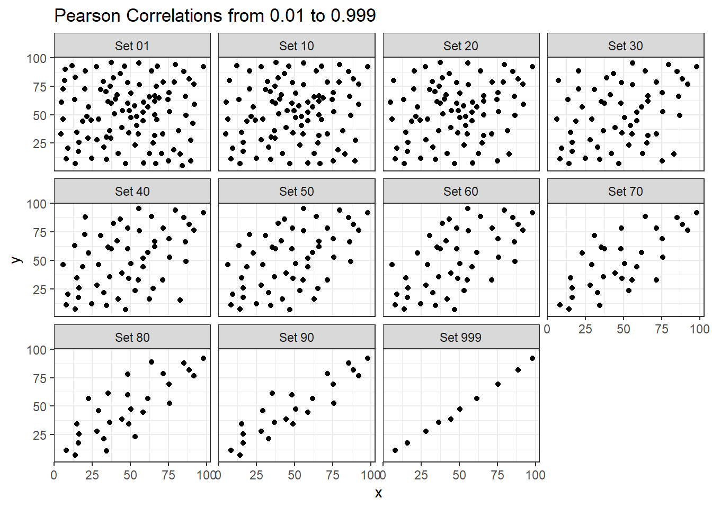

# Straight Line Models

## Assessing A Scatterplot

Let's consider the relationship of `protein` and `fat` consumption for children in the `nnyfs` data. 


```r
nnyfs <- read_rds("data/nnyfs.Rds")
```

We'll begin our investigation, as we always should, by drawing a relevant picture. For the association of two quantitative variables, a **scatterplot** is usually the right start. Each subject in the `nnyfs` data is represented by one of the points below. To the plot, I've also used `geom_smooth` to add a straight line regression model, which we'll discuss later.


```r
ggplot(data = nnyfs, aes(x = protein, y = fat)) +
    geom_point(shape = 1, size = 2, col = "sienna") +
    geom_smooth(method = "lm", formula = y ~ x, se = FALSE, col = "steelblue") +
    labs(title = "Protein vs. Fat consumption",
         subtitle = "Children in the NNYFS data, with fitted straight line regression model",
         x = "Protein (in g)", y = "Fat (in g)")
```


Here, I've arbitrarily decided to place `fat` on the vertical axis, and `protein` on the horizontal. Fitting a prediction model to this scatterplot will then require that we predict `fat` on the basis of `protein`. 

In this case, the pattern appears to be:

1. **direct**, or positive, in that the values of the $x$ variable (`protein`) increase, so do the values of the $y$ variable (`fat`). Essentially, it appears that subjects who consumed more protein also consumed more fat, but we don't know cause and effect here. 
2. fairly **linear** in that most of the points cluster around what appears to be a pattern which is well-fitted by a straight line.
3. moderately **strong** in that the range of values for `fat` associated with any particular value of `protein` is fairly tight. If we know someone's protein consumption, that should meaningfully improve our ability to predict their fat consumption, among the subjects in these data.
4. that we see some unusual or **outlier** values, further away from the general pattern of most subjects shown in the data.

### Highlighting an unusual point

Consider the subject with protein consumption close to 200 g, whose fat consumption is below 100 g. That's well below the prediction of the linear model for example. We can identify the subject because it is the only person with `protein` > 190 and `fat` < 100 with BMI > 35 and waist.circ < 70. So I'll create a subset of the `nnyfs` data containing the point that meets that standard, and then add a red point and a label to the plot.


```r
# identify outlier and place it in data frame s1 
s1 <- filter(nnyfs, protein > 190 & fat < 100)

ggplot(data = nnyfs, aes(x = protein, y = fat)) +
    geom_point(shape = 1, size = 2, col = "sienna") +
    geom_smooth(method = "lm", se = FALSE, formula = y ~ x, col = "steelblue") +
    geom_point(data = s1, size = 2, col = "red") +
    geom_text(data = s1, label = s1$SEQN, 
              vjust = -1, col = "red") +
    labs(title = "Protein vs. Fat consumption in NNYFS",
         subtitle = "with regression line, and an outlier labeled by SEQN",
         x = "Protein (in g)", y = "Fat (in g)")
```


While this subject is hardly the only unusual point in the data set, it is one of the more unusual ones, in terms of its vertical distance from the regression line. We can identify the subject by printing (part of) the tibble we created.


```r
s1 %>% select(SEQN, sex, race_eth, age_child, protein, fat) %>% kable()
```


|  SEQN|sex    |race_eth             | age_child| protein|   fat|
|-----:|:------|:--------------------|---------:|-------:|-----:|
| 71919|Female |2_White Non-Hispanic |        14|  199.33| 86.08|

Now, does it seem to you like a straight line model will describe this `protein`-`fat` relationship well?

### Adding a Scatterplot Smooth using loess

Next, we'll use the **loess** procedure to fit a smooth curve to the data, which attempts to capture the general pattern.


```r
ggplot(data = nnyfs, aes(x = protein, y = fat)) +
    geom_point(shape = 1, size = 2, col = "sienna") +
    geom_smooth(method = "loess", se = FALSE, formula = y ~ x, col = "red") +
    geom_smooth(method = "lm", se = FALSE, formula = y ~ x, col = "steelblue") +
    labs(title = "Protein vs. Fat consumption in NNYFS",
         subtitle = "with loess smooth (red) and linear fit (blue)",
         x = "Protein (in g)", y = "Fat (in g)")
```


This "loess" smooth curve is fairly close to the straight line fit, indicating that perhaps a linear regression model might fit the data well. 

A **loess smooth** is a method of fitting a local polynomial regression model that R uses as its default smooth for scatterplots with fewer than 1000 observations. Think of the loess as a way of fitting a curve to data by tracking (at point x) the points within a neighborhood of point x, with more emphasis given to points near x. It can be adjusted by tweaking two specific parameters, in particular:

- a `span` parameter (defaults to 0.75) which is also called $\alpha$ in the literature, that controls the degree of smoothing (essentially, how large the neighborhood should be), and
- a `degree` parameter (defaults to 2) which specifies the degree of polynomial to be used. Normally, this is either 1 or 2 - more complex functions are rarely needed for simple scatterplot smoothing.

In addition to the curve, smoothing procedures can also provide confidence intervals around their main fitted line. Consider the following plot, which adjusts the span and also adds in the confidence intervals.


```r
p1 <- ggplot(data = nnyfs, aes(x = protein, y = fat)) +
    geom_point(shape = 1, size = 2, col = "sienna") +
    geom_smooth(method = "loess", span = 0.75, se = TRUE, 
                col = "red", formula = y ~ x) +
    labs(title = "loess smooth (span = 0.75)",
         x = "Protein (in g)", y = "Fat (in g)")

p2 <- ggplot(data = nnyfs, aes(x = protein, y = fat)) +
    geom_point(shape = 1, size = 2, col = "sienna") +
    geom_smooth(method = "loess", span = 0.2, se = TRUE, 
                col = "red", formula = y ~ x) +
    labs(title = "loess smooth (span = 0.2)",
         x = "Protein (in g)", y = "Fat (in g)")

p1 + p2 + 
    plot_annotation(title = "Impact of adjusting loess smooth span: NNYFS")
```


By reducing the size of the span, the plot on the right shows a somewhat less "smooth" function than the plot on the left. 

### What Line Does R Fit?

Returning to the linear regression model, how can we, mathematically, characterize that line? As with any straight line, our model equation requires us to specify two parameters: a slope and an intercept (sometimes called the y-intercept.)

To identify the equation R used to fit this line (using the method of least squares), we use the `lm` command


```r
lm(fat ~ protein, data = nnyfs)
```

```

Call:
lm(formula = fat ~ protein, data = nnyfs)

Coefficients:
(Intercept)      protein  
    18.8945       0.7251  
```

So the fitted line is specified as

$$
\mbox{fat} = 18.8945 + 0.7251 \mbox{ protein }
$$

A detailed summary of the fitted linear regression model is also available.


```r
summary(lm(fat ~ protein, data = nnyfs))
```

```

Call:
lm(formula = fat ~ protein, data = nnyfs)

Residuals:
    Min      1Q  Median      3Q     Max 
-77.798 -14.841  -2.449  13.601 110.597 

Coefficients:
            Estimate Std. Error t value Pr(>|t|)    
(Intercept)  18.8945     1.5330   12.32   <2e-16 ***
protein       0.7251     0.0208   34.87   <2e-16 ***
---
Signif. codes:  
0 '***' 0.001 '**' 0.01 '*' 0.05 '.' 0.1 ' ' 1

Residual standard error: 25.08 on 1516 degrees of freedom
Multiple R-squared:  0.4451,	Adjusted R-squared:  0.4447 
F-statistic:  1216 on 1 and 1516 DF,  p-value: < 2.2e-16
```

The way we'll usually summarize the estimated coefficients of a linear model is to use the `broom` package's `tidy` function to put the coefficient estimates into a tibble.


```r
tidy(lm(fat ~ protein, data = nnyfs),
            conf.int = TRUE, conf.level = 0.95) %>%
    kable(digits = 3)
```


|term        | estimate| std.error| statistic| p.value| conf.low| conf.high|
|:-----------|--------:|---------:|---------:|-------:|--------:|---------:|
|(Intercept) |   18.895|     1.533|    12.325|       0|   15.887|    21.902|
|protein     |    0.725|     0.021|    34.868|       0|    0.684|     0.766|

We can also summarize the quality of fit in a linear model using the `broom` package's `glance` function. For now, we'll focus our attention on just one of the many summaries available for a linear model from `glance`: the R-squared value.


```r
glance(lm(fat ~ protein, data = nnyfs)) %>% select(r.squared) %>%
    kable(digits = 3)
```


| r.squared|
|---------:|
|     0.445|

We'll spend a lot of time working with these regression summaries in this course.

For now, it will suffice to understand the following:
    
- The outcome variable in this model is **fat**, and the predictor variable is **protein**.
- The straight line model for these data fitted by least squares is `fat` = 18.9 + 0.725 `protein`
- The slope of `protein` is positive, which indicates that as `protein` increases, we expect that `fat` will also increase. Specifically, we expect that for every additional gram of protein consumed, the fat consumption will be 0.725 gram larger.
- The multiple R-squared (squared correlation coefficient) is 0.445, which implies that 44.5% of the variation in `fat` is explained using this linear model with `protein`. 
- This also implies that the Pearson correlation between `fat` and `protein` is the square root of 0.445, or 0.667. More on the Pearson correlation soon.

So, if we plan to use a simple (least squares) linear regression model to describe fat consumption as a function of protein consumption in the NNYFS data, does it look like a least squares (or linear regression) model will be an effective choice?

## Correlation Coefficients

Two different correlation measures are worth our immediate attention. 

- The one most often used is called the *Pearson* correlation coefficient, and is symbolized with the letter r or sometimes the Greek letter rho ($\rho$).
- Another tool is the Spearman rank correlation coefficient, also occasionally symbolized by $\rho$.

For the `nnyfs` data, the Pearson correlation of `fat` and `protein` can be found using the `cor()` function. 


```r
nnyfs %$% cor(fat, protein)
```

```
[1] 0.6671209
```

Note that the correlation of any variable with itself is 1, and that the correlation of `fat` with `protein` is the same regardless of whether you enter `fat` first or `protein` first.

## The Pearson Correlation Coefficient

Suppose we have $n$ observations on two variables, called X and Y. The Pearson correlation coefficient assesses how well the relationship between X and Y can be described using a linear function. 

- The Pearson correlation is **dimension-free**. 
- It falls between -1 and +1, with the extremes corresponding to situations where all the points in a scatterplot fall exactly on a straight line with negative and positive slopes, respectively. 
- A Pearson correlation of zero corresponds to the situation where there is no linear association.
- Unlike the estimated slope in a regression line, the sample correlation coefficient is symmetric in X and Y, so it does not depend on labeling one of them (Y) the response variable, and one of them (X) the predictor.

Suppose we have $n$ observations on two variables, called $X$ and $Y$, where $\bar{X}$ is the sample mean of $X$ and $s_x$ is the standard deviation of $X$. The **Pearson** correlation coefficient $r_{XY}$ is:
    
$$
r_{XY} = \frac{1}{n-1} \sum\limits_{i=1}^n (\frac{x_i - \bar{x}}{s_x}) (\frac{y_i - \bar{y}}{s_y}) 
$$

## Studying Correlation through 6 Examples

The `correx1` data file contains six different sets of (x,y) points, identified by the `set` variable.


```r
correx1 <- read_csv("data/correx1.csv") 
```

```
Rows: 277 Columns: 3
```

```
-- Column specification ------------------------------------
Delimiter: ","
chr (1): set
dbl (2): x, y
```

```

i Use `spec()` to retrieve the full column specification for this data.
i Specify the column types or set `show_col_types = FALSE` to quiet this message.
```

```r
summary(correx1)
```

```
     set                  x                y         
 Length:277         Min.   : 5.897   Min.   : 7.308  
 Class :character   1st Qu.:29.487   1st Qu.:30.385  
 Mode  :character   Median :46.154   Median :46.923  
                    Mean   :46.529   Mean   :49.061  
                    3rd Qu.:63.333   3rd Qu.:68.077  
                    Max.   :98.205   Max.   :95.385  
```

### Data Set Alex

Let's start by working with the **Alex** data set.


```r
ggplot(filter(correx1, set == "Alex"), aes(x = x, y = y)) + 
    geom_point() +
    labs(title = "correx1: Data Set Alex")
```


```r
ggplot(filter(correx1, set == "Alex"), aes(x = x, y = y)) + 
    geom_point() +
    geom_smooth(method = "loess", formula = y ~ x, col = "blue") +
    labs(title = "correx1: Alex, with loess smooth")
```


```r
setA <- filter(correx1, set == "Alex")

ggplot(setA, aes(x = x, y = y)) + 
    geom_point() +
    geom_smooth(method = "lm", formula = y ~ x, col = "red") +
    labs(title = "correx1: Alex, with Fitted Linear Model") +
    annotate("text", x = 75, y = 75, col = "purple", size = 6,
             label = paste("Pearson r = ", signif(cor(setA$x, setA$y),3))) +
    annotate("text", x = 50, y = 15,  col = "red", size = 5,
             label = paste("y = ", signif(coef(lm(setA$y ~ setA$x))[1],3), 
                           signif(coef(lm(setA$y ~ setA$x))[2],2), "x"))
```


### Data Set Bonnie


```r
setB <- dplyr::filter(correx1, set == "Bonnie")

ggplot(setB, aes(x = x, y = y)) + 
    geom_point() +
    labs(title = "correx1: Data Set Bonnie")
```


```r
ggplot(setB, aes(x = x, y = y)) + 
    geom_point() +
    geom_smooth(method = "lm", formula = y ~ x, col = "red") +
    labs(title = "correx1: Bonnie, with Fitted Linear Model") +
    annotate("text", x = 25, y = 65, col = "purple", size = 6,
             label = paste("Pearson r = ", signif(cor(setB$x, setB$y),2))) +
    annotate("text", x = 50, y = 15,  col = "red", size = 5,
             label = paste("y = ", signif(coef(lm(setB$y ~ setB$x))[1],3), 
                           " + ",
                           signif(coef(lm(setB$y ~ setB$x))[2],2), "x"))
```


### Correlations for All Six Data Sets in the Correx1 Example

Let's look at the Pearson correlations associated with each of the six data sets contained in the `correx1` example.


```r
tab1 <- correx1 %>%
    group_by(set) %>%
    summarise("Pearson r" = round(cor(x, y, use="complete"),2))

knitr::kable(tab1)
```


|set      | Pearson r|
|:--------|---------:|
|Alex     |     -0.97|
|Bonnie   |      0.80|
|Colin    |     -0.80|
|Danielle |      0.00|
|Earl     |     -0.01|
|Fiona    |      0.00|


### Data Set Colin

It looks like the picture for Colin should be very similar (in terms of scatter) to the picture for Bonnie, except that Colin will have a negative slope, rather than the positive one Bonnie has. Is that how this plays out?
    

```r
setBC <- filter(correx1, set == "Bonnie" | set == "Colin")

ggplot(setBC, aes(x = x, y = y)) + 
    geom_point() +
    geom_smooth(method = "lm", formula = y ~ x, col = "red") +
    facet_wrap(~ set)
```


Uh, oh. It looks like the point in Colin at the top right is twisting what would otherwise be a very straight regression model with an extremely strong negative correlation. There's no better way to look for outliers than to examine the scatterplot.

### Draw the Picture!

We've seen that Danielle, Earl and Fiona all show Pearson correlations of essentially zero. However, the three data sets look very different in a scatterplot.


```r
ggplot(correx1, aes(x = x, y = y)) +
    geom_point() +
    geom_smooth(method = "loess", formula = y ~ x) +
    facet_wrap(~ set)
```


When we learn that the correlation is zero, we tend to assume we have a picture like the Danielle data set. If Danielle were our real data, we might well think that x would be of little use in predicting y. 

- But what if our data looked like Earl? In the Earl data set, x is incredibly helpful in predicting y, but we can't use a straight line model - instead, we need a non-linear modeling approach.
- You'll recall that the Fiona data set also had a Pearson correlation of zero. But here, the picture is rather more interesting.

So, remember, draw the appropriate scatterplot whenever you make use of a correlation coefficient.
    

```r
rm(setA, setB, setBC, tab1)
```

## Estimating Correlation from Scatterplots

The correx2 data set is designed to help you calibrate yourself a bit in terms of estimating a correlation from a scatterplot. There are 11 data sets buried within the correx2 example, and they are labeled by their Pearson correlation coefficients, ranging from r = 0.01 to r = 0.999


```r
correx2 <- read_csv("data/correx2.csv")
```

```
Rows: 582 Columns: 4
```

```
-- Column specification ------------------------------------
Delimiter: ","
chr (1): set
dbl (3): x, y, group
```

```

i Use `spec()` to retrieve the full column specification for this data.
i Specify the column types or set `show_col_types = FALSE` to quiet this message.
```

```r
correx2 %>%
    group_by(set) %>%
    summarise(cor = round(cor(x, y, use="complete"),3))
```

```
# A tibble: 11 x 2
   set       cor
   <chr>   <dbl>
 1 Set 01  0.01 
 2 Set 10  0.102
 3 Set 20  0.202
 4 Set 30  0.301
 5 Set 40  0.403
 6 Set 50  0.499
 7 Set 60  0.603
 8 Set 70  0.702
 9 Set 80  0.799
10 Set 90  0.902
11 Set 999 0.999
```

Here is a plot of the 11 data sets, showing the increase in correlation from 0.01 (in Set 01) to 0.999 (in Set 999).


```r
ggplot(correx2, aes(x = x, y = y)) +
    geom_point() + 
    facet_wrap(~ set) +
    labs(title = "Pearson Correlations from 0.01 to 0.999")
```



Note that R will allow you to fit a straight line model to any of these relationships, no matter how appropriate it might be to do so.


```r
ggplot(correx2, aes(x = x, y = y)) +
    geom_point() + 
    geom_smooth(method = "lm", formula = y ~ x, col = "red") +
    facet_wrap(~ set) +
    labs(title = "R will fit a straight line to anything.")
```


```r
ggplot(correx2, aes(x = x, y = y)) +
    geom_point() + 
    geom_smooth(col = "blue") +
    facet_wrap(~ set) +
    labs(title = "Even if a loess smooth suggests non-linearity.")
```


```r
ggplot(correx2, aes(x = x, y = y, color = factor(group))) +
    geom_point() + 
    guides(color = "none") +
    facet_wrap(~ set) +
    labs(title = "Note: The same 10 points (in red) are in each plot.")
```


Note that the same 10 points are used in each of the data sets. It's always possible that a lurking subgroup of the data within a scatterplot follows a very strong linear relationship. This is why it's so important (and difficult) not to go searching for such a thing without a strong foundation of logic, theory and prior empirical evidence.


## The Spearman Rank Correlation

The Spearman rank correlation coefficient is a rank-based measure of statistical dependence that assesses how well the relationship between X and Y can be described using a **monotone function** even if that relationship is not linear. 

- A monotone function preserves order, that is, Y must either be strictly increasing as X increases, or strictly decreasing as X increases.
- A Spearman correlation of 1.0 indicates simply that as X increases, Y always increases.
- Like the Pearson correlation, the Spearman correlation is dimension-free, and falls between -1 and +1.
- A positive Spearman correlation corresponds to an increasing (but not necessarily linear) association between X and Y, while a negative Spearman correlation corresponds to a decreasing (but again not necessarily linear) association.

### Spearman Formula

To calculate the Spearman rank correlation, we take the ranks of the X and Y data, and then apply the usual Pearson correlation. To find the ranks, sort X and Y into ascending order, and then number them from 1 (smallest) to n (largest). In the event of a tie, assign the average rank to the tied subjects.

### Comparing Pearson and Spearman Correlations

Let's look at the `nnyfs` data again.


```r
nnyfs %$% cor(fat, protein)
```

```
[1] 0.6671209
```

```r
nnyfs %$% cor(fat, protein, method = "spearman")
```

```
[1] 0.6577489
```

The Spearman and Pearson correlations are not especially different in this case.

### Spearman vs. Pearson Example 1

The next few plots describe relationships where we anticipate the Pearson and Spearman correlations might differ in their conclusions. 


```r
spear1 <- read_csv("data/spear1.csv")
```

```
Rows: 22 Columns: 2
```

```
-- Column specification ------------------------------------
Delimiter: ","
dbl (2): x, y
```

```

i Use `spec()` to retrieve the full column specification for this data.
i Specify the column types or set `show_col_types = FALSE` to quiet this message.
```

```r
spear2 <- read_csv("data/spear2.csv")
```

```
Rows: 90 Columns: 2
```

```
-- Column specification ------------------------------------
Delimiter: ","
dbl (2): x, y
```

```

i Use `spec()` to retrieve the full column specification for this data.
i Specify the column types or set `show_col_types = FALSE` to quiet this message.
```

```r
spear3 <- read_csv("data/spear3.csv")
```

```
Rows: 55 Columns: 2
```

```
-- Column specification ------------------------------------
Delimiter: ","
dbl (2): x, y
```

```

i Use `spec()` to retrieve the full column specification for this data.
i Specify the column types or set `show_col_types = FALSE` to quiet this message.
```

```r
spear4 <- read_csv("data/spear4.csv")
```

```
Rows: 15 Columns: 2
```

```
-- Column specification ------------------------------------
Delimiter: ","
dbl (2): x, y
```

```

i Use `spec()` to retrieve the full column specification for this data.
i Specify the column types or set `show_col_types = FALSE` to quiet this message.
```

```r
# these are just toy examples with
# two columns per data set and no row numbering
```

Example 1 shows a function where the Pearson correlation is 0.925 (a strong but not perfect linear relation), but the Spearman correlation is 1 because the relationship is monotone, even though it is not perfectly linear. 


```r
ggplot(spear1, aes(x = x, y = y)) + 
    geom_point() +
    labs(title = "Spearman vs. Pearson, Example 1") +
    annotate("text", x = -10, y = 20, 
             label = paste("Pearson r = ", 
                 signif(cor(spear1$x, spear1$y),2),
                 ", Spearman r = ", 
                 signif(cor(spear1$x, spear1$y, method = "spearman"),2)))
```


So, a positive Spearman correlation corresponds to an increasing (but not necessarily linear) association between x and y.


### Spearman vs. Pearson Example 2

Example 2 shows that a negative Spearman correlation corresponds to a decreasing (but, again, not necessarily linear) association between x and y.


```r
ggplot(spear2, aes(x = x, y = y)) + 
    geom_point(col = "purple") +
    geom_smooth(method = "loess", formula = y ~ x, se = FALSE) +
    labs(title = "Spearman vs. Pearson, Example 2") +
    annotate("text", x = 10, y = 20, col = "purple",
             label = paste("Pearson r = ", 
                    signif(cor(spear2$x, spear2$y),2),
                    ", Spearman r = ", 
                    signif(cor(spear2$x, spear2$y, method = "spearman"),2)))
```


### Spearman vs. Pearson Example 3

The Spearman correlation is less sensitive than the Pearson correlation is to strong outliers that are unusual on either the X or Y axis, or both. That is because the Spearman rank coefficient limits the outlier to the value of its rank. 

In Example 3, for instance, the Spearman correlation reacts much less to the outliers around X = 12 than does the Pearson correlation. 


```r
ggplot(spear3, aes(x = x, y = y)) + 
    geom_point(col = "blue") +
    labs(title = "Spearman vs. Pearson, Example 3") +
    annotate("text", x = 5, y = -15, col = "blue",
             label = paste("Pearson r = ", 
                signif(cor(spear3$x, spear3$y),2),
                ", Spearman r = ", 
                signif(cor(spear3$x, spear3$y, method = "spearman"),2)))
```


### Spearman vs. Pearson Example 4

The use of a Spearman correlation is no substitute for looking at the data. For non-monotone data like what we see in Example 4, neither the Spearman nor the Pearson correlation alone provides much guidance, and just because they are (essentially) telling you the same thing, that doesn't mean what they're telling you is all that helpful.


```r
ggplot(spear4, aes(x = x, y = y)) +
    geom_point(col = "purple") +
    geom_smooth(method = "loess", formula = y ~ x, se = FALSE) +
    labs(title = "Spearman vs. Pearson, Example 4") +
    annotate("text", x = 10, y = 20, col = "purple",
             label = paste("Pearson r = ", 
                 signif(cor(spear4$x, spear4$y),2),
                 ", Spearman r = ", 
                 signif(cor(spear4$x, spear4$y, method = "spearman"),2)))
```


