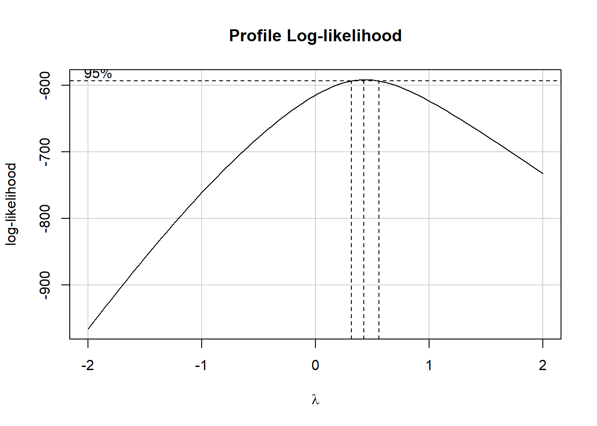
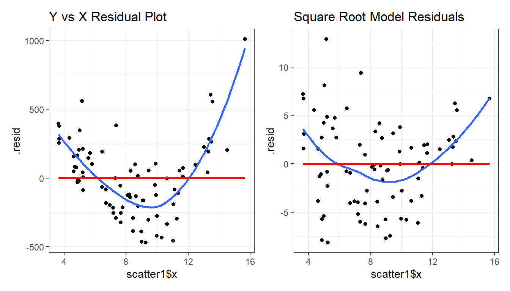
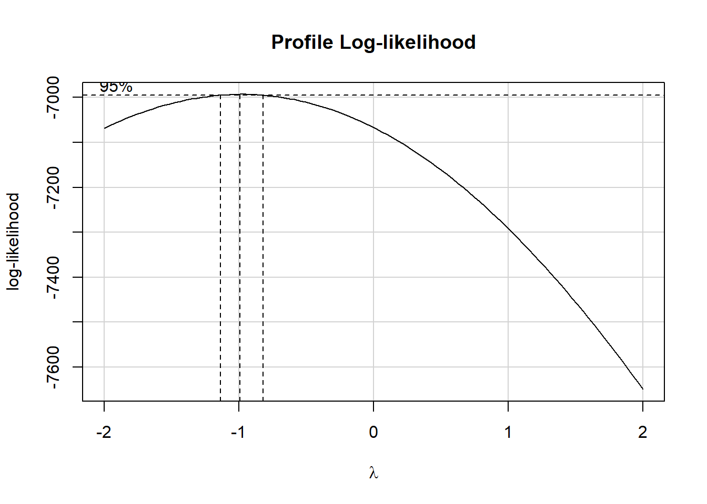

# Linearizing Transformations

## "Linearize" The Association between Quantitative Variables

Confronted with a scatterplot describing a monotone association between two quantitative variables, we may decide the data are not well approximated by a straight line, and thus, that a least squares regression may not be not sufficiently useful. In these circumstances, we have at least two options, which are not mutually exclusive:

a.	Let the data be as they may, and summarize the scatterplot using tools like loess curves, polynomial functions, or cubic splines to model the relationship.
b.	Consider re-expressing the data (often we start with re-expressions of the outcome data [the Y variable]) using a transformation so that the transformed data may be modeled effectively using a straight line. 

## The Box-Cox Plot

As before, Tukey's ladder of power transformations can guide our exploration. 

Power ($\lambda$) | -2 | -1 | -1/2 | 0 | 1/2 | 1 | 2 
:-:| :-:| :-:| :-:| :-:| :-:| :-:| :-:
Transformation | 1/y^2^ | 1/y | 1/$\sqrt{y}$ | log y | $\sqrt{y}$ | y | y^2^

The **Box-Cox plot**, from the `boxCox` function in the `car` package, sifts through the ladder of options to suggest a transformation (for Y) to best linearize the outcome-predictor(s) relationship.

### A Few Caveats

1. These methods work well with *monotone* data, where a smooth function of Y is either strictly increasing, or strictly decreasing, as X increases.
2. Some of these transformations require the data to be positive. We can rescale the Y data by adding a constant to every observation in a data set without changing shape.
3. We can use a natural logarithm (`log` in R), a base 10 logarithm (`log10`) or even sometimes a base 2 logarithm (`log2`) to good effect in Tukey's ladder. All affect the association's shape in the same way, so we'll stick with `log` (base e).
4. Some re-expressions don't lead to easily interpretable results. Not many things that make sense in their original units also make sense in inverse square roots. There are times when we won't care, but often, we will.
5. If our primary interest is in making predictions, we'll generally be more interested in getting good predictions back on the original scale, and we can back-transform the point and interval estimates to accomplish this.

## A Simulated Example


```r
set.seed(999); x.rand <- rbeta(80, 2, 5) * 20 + 3
set.seed(1000); y.rand <- abs(50 + 0.75*x.rand^(3) - 0.65*x.rand + rnorm(80, 0, 200))
scatter1 <- data_frame(x = x.rand, y = y.rand) 
```

```
Warning: `data_frame()` was deprecated in tibble 1.1.0.
Please use `tibble()` instead.
This warning is displayed once every 8 hours.
Call `lifecycle::last_lifecycle_warnings()` to see where this warning was generated.
```

```r
rm(x.rand, y.rand)

ggplot(scatter1, aes(x = x, y = y)) +
    geom_point(shape = 1, size = 3) +
    ## add loess smooth
    geom_smooth(method = "loess", se = FALSE, 
                col = "dodgerblue", formula = y ~ x) +
    ## then add linear fit
    geom_smooth(method = "lm", se = FALSE, 
                col = "red", formula = y ~ x, linetype = "dashed") +
    labs(title = "Simulated scatter1 example: Y vs. X")
```


Having simulated data that produces a curved scatterplot, I will now use the Box-Cox plot to lead my choice of an appropriate power transformation for Y in order to "linearize" the association of Y and X.


```r
library(car)
boxCox(scatter1$y ~ scatter1$x) 
```



```r
powerTransform(scatter1$y ~ scatter1$x)
```

```
Estimated transformation parameter 
       Y1 
0.4368753 
```

The Box-Cox plot peaks at the value $\lambda$ = 0.44, which is pretty close to $\lambda$ = 0.5. Now, 0.44 isn't on Tukey's ladder, but 0.5 is. 

Power ($\lambda$) | -2 | -1 | -1/2 | 0 | 1/2 | 1 | 2 
:-:| :-:| :-:| :-:| :-:| :-:| :-:| :-:
Transformation | 1/y^2^ | 1/y | 1/$\sqrt{y}$ | log y | $\sqrt{y}$ | y | y^2^

If we use $\lambda$ = 0.5, on Tukey's ladder of power transformations, it suggests we look at the relationship between the square root of Y and X, as shown next.


```r
p1 <- ggplot(scatter1, aes(x = x, y = y)) +
    geom_point(size = 2) +
    geom_smooth(method = "loess", se = FALSE, 
                formula = y ~ x, col = "dodgerblue") +
    geom_smooth(method = "lm", se = FALSE, 
                formula = y ~ x, col = "red", linetype = "dashed") +
    labs(title = "scatter1: Y vs. X")

p2 <- ggplot(scatter1, aes(x = x, y = sqrt(y))) +
    geom_point(size = 2) +
    geom_smooth(method = "loess", se = FALSE, 
                formula = y ~ x, col = "dodgerblue") +
    geom_smooth(method = "lm", se = FALSE, 
                formula = y ~ x, col = "red", linetype = "dashed") +
    labs(title = "scatter1: Square Root of Y vs. X")

p1 + p2
```


By eye, I think the square root plot better matches the linear fit.

## Checking on a Transformation or Re-Expression

We can do three more things to check on our transformation.

1. We can calculate the correlation of our original and re-expressed associations.
2. We can use the `testTransform` function in the `car` library in R to perform a statistical test comparing the optimal choice of power ($\lambda$ = 0.44) to various other transformations.
3. We can go ahead and fit the regression models using each approach and compare the plots of studentized residuals against fitted values from the data to see if the re-expression reduces the curve in that residual plot, as well.

Option 3 is by far the most important in practice, and it's the one we'll focus on going forward, but we'll demonstrate all three here.

### Checking the Correlation Coefficients

Here, we calculate the correlation of original and re-expressed associations. 


```r
cor(scatter1$y, scatter1$x)
```

```
[1] 0.891198
```

```r
cor(sqrt(scatter1$y), scatter1$x)
```

```
[1] 0.9144307
```

The Pearson correlation is a little stronger after the transformation. as we'd expect.

### Using the `testTransform` function

Here, we use the `testTransform` function (also from the `car` package) to compare the optimal choice determined by the powerTransform function (here $\lambda$ = 0.44) to $\lambda$ = 0 (logarithm), 0.5 (square root) and 1 (no transformation). 


```r
testTransform(powerTransform(scatter1$y ~ scatter1$x), 0)
```

```
                           LRT df      pval
LR test, lambda = (0) 46.17947  1 1.079e-11
```

```r
testTransform(powerTransform(scatter1$y ~ scatter1$x), 0.5)
```

```
                             LRT df    pval
LR test, lambda = (0.5) 1.024888  1 0.31136
```

```r
testTransform(powerTransform(scatter1$y ~ scatter1$x), 1)
```

```
                           LRT df       pval
LR test, lambda = (1) 63.75953  1 1.4433e-15
```

- It looks like only the square root ($\lambda$ = 0.5) of these three options is not significantly worse by the log-likelihood criterion applied here than the optimal choice. 
- That's because it's the only one with a *p* value larger than our usual standard for statistical significance, of 0.05.

### Comparing the Residual Plots

We can fit the regression models, obtain plots of residuals against fitted values, and compare them to see which one has less indication of a curve in the residuals.


```r
model.orig <- lm(scatter1$y ~ scatter1$x)
model.sqrt <- lm(sqrt(scatter1$y) ~ scatter1$x)

p1 <- augment(model.orig) %>%
    ggplot(., aes(x = scatter1$x, y = .resid)) + 
    geom_point() +
    geom_smooth(method = "loess", formula = y ~ x, se = FALSE) +
    geom_smooth(method = "lm", formula = y ~ x, se = FALSE, col = "red") +
    labs(title = "Y vs X Residual Plot")

p2 <- augment(model.sqrt) %>%
    ggplot(., aes(x = scatter1$x, y = .resid)) + 
    geom_point() +
    geom_smooth(method = "loess", formula = y ~ x, se = FALSE) +
    geom_smooth(method = "lm", formula = y ~ x, se = FALSE, col = "red") +
    labs(title = "Square Root Model Residuals")

p1 + p2
```



What we're looking for in such a plot is the absence of a curve, among other things, we want to see "fuzzy football" shapes. 

As compared to the original residual plot, the square root version, is a modest improvement in this regard. It does look a bit less curved, and a bit more like a random cluster of points, so that's nice. Usually, we can do a little better in real data, as shown in the next example from the NNYFS data we introduced in Chapter \@ref(NYFS-Study).

## An Example from the NNYFS data


```r
nnyfs <- read_rds("data/nnyfs.Rds")
```

Using the subjects in the `nnyfs` data with complete data on the two variables of interest, let's look at the relationship between arm circumference (the outcome, shown on the Y axis) and arm length (the predictor, shown on the X axis.)


```r
nnyfs_c <- nnyfs %>% 
    filter(complete.cases(arm_circ, arm_length)) %>%
    select(SEQN, arm_circ, arm_length)
```

### Pearson correlation and scatterplot

Here is the Pearson correlation between these two variables. Note the use of the `%$%` pipe from the `magrittr` package to help tell the `cor` function which data to process.


```r
nnyfs_c %$% cor(arm_length, arm_circ)
```

```
[1] 0.8120242
```

Here's the resulting scatterplot. 


```r
ggplot(nnyfs_c, aes(x = arm_length, y = arm_circ)) +
    geom_point(alpha = 0.2) +
    geom_smooth(method = "loess", formula = y ~ x, 
                se = FALSE, color = "blue") +
    geom_smooth(method = "lm", formula = y ~ x, 
                se = FALSE, color = "red")
```


While the Pearson correlation is still quite strong, note that the loess smooth (shown in blue) bends up from the straight line model (shown in red) at both the low and high end of arm length. 

Note also the use of `alpha = 0.2` to show the points with greater transparency than they would be shown normally (the default setting is no transparency with `alpha = 1`.)

### Plotting the Residuals

Now, let's build a plot of residuals from the straight line model plotted against the arm length. We can obtain these residuals using the `augment()` function from the `broom` package.


```r
m1 <- lm(arm_circ ~ arm_length, data = nnyfs_c)

nnyfs_c_aug1 <- augment(m1, data = nnyfs_c)

nnyfs_c_aug1
```

```
# A tibble: 1,511 x 9
    SEQN arm_circ arm_length .fitted .resid     .hat .sigma
   <dbl>    <dbl>      <dbl>   <dbl>  <dbl>    <dbl>  <dbl>
 1 71918     25.4       27.7    21.9  3.51  0.000695   3.21
 2 71919     26         38.4    30.4 -4.38  0.00253    3.21
 3 71920     37.9       35.9    28.4  9.50  0.00167    3.20
 4 71921     15.1       18.3    14.4  0.669 0.00304    3.21
 5 71922     29.5       34.2    27.0  2.45  0.00124    3.21
 6 71923     27.9       33      26.1  1.80  0.00100    3.21
 7 71924     17.6       26.5    20.9 -3.34  0.000788   3.21
 8 71925     17.7       24.2    19.1 -1.41  0.00113    3.21
 9 71926     19.9       26      20.5 -0.642 0.000844   3.21
10 71927     17.3       20      15.8  1.52  0.00234    3.21
# ... with 1,501 more rows, and 2 more variables:
#   .cooksd <dbl>, .std.resid <dbl>
```

OK. So the residuals are now stored in the `.resid` variable. We can create a residual plot, as follows.


```r
ggplot(nnyfs_c_aug1, aes(x = arm_length, y = .resid)) +
    geom_point(alpha = 0.2) +
    geom_smooth(method = "loess", col = "purple",
                formula = y ~ x, se = FALSE) +
    labs(title = "Residuals show a curve.")
```


### Using the Box-Cox approach to identify a transformation


```r
library(car)
boxCox(nnyfs_c$arm_circ ~ nnyfs_c$arm_length) 
```



```r
powerTransform(nnyfs_c$arm_circ ~ nnyfs_c$arm_length)
```

```
Estimated transformation parameter 
        Y1 
-0.9783135 
```

This suggests that we should transform the `arm_circ` data by taking its inverse (power = -1.) Let's take a look at that result.

### Plots after Inverse Transformation

Let's build (on the left) the revised scatterplot and (on the right) the revised residual plot after transforming the outcome (`arm_circ`) by taking its inverse.


```r
nnyfs_c <- nnyfs_c %>%
    mutate(inv_arm_circ = 1/arm_circ)

p1 <- ggplot(nnyfs_c, aes(x = arm_length, y = inv_arm_circ)) +
    geom_point(alpha = 0.2) +
    geom_smooth(method = "loess", formula = y ~ x, 
                se = FALSE, color = "blue") +
    geom_smooth(method = "lm", formula = y ~ x, 
                se = FALSE, color = "red") +
    labs(title = "Transformation reduces curve")

m2 <- lm(inv_arm_circ ~ arm_length, data = nnyfs_c)

nnyfs_c_aug2 <- augment(m2, data = nnyfs_c)

p2 <- ggplot(nnyfs_c_aug2, aes(x = arm_length, y = .resid)) +
    geom_point(alpha = 0.2) +
    geom_smooth(method = "loess", col = "purple",
                formula = y ~ x, se = FALSE) +
    labs(title = "Residuals much improved")

p1 + p2 + 
    plot_annotation(title = "Evaluating the Inverse Transformation")
```


