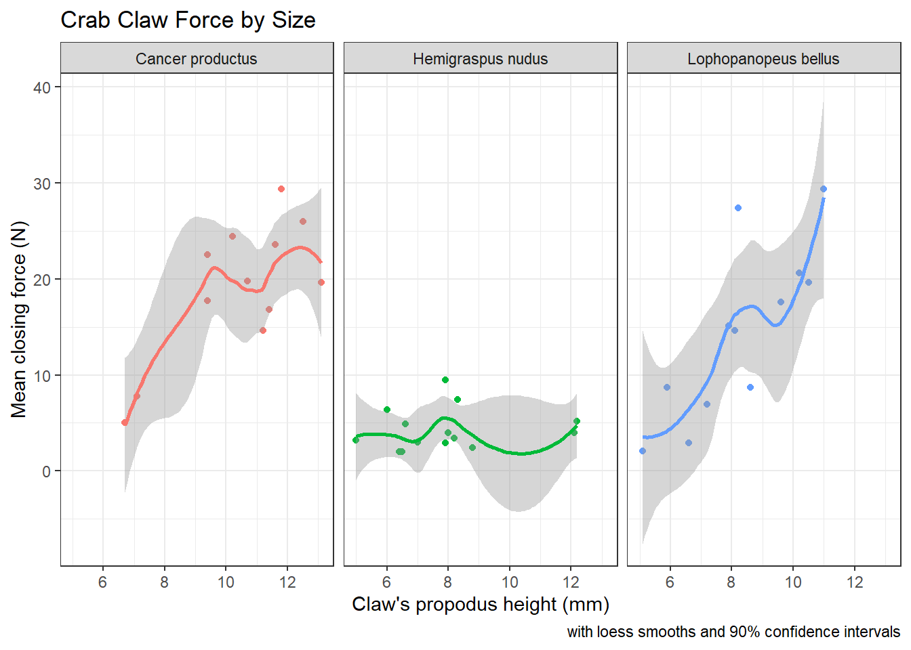
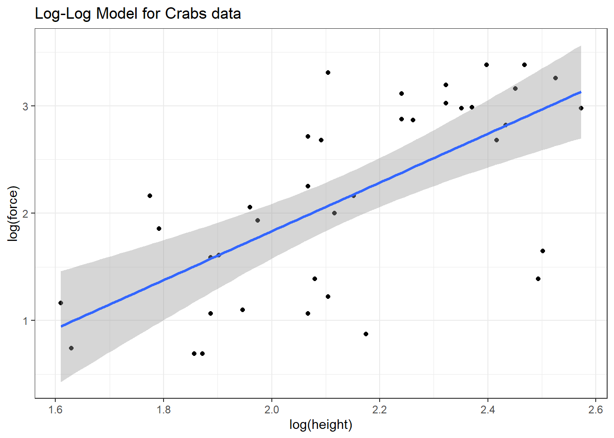

# Studying Crab Claws (`crabs`)

For our next example, we'll consider a study from zoology, specifically carcinology - the study of crustaceans. My source for these data is Chapter 7 in @RamseySchafer which drew the data from a figure in @Yamada1998.  

The available data are the mean closing forces (in Newtons) and the propodus heights (mm) of the claws on 38 crabs that came from three different species. The *propodus* is the segment of the crab's clawed leg with an immovable finger and palm. 

<div class="figure">

<p class="caption">(\#fig:c13_crab1-fig)Source: http://txmarspecies.tamug.edu/crustglossary.cfm</p>
</div>

This was part of a study of the effects that predatory intertidal crab species have on populations of snails. The three crab species under study are:

- 14 Hemigraspus nudus, also called the [purple shore crab](https://en.wikipedia.org/wiki/Purple_shore_crab) (14 crabs)
- 12 Lophopanopeus bellus, also called the [black-clawed pebble crab](https://inverts.wallawalla.edu/Arthropoda/Crustacea/Malacostraca/Eumalacostraca/Eucarida/Decapoda/Brachyura/Family_Xanthidae/Lophopanopeus_bellus_bellus.html), and
- 12 Cancer productus, one of several species of [red rock crabs](https://en.wikipedia.org/wiki/Cancer_productus) (12)


```r
crabs <- read_csv("data/crabs.csv") 
```

```
Rows: 38 Columns: 4
```

```
-- Column specification ------------------------------------
Delimiter: ","
chr (1): species
dbl (3): crab, force, height
```

```

i Use `spec()` to retrieve the full column specification for this data.
i Specify the column types or set `show_col_types = FALSE` to quiet this message.
```

```r
crabs
```

```
# A tibble: 38 x 4
    crab species              force height
   <dbl> <chr>                <dbl>  <dbl>
 1     1 Hemigraspus nudus      4      8  
 2     2 Lophopanopeus bellus  15.1    7.9
 3     3 Cancer productus       5      6.7
 4     4 Lophopanopeus bellus   2.9    6.6
 5     5 Hemigraspus nudus      3.2    5  
 6     6 Hemigraspus nudus      9.5    7.9
 7     7 Cancer productus      22.5    9.4
 8     8 Hemigraspus nudus      7.4    8.3
 9     9 Cancer productus      14.6   11.2
10    10 Lophopanopeus bellus   8.7    8.6
# ... with 28 more rows
```

The `species` information is stored here as a character variable. How many different crabs are we talking about in each `species`?


```r
crabs %>% tabyl(species)
```

```
              species  n   percent
     Cancer productus 12 0.3157895
    Hemigraspus nudus 14 0.3684211
 Lophopanopeus bellus 12 0.3157895
```

As it turns out, we're going to want to treat the `species` information as a **factor** with three levels, rather than as a character variable.


```r
crabs <- crabs %>%
    mutate(species = factor(species))
```


Here's a quick summary of the data. Take care to note the useless results for the first two variables. At least the function flags with a `*` those variables it thinks are non-numeric.


```r
psych::describe(crabs)
```

```
         vars  n  mean    sd median trimmed   mad min  max
crab        1 38 19.50 11.11  19.50   19.50 14.08   1 38.0
species*    2 38  2.00  0.81   2.00    2.00  1.48   1  3.0
force       3 38 12.13  8.98   8.70   11.53  9.04   2 29.4
height      4 38  8.81  2.23   8.25    8.78  2.52   5 13.1
         range skew kurtosis   se
crab      37.0 0.00    -1.30 1.80
species*   2.0 0.00    -1.50 0.13
force     27.4 0.47    -1.25 1.46
height     8.1 0.19    -1.14 0.36
```

Actually, we're more interested in these results after grouping by species.


```r
crabs %>%
    group_by(species) %>%
    summarise(n = n(), median(force), median(height))
```

```
# A tibble: 3 x 4
  species                  n `median(force)` `median(height)`
  <fct>                <int>           <dbl>            <dbl>
1 Cancer productus        12            19.7            11.0 
2 Hemigraspus nudus       14             3.7             7.9 
3 Lophopanopeus bellus    12            14.8             8.15
```

## Association of Size and Force

Suppose we want to describe force on the basis of height, across all 38 crabs. We'll add titles and identify the three species of crab, using shape and color.


```r
ggplot(crabs, aes(x = height, y = force, color = species, shape = species)) +
    geom_point(size = 3) +
    labs(title = "Crab Claw Force by Size", 
         x = "Claw's propodus height (mm)", y = "Mean closing force (N)") +
    theme_bw()
```


A faceted plot for each species really highlights the difference in force between the *Hemigraspus nudus* and the other two species of crab.


```r
ggplot(crabs, aes(x = height, y = force, color = species)) +
    geom_point(size = 3) +
    facet_wrap(~ species) +
    guides(color = "none") +
    labs(title = "Crab Claw Force by Size", 
         x = "Claw's propodus height (mm)", y = "Mean closing force (N)") +
    theme_bw()
```


## The `loess` smooth{#loess_smooth}

We can obtain a smoothed curve (using several different approaches) to summarize the pattern presented by the data in any scatterplot. For instance, we might build such a plot for the complete set of 38 crabs, adding in a non-linear smooth function (called a loess smooth.)


```r
ggplot(crabs, aes(x = height, y = force)) +
    geom_point() +
    geom_smooth(method = "loess", se = FALSE, formula = y ~ x) +
    labs(title = "Crab Claw Force by Size", 
         x = "Claw's propodus height (mm)", y = "Mean closing force (N)")
```


As we have discussed previously, a **loess smooth** fits a curve to data by tracking (at point x) the points within a neighborhood of point x, with more emphasis given to points near x. It can be adjusted by tweaking the `span` and `degree` parameters. 

In addition to the curve, smoothing procedures can also provide confidence intervals around their main fitted line. Consider the following plot of the `crabs` information, which adjusts the span (from its default of 0.75) and also adds in the confidence intervals.


```r
ggplot(crabs, aes(x = height, y = force)) +
    geom_point() +
    geom_smooth(method = "loess", formula = y ~ x, span = 0.5, se = TRUE) +
    labs(title = "Crab Claw Force by Size", 
         x = "Claw's propodus height (mm)", y = "Mean closing force (N)")
```


By reducing the size of the span, our resulting picture shows a much less smooth function that we generated previously. 

### Smoothing within Species

We can, of course, produce the plot above with separate smooths for each of the three species of crab.


```r
ggplot(crabs, aes(x = height, y = force, group = species, color = species)) +
    geom_point(size = 3) +
    geom_smooth(method = "loess", formula = y ~ x, se = FALSE) +
    labs(title = "Crab Claw Force by Size", 
         x = "Claw's propodus height (mm)", y = "Mean closing force (N)")
```


If we want to add in the confidence intervals (here I'll show them at 90% rather than the default of 95%) then this plot should be faceted. Note that by default, what is displayed when `se = TRUE` are 95% prediction intervals - the `level` function in `stat_smooth` [which can be used in place of `geom_smooth`] is used here to change the coverage percentage from 95% to 90%.


```r
ggplot(crabs, aes(x = height, y = force, group = species, color = species)) +
    geom_point() +
    stat_smooth(method = "loess", formula = y ~ x, level = 0.90, se = TRUE) +
    guides(color = "none") +
    labs(title = "Crab Claw Force by Size", 
         caption = "with loess smooths and 90% confidence intervals",
         x = "Claw's propodus height (mm)", y = "Mean closing force (N)") +
    facet_wrap(~ species)
```



More on these and other confidence intervals later, especially in part B.

## Fitting a Linear Regression Model

Suppose we plan to use a simple (least squares) linear regression model to describe force as a function of height. Is a least squares model likely to be an effective choice here?

The plot below shows the regression line predicting closing force as a function of propodus height. Here we annotate the plot to show the actual fitted regression line, which required fitting it with the `lm` statement prior to developing the graph.


```r
mod <- lm(force ~ height, data = crabs)

ggplot(crabs, aes(x = height, y = force)) +
    geom_point() +
    geom_smooth(method = "lm", formula = y ~ x,  color = "red") +
    labs(title = "Crab Claw Force by Size with Linear Regression Model", 
         x = "Claw's propodus height (mm)", y = "Mean closing force (N)") +
    annotate("text", x = 11, y = 0, color = "red", fontface = "italic",
             label = paste( "Force - ", signif(coef(mod)[1],3), " + ", 
                            signif(coef(mod)[2],3), " Height" ))
```


```r
rm(mod)
```

The **lm** function, again, specifies the linear model we fit to predict force using height. Here's the summary.


```r
summary(lm(force ~ height, data = crabs))
```

```

Call:
lm(formula = force ~ height, data = crabs)

Residuals:
     Min       1Q   Median       3Q      Max 
-16.7945  -3.8113  -0.2394   4.1444  16.8814 

Coefficients:
            Estimate Std. Error t value Pr(>|t|)    
(Intercept) -11.0869     4.6224  -2.399   0.0218 *  
height        2.6348     0.5089   5.177 8.73e-06 ***
---
Signif. codes:  
0 '***' 0.001 '**' 0.01 '*' 0.05 '.' 0.1 ' ' 1

Residual standard error: 6.892 on 36 degrees of freedom
Multiple R-squared:  0.4268,	Adjusted R-squared:  0.4109 
F-statistic:  26.8 on 1 and 36 DF,  p-value: 8.73e-06
```

Again, the key things to realize are:
    
- The outcome variable in this model is **force**, and the predictor variable is **height**.
- The straight line model for these data fitted by least squares is force = -11.1 + 2.63 height.
- The slope of height is positive, which indicates that as height increases, we expect that force will also increase. Specifically, we expect that for every additional mm of height, the force will increase by 2.63 Newtons.
- The multiple R-squared (squared correlation coefficient) is 0.427, which implies that 42.7% of the variation in force is explained using this linear model with height. It also implies that the Pearson correlation between force and height is the square root of 0.427, or 0.653.

## Is a Linear Model Appropriate?

The zoology (at least as described in @RamseySchafer) suggests that the actual nature of the relationship would be represented by a log-log relationship, where the log of force is predicted by the log of height. 

This log-log model is an appropriate model when we think that percentage increases in X (height, here) lead to constant percentage increases in Y (here, force). 

To see the log-log model in action, we plot the log of force against the log of height. We could use either base 10 (log10 in R) or natural (log in R) logarithms.


```r
ggplot(crabs, aes(x = log(height), y = log(force))) +
    geom_point() +
    geom_smooth(method = "lm", formula = y ~ x) + 
    labs(title = "Log-Log Model for Crabs data")
```



The correlations between the raw force and height and between their logarithms turn out to be quite similar, and because the log transformation is monotone in these data, there's actually no change at all in the Spearman correlations.

Correlation of             | Pearson r | Spearman r
:--------------:           | :--------: | :---------:
force and height           | 0.653 | 0.657
log(force) and log(height) | 0.662 | 0.657

### The log-log model


```r
crab_loglog <- lm(log(force) ~ log(height), data = crabs)

summary(crab_loglog)
```

```

Call:
lm(formula = log(force) ~ log(height), data = crabs)

Residuals:
    Min      1Q  Median      3Q     Max 
-1.5657 -0.4450  0.1884  0.4798  1.2422 

Coefficients:
            Estimate Std. Error t value Pr(>|t|)    
(Intercept)  -2.7104     0.9251  -2.930  0.00585 ** 
log(height)   2.2711     0.4284   5.302 5.96e-06 ***
---
Signif. codes:  
0 '***' 0.001 '**' 0.01 '*' 0.05 '.' 0.1 ' ' 1

Residual standard error: 0.6748 on 36 degrees of freedom
Multiple R-squared:  0.4384,	Adjusted R-squared:  0.4228 
F-statistic: 28.11 on 1 and 36 DF,  p-value: 5.96e-06
```

Our regression equation is log(force) = -2.71 + 2.27 log(height).

So, for example, if we found a crab with propodus height = 10 mm, our prediction for that crab's claw force (in Newtons) based on this log-log model would be...

- log(force) = -2.71 + 2.27 log(10)
- log(force) = -2.71 + 2.27 x 2.3025851
- log(force) = 2.5190953
- and so predicted force = exp(2.5190953) = 12.4173582 Newtons, which, naturally, we would round to 12.4 Newtons to match the data set's level of precision.

### How does this compare to our original linear model?


```r
crab_linear <- lm(force ~ height, data = crabs)

summary(crab_linear)
```

```

Call:
lm(formula = force ~ height, data = crabs)

Residuals:
     Min       1Q   Median       3Q      Max 
-16.7945  -3.8113  -0.2394   4.1444  16.8814 

Coefficients:
            Estimate Std. Error t value Pr(>|t|)    
(Intercept) -11.0869     4.6224  -2.399   0.0218 *  
height        2.6348     0.5089   5.177 8.73e-06 ***
---
Signif. codes:  
0 '***' 0.001 '**' 0.01 '*' 0.05 '.' 0.1 ' ' 1

Residual standard error: 6.892 on 36 degrees of freedom
Multiple R-squared:  0.4268,	Adjusted R-squared:  0.4109 
F-statistic:  26.8 on 1 and 36 DF,  p-value: 8.73e-06
```

The linear regression equation is force = -11.1 + 2.63 height.

So, for example, if we found a crab with propodus height = 10 mm, our prediction for that crab's claw force (in Newtons) based on this linear model would be...

- force = -11.0869025 + 2.6348232 x 10
- force = -11.0869025 + 26.3482321
- so predicted force = 15.2613297, which we would round to 15.3 Newtons.

So, it looks like the two models give meaningfully different predictions.

## Making Predictions with a Model

The `broom` package's `augment` function provides us with a consistent method for obtaining predictions (also called fitted values) for a new crab or for our original data. Suppose we want to predict the `force` level for two new crabs: one with height = 10 mm, and another with height = 12 mm.


```r
newcrab <- tibble(crab = c("Crab_A", "Crab_B"), height = c(10, 12))

augment(crab_linear, newdata = newcrab)
```

```
# A tibble: 2 x 3
  crab   height .fitted
  <chr>   <dbl>   <dbl>
1 Crab_A     10    15.3
2 Crab_B     12    20.5
```

Should we want to obtain a prediction interval, we can use the `predict` function:


```r
predict(crab_linear, newdata = newcrab, interval = "prediction", level = 0.95)
```

```
       fit      lwr      upr
1 15.26133 1.048691 29.47397
2 20.53098 5.994208 35.06774
```

We'd interpret this result as saying that the linear model's predicted force associated with a single new crab claw with propodus height 10 mm is 15.3 Newtons, and that a 95% prediction interval for the true value of such a force for such a claw is between 1.0 and 29.5 Newtons. More on prediction intervals later.

### Predictions After a Transformation

We can also get predictions from the log-log model. The default choice is a 95% prediction interval.


```r
predict(crab_loglog, newdata = newcrab, interval = "prediction")
```

```
       fit      lwr      upr
1 2.519095 1.125900 3.912291
2 2.933174 1.515548 4.350800
```

Of course, these predictions describe the `log(force)` for such a crab claw. To get the prediction in terms of simple force, we'd need to back out of the logarithm, by exponentiating our point estimate and the prediction interval endpoints.


```r
exp(predict(crab_loglog, newdata = newcrab, interval = "prediction"))
```

```
       fit      lwr      upr
1 12.41736 3.082989 50.01341
2 18.78716 4.551916 77.54044
```

We'd interpret this result as saying, for the first new crab, that the log-log model's predicted force associated with a single new crab claw with propodus height 10 mm is 12.4 Newtons, and that a 95% prediction interval for the true value of such a force for such a claw is between 3.1 and 50.0 Newtons. 

### Comparing Model Predictions

Suppose we wish to build a plot of force vs height with a straight line for the linear model's predictions, and a new curve for the log-log model's predictions, so that we can compare and contrast the implications of the two models on a common scale. The `predict` function, when not given a new data frame, will use the existing predictor values that are in our `crabs` data. Such predictions are often called fitted values. 

To put the two sets of predictions on the same scale despite the differing outcomes in the two models, we'll exponentiate the results of the log-log model, and build a little data frame containing the heights and the predicted forces from that model.


```r
loglogdat <- tibble(height = crabs$height, force = exp(predict(crab_loglog)))
```

A cleaner way to do this might be to use the `augment` function directly from `broom`:


```r
augment(crab_loglog)
```

```
# A tibble: 38 x 7
   `log(force)` `log(height)` .fitted   .hat .sigma  .cooksd
          <dbl>         <dbl>   <dbl>  <dbl>  <dbl>    <dbl>
 1         1.39          2.08   2.01  0.0280  0.676 1.28e- 2
 2         2.71          2.07   1.98  0.0287  0.673 1.79e- 2
 3         1.61          1.90   1.61  0.0499  0.684 8.06e-10
 4         1.06          1.89   1.58  0.0530  0.679 1.69e- 2
 5         1.16          1.61   0.945 0.142   0.683 1.01e- 2
 6         2.25          2.07   1.98  0.0287  0.683 2.39e- 3
 7         3.11          2.24   2.38  0.0301  0.673 1.90e- 2
 8         2.00          2.12   2.10  0.0266  0.684 2.75e- 4
 9         2.68          2.42   2.78  0.0561  0.684 6.30e- 4
10         2.16          2.15   2.18  0.0263  0.684 5.34e- 6
# ... with 28 more rows, and 1 more variable:
#   .std.resid <dbl>
```

Now, we're ready to use the `geom_smooth` approach to plot the linear fit, and `geom_line` (which also fits curves) to display the log-log fit.


```r
ggplot(crabs, aes(x = height, y = force)) +
    geom_point() +
    geom_smooth(method = "lm", se = FALSE, 
                formula = y ~ x, col="blue", linetype = 2) +
    geom_line(data = loglogdat, col = "red", linetype = 2, size = 1) +
    annotate("text", 7, 12, label = "Linear Model", col = "blue") +
    annotate("text", 10, 8, label = "Log-Log Model", col = "red") +
    labs(title = "Comparing the Linear and Log-Log Models for Crab Claw data")
```


Based on these 38 crabs, we see some modest differences between the predictions of the two models, with the log-log model predicting generally lower closing force for a given propodus height than would be predicted by a linear model.


