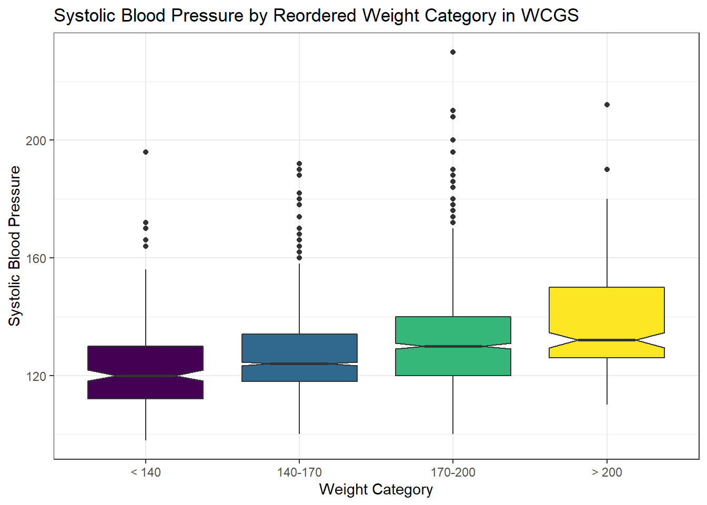
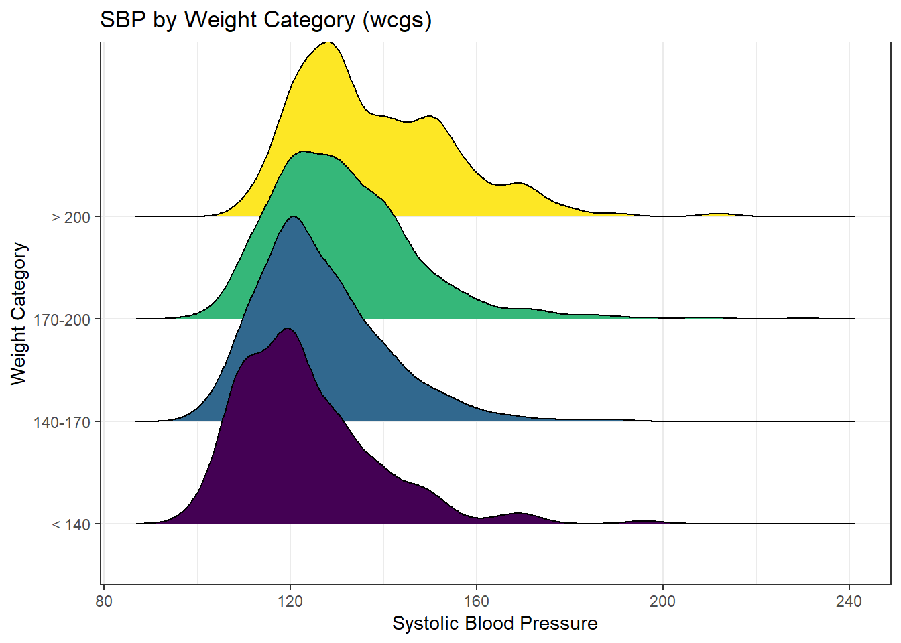
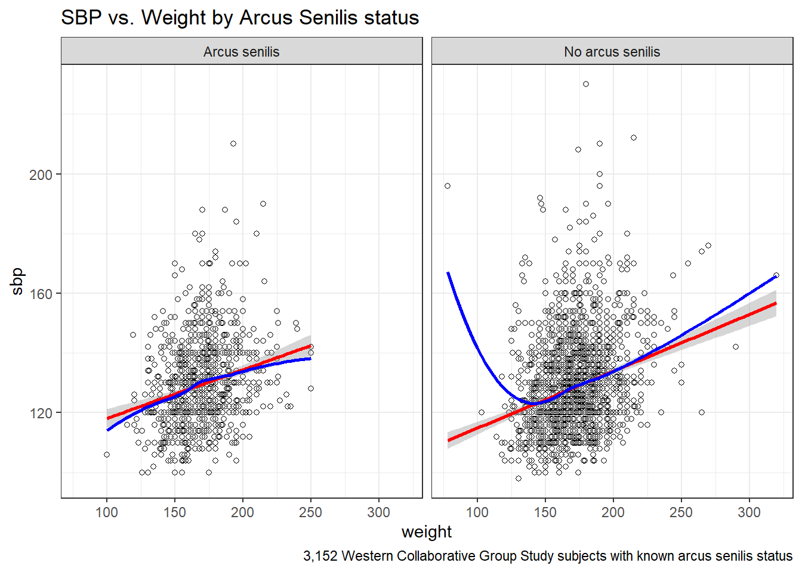

# The WCGS {#WCGS-Study}

## The Western Collaborative Group Study (`wcgs`) data set

@Vittinghoff explore data from the Western Collaborative Group Study (WCGS) in great detail^[For more on the WCGS, you might look at http://www.epi.umn.edu/cvdepi/study-synopsis/western-collaborative-group-study/]. We'll touch lightly on some key issues in this Chapter.

> The Western Collaborative Group Study (WCGS) was designed to test the hypothesis that the so-called Type A behavior pattern (TABP) - "characterized particularly by excessive drive, aggressiveness, and ambition, frequently in association with a relatively greater preoccupation with competitive activity, vocational deadlines, and similar pressures" - is a cause of coronary heart disease (CHD). Two additional goals, developed later in the study, were (1) to investigate the comparability of formulas developed in WCGS and in the Framingham Study (FS) for prediction of CHD risk, and (2) to determine how addition of TABP to an existing multivariate prediction formula affects ability to select subjects for intervention programs.

The study enrolled over 3,000 men ages 39-59 who were employed in San Francisco or Los Angeles, during 1960 and 1961.


```r
wcgs <- read_csv("data/wcgs.csv") %>%
    mutate(across(where(is.character), as_factor))

wcgs
```

```
# A tibble: 3,154 x 22
      id   age agec  height weight lnwght wghtcat   bmi
   <dbl> <dbl> <fct>  <dbl>  <dbl>  <dbl> <fct>   <dbl>
 1  2343    50 46-50     67    200   5.30 170-200  31.3
 2  3656    51 51-55     73    192   5.26 170-200  25.3
 3  3526    59 56-60     70    200   5.30 170-200  28.7
 4 22057    51 51-55     69    150   5.01 140-170  22.1
 5 12927    44 41-45     71    160   5.08 140-170  22.3
 6 16029    47 46-50     64    158   5.06 140-170  27.1
 7  3894    40 35-40     70    162   5.09 140-170  23.2
 8 11389    41 41-45     70    160   5.08 140-170  23.0
 9 12681    50 46-50     71    195   5.27 170-200  27.2
10 10005    43 41-45     68    187   5.23 170-200  28.4
# ... with 3,144 more rows, and 14 more variables:
#   sbp <dbl>, lnsbp <dbl>, dbp <dbl>, chol <dbl>,
#   behpat <fct>, dibpat <fct>, smoke <fct>, ncigs <dbl>,
#   arcus <dbl>, chd69 <fct>, typchd69 <dbl>,
#   time169 <dbl>, t1 <dbl>, uni <dbl>
```

Here, we have 3154 rows (subjects) and 22 columns (variables). After importing the data and creating a tibble with `read_csv`, I used `mutate(across(where(is.character), as_factor)` to convert all variables containing character data into factors.

### Structure of `wcgs`

We can specify the (sometimes terrible) variable names, through the `names` function, or we can add other elements of the structure, so that we can identify elements of particular interest.


```r
str(wcgs)
```

```
spec_tbl_df [3,154 x 22] (S3: spec_tbl_df/tbl_df/tbl/data.frame)
 $ id      : num [1:3154] 2343 3656 3526 22057 12927 ...
 $ age     : num [1:3154] 50 51 59 51 44 47 40 41 50 43 ...
 $ agec    : Factor w/ 5 levels "46-50","51-55",..: 1 2 3 2 4 1 5 4 1 4 ...
 $ height  : num [1:3154] 67 73 70 69 71 64 70 70 71 68 ...
 $ weight  : num [1:3154] 200 192 200 150 160 158 162 160 195 187 ...
 $ lnwght  : num [1:3154] 5.3 5.26 5.3 5.01 5.08 ...
 $ wghtcat : Factor w/ 4 levels "170-200","140-170",..: 1 1 1 2 2 2 2 2 1 1 ...
 $ bmi     : num [1:3154] 31.3 25.3 28.7 22.1 22.3 ...
 $ sbp     : num [1:3154] 132 120 158 126 126 116 122 130 112 120 ...
 $ lnsbp   : num [1:3154] 4.88 4.79 5.06 4.84 4.84 ...
 $ dbp     : num [1:3154] 90 74 94 80 80 76 78 84 70 80 ...
 $ chol    : num [1:3154] 249 194 258 173 214 206 190 212 130 233 ...
 $ behpat  : Factor w/ 4 levels "A1","A2","B3",..: 1 1 1 1 1 1 1 1 1 1 ...
 $ dibpat  : Factor w/ 2 levels "Type A","Type B": 1 1 1 1 1 1 1 1 1 1 ...
 $ smoke   : Factor w/ 2 levels "Yes","No": 1 1 2 2 2 1 2 1 2 1 ...
 $ ncigs   : num [1:3154] 25 25 0 0 0 80 0 25 0 25 ...
 $ arcus   : num [1:3154] 1 0 1 1 0 0 0 0 1 0 ...
 $ chd69   : Factor w/ 2 levels "No","Yes": 1 1 1 1 1 1 1 1 1 1 ...
 $ typchd69: num [1:3154] 0 0 0 0 0 0 0 0 0 0 ...
 $ time169 : num [1:3154] 1367 2991 2960 3069 3081 ...
 $ t1      : num [1:3154] -1.63 -4.06 0.64 1.12 2.43 ...
 $ uni     : num [1:3154] 0.486 0.186 0.728 0.624 0.379 ...
 - attr(*, "spec")=
  .. cols(
  ..   id = col_double(),
  ..   age = col_double(),
  ..   agec = col_character(),
  ..   height = col_double(),
  ..   weight = col_double(),
  ..   lnwght = col_double(),
  ..   wghtcat = col_character(),
  ..   bmi = col_double(),
  ..   sbp = col_double(),
  ..   lnsbp = col_double(),
  ..   dbp = col_double(),
  ..   chol = col_double(),
  ..   behpat = col_character(),
  ..   dibpat = col_character(),
  ..   smoke = col_character(),
  ..   ncigs = col_double(),
  ..   arcus = col_double(),
  ..   chd69 = col_character(),
  ..   typchd69 = col_double(),
  ..   time169 = col_double(),
  ..   t1 = col_double(),
  ..   uni = col_double()
  .. )
 - attr(*, "problems")=<externalptr> 
```

### Codebook for `wcgs`

This table was lovingly hand-crafted, and involved a lot of typing. We'll look for better ways in 432.

Name    | Stored As  | Type         | Details (units, levels, etc.)
-------:|:----------:|:------------:|------------------------------------
`id`      | integer    | (nominal)  | ID #, nominal and uninteresting
`age`     | integer    | quantitative | age, in years - no decimal places
`agec`    | factor (5) | (ordinal) | age: 35-40, 41-45, 46-50, 51-55, 56-60
`height`  | integer    | quantitative | height, in inches
`weight`  | integer    | quantitative | weight, in pounds
`lnwght`  | number     | quantitative | natural logarithm of weight
`wghtcat` | factor (4) | (ordinal) | wt: < 140, 140-170, 170-200, > 200
`bmi`     | number     | quantitative | body-mass index: 
| | | | 703 * weight in lb / (height in in)^2^
`sbp`     | integer    | quantitative | systolic blood pressure, in mm Hg
`lnsbp`   | number     | quantitative | natural logarithm of sbp
`dbp`     | integer    | quantitative | diastolic blood pressure, mm Hg
`chol`    | integer    | quantitative | total cholesterol, mg/dL
`behpat`  | factor (4) | (nominal) | behavioral pattern: A1, A2, B3 or B4
`dibpat`  | factor (2) | (binary)  | behavioral pattern: A or B
`smoke`   | factor (2) | (binary)  | cigarette smoker: Yes or No
`ncigs`   | integer | quantitative | number of cigarettes smoked per day
`arcus`   | integer | (nominal) | arcus senilis present (1) or absent (0)
`chd69`   | factor (2) | (binary) | CHD event: Yes or No
`typchd69`| integer | (4 levels) | event: 0 = no CHD, 1 = MI or SD,
| | | | 2 = silent MI, 3 = angina
`time169` | integer | quantitative | follow-up time in days
`t1`      | number  | quantitative | heavy-tailed (random draws)
`uni`     | number  | quantitative | light-tailed (random draws)

### Quick Summary


```r
summary(wcgs)
```

```
       id             age           agec     
 Min.   : 2001   Min.   :39.00   46-50: 750  
 1st Qu.: 3741   1st Qu.:42.00   51-55: 528  
 Median :11406   Median :45.00   56-60: 242  
 Mean   :10478   Mean   :46.28   41-45:1091  
 3rd Qu.:13115   3rd Qu.:50.00   35-40: 543  
 Max.   :22101   Max.   :59.00               
                                             
     height          weight        lnwght     
 Min.   :60.00   Min.   : 78   Min.   :4.357  
 1st Qu.:68.00   1st Qu.:155   1st Qu.:5.043  
 Median :70.00   Median :170   Median :5.136  
 Mean   :69.78   Mean   :170   Mean   :5.128  
 3rd Qu.:72.00   3rd Qu.:182   3rd Qu.:5.204  
 Max.   :78.00   Max.   :320   Max.   :5.768  
                                              
    wghtcat          bmi             sbp       
 170-200:1171   Min.   :11.19   Min.   : 98.0  
 140-170:1538   1st Qu.:22.96   1st Qu.:120.0  
 > 200  : 213   Median :24.39   Median :126.0  
 < 140  : 232   Mean   :24.52   Mean   :128.6  
                3rd Qu.:25.84   3rd Qu.:136.0  
                Max.   :38.95   Max.   :230.0  
                                               
     lnsbp            dbp              chol       behpat   
 Min.   :4.585   Min.   : 58.00   Min.   :103.0   A1: 264  
 1st Qu.:4.787   1st Qu.: 76.00   1st Qu.:197.2   A2:1325  
 Median :4.836   Median : 80.00   Median :223.0   B3:1216  
 Mean   :4.850   Mean   : 82.02   Mean   :226.4   B4: 349  
 3rd Qu.:4.913   3rd Qu.: 86.00   3rd Qu.:253.0            
 Max.   :5.438   Max.   :150.00   Max.   :645.0            
                                  NA's   :12               
    dibpat     smoke          ncigs          arcus       
 Type A:1589   Yes:1502   Min.   : 0.0   Min.   :0.0000  
 Type B:1565   No :1652   1st Qu.: 0.0   1st Qu.:0.0000  
                          Median : 0.0   Median :0.0000  
                          Mean   :11.6   Mean   :0.2985  
                          3rd Qu.:20.0   3rd Qu.:1.0000  
                          Max.   :99.0   Max.   :1.0000  
                                         NA's   :2       
 chd69         typchd69         time169    
 No :2897   Min.   :0.0000   Min.   :  18  
 Yes: 257   1st Qu.:0.0000   1st Qu.:2842  
            Median :0.0000   Median :2942  
            Mean   :0.1363   Mean   :2684  
            3rd Qu.:0.0000   3rd Qu.:3037  
            Max.   :3.0000   Max.   :3430  
                                           
       t1                 uni           
 Min.   :-47.43147   Min.   :0.0007097  
 1st Qu.: -1.00337   1st Qu.:0.2573755  
 Median :  0.00748   Median :0.5157779  
 Mean   : -0.03336   Mean   :0.5052159  
 3rd Qu.:  0.97575   3rd Qu.:0.7559902  
 Max.   : 47.01623   Max.   :0.9994496  
 NA's   :39                             
```

For a more detailed description, we might consider `Hmisc::describe`, `psych::describe`, `mosaic::favstats`, etc.

## Are the SBPs Normally Distributed?

Consider the question of whether the distribution of the systolic blood pressure results is well-approximated by the Normal.


```r
res <- mosaic::favstats(~ sbp, data = wcgs)
bin_w <- 5 # specify binwidth

ggplot(wcgs, aes(x = sbp)) +
    geom_histogram(binwidth = bin_w, 
                   fill = "orchid", 
                   col = "blue") +
    stat_function(
        fun = function(x) dnorm(x, mean = res$mean, 
                                sd = res$sd) * 
            res$n * bin_w,
        col = "navy") +
    labs(title = "Systolic BP for `wcgs` subjects",
     x = "Systolic BP (mm Hg)", y = "",
     caption = "Superimposed Normal model")
```


Since the data contain both `sbp` and `lnsbp` (its natural logarithm), let's compare them. Note that in preparing the graph, we'll need to change the location for the text annotation.


```r
res <- mosaic::favstats(~ lnsbp, data = wcgs)
bin_w <- 0.05 # specify binwidth

ggplot(wcgs, aes(x = lnsbp)) +
    geom_histogram(binwidth = bin_w, 
                   fill = "orange", 
                   col = "blue") +
    stat_function(
        fun = function(x) dnorm(x, mean = res$mean, 
                                sd = res$sd) * 
            res$n * bin_w,
        col = "navy") +
    labs(title = "ln(Systolic BP) for `wcgs` subjects",
     x = "ln(Systolic BP)", y = "",
     caption = "Superimposed Normal model")
```


We can also look at Normal Q-Q plots, for instance...


```r
p1 <- ggplot(wcgs, aes(sample = sbp)) +
    geom_qq(color = "orchid") + 
    geom_qq_line(color = "red") +
    labs(y = "Ordered SBP", title = "sbp in wcgs")

p2 <- ggplot(wcgs, aes(sample = lnsbp)) +
    geom_qq(color = "orange") + 
    geom_qq_line(color = "red") +
    labs(y = "Ordered ln(SBP)", title = "ln(sbp) in wcgs")

## next step requires library(patchwork)

p1 + p2 + 
    plot_annotation(title = "Normal Q-Q plots of SBP and ln(SBP) in wcgs")
```


There's at best a small improvement from `sbp` to `lnsbp` in terms of approximation by a Normal distribution.

## Identifying and Describing SBP outliers

It looks like there's an outlier (or a series of them) in the SBP data.


```r
ggplot(wcgs, aes(x = "", y = sbp)) +
    geom_violin() +
    geom_boxplot(width = 0.3, fill = "royalblue", 
                 outlier.color = "royalblue") +
    labs(title = "Boxplot with Violin of SBP in `wcgs` data",
         y = "Systolic Blood Pressure (mm Hg)", 
         x = "") +
    coord_flip() 
```


```r
wcgs %$% Hmisc::describe(sbp)
```

```
sbp 
       n  missing distinct     Info     Mean      Gmd 
    3154        0       62    0.996    128.6    16.25 
     .05      .10      .25      .50      .75      .90 
     110      112      120      126      136      148 
     .95 
     156 

lowest :  98 100 102 104 106, highest: 200 208 210 212 230
```

The maximum value here is 230, and is clearly the most extreme value in the data set. One way to gauge this is to describe that observation's **Z score**, the number of standard deviations away from the mean that the observation falls. Here, the maximum value, 230 is 6.71 standard deviations above the mean, and thus has a Z score of 6.7.

A negative Z score would indicate a point below the mean, while a positive Z score indicates, as we've seen, a point above the mean. The minimum systolic blood pressure, 98 is 2.03 standard deviations *below* the mean, so it has a Z score of -2. 

Recall that the Empirical Rule suggests that if a variable follows a Normal distribution, it would have approximately 95% of its observations falling inside a Z score of (-2, 2), and 99.74% falling inside a Z score range of (-3, 3). Do the systolic blood pressures appear Normally distributed?

## Does Weight Category Relate to SBP?

The data are collected into four groups based on the subject's weight (in pounds).


```r
ggplot(wcgs, aes(x = wghtcat, y = sbp)) +
    geom_violin() +
    geom_boxplot(aes(fill = wghtcat), width = 0.3, notch = TRUE) +
    scale_fill_viridis_d() +
    guides(fill = "none") + 
    labs(title = "Boxplot of Systolic BP by Weight Category in WCGS", 
         x = "Weight Category", y = "Systolic Blood Pressure")
```


## Re-Leveling a Factor

Well, that's not so good. We really want those weight categories (the *levels*) to be ordered more sensibly. 


```r
wcgs %>% tabyl(wghtcat)
```

```
 wghtcat    n    percent
 170-200 1171 0.37127457
 140-170 1538 0.48763475
   > 200  213 0.06753329
   < 140  232 0.07355739
```

Like all *factor* variables in R, the categories are specified as levels. We want to change the order of the levels in a new version of this factor variable so they make sense. There are multiple ways to do this, but I prefer the `fct_relevel` function from the `forcats` package (part of the tidyverse.) Which order is more appropriate?

I'll add a new variable to the `wcgs` data called `weight_f` that relevels the `wghtcat` data.


```r
wcgs <- wcgs %>%
    mutate(weight_f = fct_relevel(wghtcat, "< 140", "140-170", "170-200", "> 200"))

wcgs %>% tabyl(weight_f)
```

```
 weight_f    n    percent
    < 140  232 0.07355739
  140-170 1538 0.48763475
  170-200 1171 0.37127457
    > 200  213 0.06753329
```

For more on the `forcats` package, check out @R4DS, especially the Section on Factors.

### SBP by Weight Category


```r
ggplot(wcgs, aes(x = weight_f, y = sbp, fill = weight_f)) +
    geom_boxplot(notch = TRUE) +
    scale_fill_viridis_d() +
    guides(fill = "none") +
    labs(title = "Systolic Blood Pressure by Reordered Weight Category in WCGS", 
         x = "Weight Category", y = "Systolic Blood Pressure")
```



We might see some details well with a **ridgeline plot**, too.


```r
wcgs %>%
    ggplot(aes(x = sbp, y = weight_f, fill = weight_f, height = ..density..)) +
    ggridges::geom_density_ridges(scale = 2) +
    scale_fill_viridis_d() +
    guides(fill = "none") +
    labs(title = "SBP by Weight Category (wcgs)",
         x = "Systolic Blood Pressure",
         y = "Weight Category") 
```

```
Picking joint bandwidth of 3.74
```



As the plots suggest, patients in the heavier groups generally had higher systolic blood pressures.


```r
mosaic::favstats(sbp ~ weight_f, data = wcgs)
```

```
  weight_f min  Q1 median  Q3 max     mean       sd    n
1    < 140  98 112    120 130 196 123.1379 14.73394  232
2  140-170 100 118    124 134 192 126.2939 13.65294 1538
3  170-200 100 120    130 140 230 131.1136 15.57024 1171
4    > 200 110 126    132 150 212 137.8685 16.75522  213
  missing
1       0
2       0
3       0
4       0
```

## Are Weight and SBP Linked?

Let's build a scatter plot of SBP (Outcome) by Weight (Predictor), rather than breaking down into categories.


```r
ggplot(wcgs, aes(x = weight, y = sbp)) +
    geom_point(size=3, shape=1, color="forestgreen") + ## default size = 2
    stat_smooth(method=lm, color="red") + ## add se=FALSE to hide conf. interval
    stat_smooth(method=loess, se=FALSE, color="blue") +
    ggtitle("SBP vs. Weight in 3,154 WCGS Subjects") 
```


- The mass of the data is hidden from us - showing 3154 points in one plot can produce little more than a blur where there are lots of points on top of each other.
- Here the least squares regression line (in red), and loess scatterplot smoother, (in blue) can help.

The relationship between systolic blood pressure and weight appears to be very close to linear, but of course there is considerable scatter around that generally linear relationship. It turns out that the Pearson correlation of these two variables is 0.253.

## SBP and Weight by Arcus Senilis groups?

An issue of interest to us will be to assess whether the SBP-Weight relationship we see above is similar among subjects who have arcus senilis and those who do not. 

> Arcus senilis is an old age syndrome where there is a white, grey, or blue opaque ring in the corneal margin (peripheral corneal opacity), or white ring in front of the periphery of the iris. It is present at birth but then fades; however, it is quite commonly present in the elderly. It can also appear earlier in life as a result of hypercholesterolemia.
> 
> Wikipedia article on Arcus Senilis, retrieved 2017-08-15

Let's start with a quick look at the `arcus` data.


```r
wcgs %>% tabyl(arcus)
```

```
 arcus    n      percent valid_percent
     0 2211 0.7010145847     0.7014594
     1  941 0.2983512999     0.2985406
    NA    2 0.0006341154            NA
```

We have 2 missing values, so we probably want to do something about that before plotting the data, and we may also want to create a factor variable with more meaningful labels than 1 (which means yes, arcus senilis is present) and 0 (which means no, it isn't.)


```r
wcgs <- wcgs %>%
    mutate(arcus_f = fct_recode(factor(arcus),
                                "Arcus senilis" = "1",
                                "No arcus senilis" = "0"),
           arcus_f = fct_relevel(arcus_f, "Arcus senilis"))

wcgs %>% tabyl(arcus_f, arcus)
```

```
          arcus_f    0   1 NA_
    Arcus senilis    0 941   0
 No arcus senilis 2211   0   0
             <NA>    0   0   2
```

Let's build a version of the `wcgs` data that eliminates all missing data in the variables of immediate interest, and then plot the SBP-weight relationship in groups of patients with and without arcus senilis.


```r
wcgs %>%
    filter(complete.cases(arcus_f, sbp, weight)) %>%
    ggplot(aes(x = weight, y = sbp, group = arcus_f)) +
    geom_point(shape = 1) + 
    stat_smooth(method=lm, color="red") +
    stat_smooth(method=loess, se=FALSE, color="blue") +
    labs(title = "SBP vs. Weight by Arcus Senilis status",
         caption = "3,152 Western Collaborative Group Study subjects with known arcus senilis status") + 
    facet_wrap(~ arcus_f) 
```



## Linear Model for SBP-Weight Relationship: subjects without Arcus Senilis


```r
model.noarcus <- 
    lm(sbp ~ weight, data = filter(wcgs, arcus == 0))

tidy(model.noarcus) %>% kable(digits = 2)
```


|term        | estimate| std.error| statistic| p.value|
|:-----------|--------:|---------:|---------:|-------:|
|(Intercept) |    95.92|      2.56|     37.54|       0|
|weight      |     0.19|      0.01|     12.77|       0|

```r
glance(model.noarcus) %>% select(r.squared:p.value, AIC) %>% kable(digits = 3)
```


| r.squared| adj.r.squared|  sigma| statistic| p.value|      AIC|
|---------:|-------------:|------:|---------:|-------:|--------:|
|     0.069|         0.068| 14.799|   162.959|       0| 18193.78|

```r
summary(model.noarcus)
```

```

Call:
lm(formula = sbp ~ weight, data = filter(wcgs, arcus == 0))

Residuals:
    Min      1Q  Median      3Q     Max 
-29.011 -10.251  -2.447   7.553  99.848 

Coefficients:
            Estimate Std. Error t value Pr(>|t|)    
(Intercept)  95.9219     2.5552   37.54   <2e-16 ***
weight        0.1902     0.0149   12.77   <2e-16 ***
---
Signif. codes:  
0 '***' 0.001 '**' 0.01 '*' 0.05 '.' 0.1 ' ' 1

Residual standard error: 14.8 on 2209 degrees of freedom
Multiple R-squared:  0.0687,	Adjusted R-squared:  0.06828 
F-statistic:   163 on 1 and 2209 DF,  p-value: < 2.2e-16
```

The linear model for the 2211 patients without Arcus Senilis has R-squared = 6.87\%.

- The regression equation is 95.92 - 0.19 weight, for those patients without Arcus Senilis.

## Linear Model for SBP-Weight Relationship: subjects with Arcus Senilis


```r
model.witharcus <- 
    lm(sbp ~ weight, data = filter(wcgs, arcus == 1))

tidy(model.witharcus) %>% kable(digits = 2)
```


|term        | estimate| std.error| statistic| p.value|
|:-----------|--------:|---------:|---------:|-------:|
|(Intercept) |   101.88|      3.76|     27.13|       0|
|weight      |     0.16|      0.02|      7.39|       0|

```r
glance(model.witharcus) %>% select(r.squared:p.value, AIC) %>% kable(digits = 3)
```


| r.squared| adj.r.squared|  sigma| statistic| p.value|      AIC|
|---------:|-------------:|------:|---------:|-------:|--------:|
|     0.055|         0.054| 14.192|    54.583|       0| 7666.828|

```r
summary(model.witharcus)
```

```

Call:
lm(formula = sbp ~ weight, data = filter(wcgs, arcus == 1))

Residuals:
    Min      1Q  Median      3Q     Max 
-30.335  -9.636  -1.961   7.973  76.738 

Coefficients:
             Estimate Std. Error t value Pr(>|t|)    
(Intercept) 101.87847    3.75572  27.126  < 2e-16 ***
weight        0.16261    0.02201   7.388 3.29e-13 ***
---
Signif. codes:  
0 '***' 0.001 '**' 0.01 '*' 0.05 '.' 0.1 ' ' 1

Residual standard error: 14.19 on 939 degrees of freedom
Multiple R-squared:  0.05494,	Adjusted R-squared:  0.05393 
F-statistic: 54.58 on 1 and 939 DF,  p-value: 3.29e-13
```

The linear model for the 941 patients with Arcus Senilis has R-squared = 5.49\%.

- The regression equation is 101.88 - 0.163 weight, for those patients with Arcus Senilis.

## Including Arcus Status in the model


```r
model3 <- lm(sbp ~ weight * arcus, data = filter(wcgs, !is.na(arcus)))

tidy(model3) %>% kable(digits = 2)
```


|term         | estimate| std.error| statistic| p.value|
|:------------|--------:|---------:|---------:|-------:|
|(Intercept)  |    95.92|      2.52|     38.00|    0.00|
|weight       |     0.19|      0.01|     12.92|    0.00|
|arcus        |     5.96|      4.62|      1.29|    0.20|
|weight:arcus |    -0.03|      0.03|     -1.02|    0.31|

```r
glance(model3) %>% select(r.squared:p.value, AIC) %>% kable(digits = 3)
```


| r.squared| adj.r.squared| sigma| statistic| p.value|      AIC|
|---------:|-------------:|-----:|---------:|-------:|--------:|
|     0.066|         0.065| 14.62|    74.094|       0| 25860.96|

```r
summary(model3)
```

```

Call:
lm(formula = sbp ~ weight * arcus, data = filter(wcgs, !is.na(arcus)))

Residuals:
    Min      1Q  Median      3Q     Max 
-30.335 -10.152  -2.349   7.669  99.848 

Coefficients:
             Estimate Std. Error t value Pr(>|t|)    
(Intercept)  95.92190    2.52440  37.998   <2e-16 ***
weight        0.19017    0.01472  12.921   <2e-16 ***
arcus         5.95657    4.61972   1.289    0.197    
weight:arcus -0.02756    0.02703  -1.019    0.308    
---
Signif. codes:  
0 '***' 0.001 '**' 0.01 '*' 0.05 '.' 0.1 ' ' 1

Residual standard error: 14.62 on 3148 degrees of freedom
Multiple R-squared:  0.06595,	Adjusted R-squared:  0.06506 
F-statistic: 74.09 on 3 and 3148 DF,  p-value: < 2.2e-16
```

The actual regression equation in this setting includes both weight, and an indicator variable (1 = yes, 0 = no) for arcus senilis status, and the product term combining weight and that 1/0 indicator. In 432, we'll spend substantial time and energy discussing these product terms, but we'll not do much of that in 431.

- Note the use of the product term `weight*arcus` in the setup of the model to allow both the slope of weight and the intercept term in the model to change depending on arcus senilis status.
    + For a patient who has arcus, the regression equation is SBP = 95.92 + 0.19 weight + 5.96 (1) - 0.028 weight (1) = 101.88 + 0.162 weight.
    + For a patient without arcus senilis, the regression equation is SBP = 95.92 + 0.19 weight + 5.96 (0) - 0.028 weight (0) = 95.92 + 0.19 weight. 

The linear model including the interaction of weight and arcus to predict sbp for the 3152 patients with known Arcus Senilis status has R-squared = 6.6\%. Again, we'll discuss interaction more substantially in 432.


## Predictions from these Linear Models

What is our predicted SBP for a subject weighing 175 pounds?
    
How does that change if our subject weighs 200 pounds?
    
Recall that

- *Without* Arcus Senilis, linear model for SBP = 95.9 + 0.19 x weight
- *With* Arcus Senilis, linear model for SBP = 101.9 + 0.16 x weight

So the predictions for a 175 pound subject are:

- 95.9 + 0.19 x 175 = 129 mm Hg without Arcus Senilis, and 

- 101.9 + 0.16 x 175 = 130 mm Hg with Arcus Senilis.

And thus, the predictions for a 200 pound subject are:

- 95.9 + 0.19 x 200 = 134 mm Hg without Arcus Senilis, and 

- 101.9 + 0.16 x 200 = 134.4 mm Hg with Arcus Senilis.

## Scatterplots with Facets Across a Categorical Variable

We can use facets in `ggplot2` to show scatterplots across the levels of a categorical variable, like `behpat`.


```r
ggplot(wcgs, aes(x = weight, y = sbp, col = behpat)) +
    geom_point() +
    facet_wrap(~ behpat) +
    geom_smooth(method = "lm", se = FALSE, 
                formula = y ~ x, col = "black") +
    guides(color = "none") +
    theme(strip.text = element_text(face="bold", size=rel(1.25), color="white"),
          strip.background = element_rect(fill="royalblue")) +
    labs(title = "Scatterplots of SBP vs. Weight within Behavior Pattern")
```


## Scatterplot and Correlation Matrices

A **scatterplot matrix** can be very helpful in understanding relationships between multiple variables simultaneously. There are several ways to build such a thing, including the `pairs` function...


```r
pairs (~ sbp + age + weight + height, data=wcgs, main="Simple Scatterplot Matrix")
```


### Displaying a Correlation Matrix


```r
wcgs %>%
    dplyr::select(sbp, age, weight, height) %>%
    cor() %>% # obtain correlation coefficients for this subgroup
    signif(., 3) # round them off to three significant figures before printing
```

```
          sbp     age  weight  height
sbp    1.0000  0.1660  0.2530  0.0184
age    0.1660  1.0000 -0.0344 -0.0954
weight 0.2530 -0.0344  1.0000  0.5330
height 0.0184 -0.0954  0.5330  1.0000
```

### Using the `GGally` package

The `ggplot2` system doesn't have a built-in scatterplot system. There are some nice add-ins in the world, though. One option I sort of like is in the `GGally` package, which can produce both correlation matrices and scatterplot matrices.

The `ggpairs` function provides a density plot on each diagonal, Pearson correlations on the upper right and scatterplots on the lower left of the matrix.


```r
GGally::ggpairs(wcgs %>% select(sbp, age, weight, height), 
                title = "Scatterplot Matrix via ggpairs")
```


