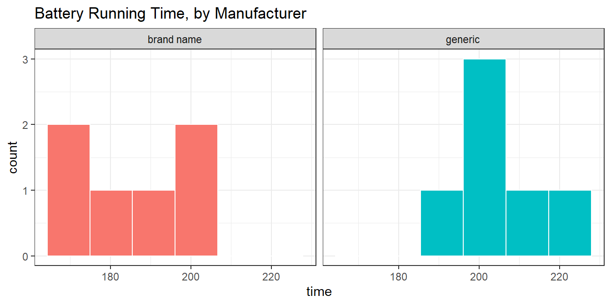
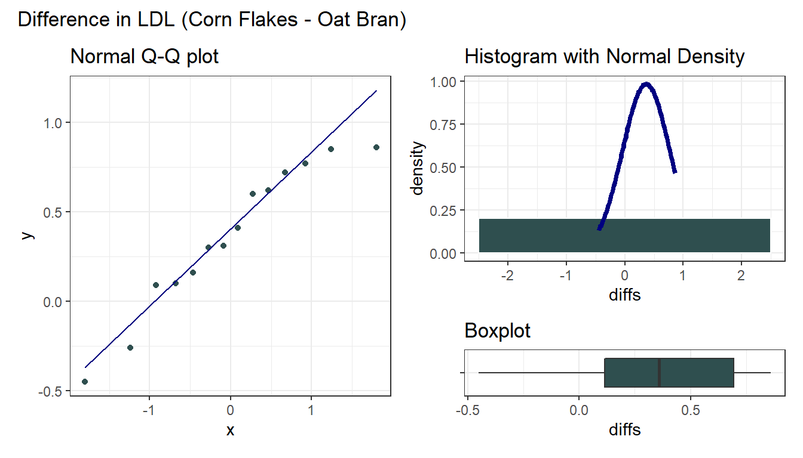

# Two Examples Comparing Means

## A Study of Battery Life

Should you buy generic rather than brand-name batteries? @BockVD descibe a designed experiment to test battery life. A (male) student obtained six pairs of AA alkaline batteries from two major battery manufacturers; a well-known brand name and a generic brand, so that battery brand was the factor of interest.

To estimate the difference in mean lifetimes across the two manufacturers, the student kept a battery-powered CD player with the same CD running continuously, with the volume control fixed at 5, and measured the time until no more music was heard through the headphones. (He ran an initial trial to find out approximately how long that would take, so he didn't have to spend the first 3 hours of each run listening to the same CD.) The outcome was the time in minutes until the sound stopped. To account for changes in the CD player's performance over time, he randomized the run order by choosing pairs of batteries (the CD-player required two batteries to run) at random.

Here are the results for the 6 brand name and 6 generic tests, in minutes, found in the `battery.csv` data file, where `run` indicates the order in which the tests were run...


```r
battery <- read_csv("data/battery.csv",
                    show_col_types = FALSE)

battery
```

```
# A tibble: 12 x 4
     run  test type        time
   <dbl> <dbl> <chr>      <dbl>
 1     1     1 brand name  191.
 2     2     2 brand name  206.
 3     6     3 brand name  199.
 4     8     4 brand name  172.
 5     9     5 brand name  184 
 6    12     6 brand name  170.
 7     3     1 generic     194 
 8     4     2 generic     204.
 9     5     3 generic     204.
10     7     4 generic     206.
11    10     5 generic     222.
12    11     6 generic     209.
```

### Question 1. What is the outcome under study?

We are studying battery lifetimes (time until the sound stopped) in minutes.

### Question 2. What are the treatment/exposure groups?

We are comparing the two brands of batteries: the well-known vs. the generic.

### Question 3. Are the data collected using paired or independent samples?

Of course, if we had different numbers of samples in the two groups, then we'd know without further thought that independent samples were required. Since we have 6 observations in the brand name group, and also have 6 observations in the generic group, i.e. a balanced design, we need to pause now to decide whether paired or independent samples testing is appropriate in this setting.

Two samples are paired if each data point in one sample is naturally linked to a specific data point in the other sample. So, do we have paired or independent samples?

- Despite the way I've set up the data table, there is no particular reason to pair, say, run #1 (a brand name run) with any particular experimental run in the generic group. So the samples are independent. This is not a matched-pairs design.
- In each trial, the student either used two of the well-known batteries, or two of the generic batteries.
- Any of the tests/confidence intervals for the independent samples methods suggests a statistically significant (at the 5% level) difference between the generic and brand name batteries.

### Question 4. Are the data a random sample from the population of interest?

Probably not. The data are likely to come from a convenient sample of batteries. I don't know how this might bias the study, though. It seems unlikely that there would be a particular bias unless, for example, the well-known batteries were substantially older or younger than the generic.

### Question 5. What significance level will we use?

We have no reason not to use a 95% confidence level.

### Question 6. Are we using a one-sided or two-sided comparison?

We could argue for a one-sided comparison, but I'll be safe and use the two-sided version.

### Question 9. What does the distribution of outcomes in each group tell us?


```r
ggplot(battery, aes(x = type, y = time, fill = type)) +
  geom_jitter(aes(color = type), alpha = 0.75, width = 0.125) +
  geom_boxplot(alpha = 0.5) +
  coord_flip() +
  guides(fill = "none", col = "none") +
  labs(title = "Battery Running Time, by Manufacturer",
       y = "Running Time (minutes)", x = "Manufacturer")
```


We can generate histograms, too, but that's an issue, because we have so few observations.


```r
ggplot(battery, aes(x = time, fill = type)) +
  geom_histogram(bins = 6, col = "white") +
  facet_wrap(~ type) +
  guides(fill = "none") + 
  labs(title = "Battery Running Time, by Manufacturer")
```




```r
mosaic::favstats(time ~ type, data = battery)
```

```
        type   min    Q1 median      Q3   max     mean
1 brand name 169.5 175.3 187.35 197.075 205.5 186.8833
2    generic 194.0 203.5 205.00 208.675 222.5 206.5667
         sd n missing
1 14.374341 6       0
2  9.366251 6       0
```

It sure looks like the generic batteries lasted longer. And they also look like they were more consistent. The sample means are 206.6 for the generic group, 186.9 minutes for brand name, so the point estimate of the difference is 19.7 minutes.

The question is: can we be confident that the difference we observe here is more than just random fluctuation, at a 5% significance level?

### Inferential Results for the Battery Study

In the table below, I have summarized the two-sided testing results for most of the ways in which we have looked at a two sample comparison so far, with 95% confidence intervals. If the samples really are paired, then we must choose from the paired samples comparisons described in the table. If the samples really are independent, then we must choose from the independent samples comparisons. 

### Paired Samples Approaches

Method | *p* Value | 95% CI for Generic - Brand Name
----:|----------:|:------------------------------:
Paired t  | 0.058 | -1.0, 40.4
Wilcoxon signed rank | 0.063 | -2.0, 39.9
Bootstrap via `smean.cl.boot` | -- | 6.7, 33.0

### Independent Samples Approaches

Method | *p* Value | 95% CI for Generic - Brand Name
----:|----------:|:------------------------------:
Pooled t  | 0.018 | 4.1, 35.3
Welch's t | 0.021 | 3.7, 35.6
Wilcoxon Mann Whitney rank sum | 0.030 | 3.3, 37.0
Bootstrap via `bootdif` | -- | 7.7, 32.2

## The Breakfast Study: Does Oat Bran Cereal Lower Serum LDL Cholesterol?

@Norman-Streiner describe a crossover study that was conducted to investigate whether oat bran cereal helps to lower serum cholesterol levels in hypercholesterolemic males.  Fourteen such individuals were randomly placed on a diet that included either oat bran or corn flakes; after two weeks, their low-density lipoprotein (LDL) cholesterol levels, in mmol/l were recorded.  Each subject was then switched to the alternative diet.  After a second two-week period, the LDL cholesterol level of each subject was again recorded.  


```r
breakfast <- read_csv("data/breakfast.csv",
                    show_col_types = FALSE)

breakfast
```

```
# A tibble: 14 x 3
   subject cornflakes oatbran
     <dbl>      <dbl>   <dbl>
 1       1       4.61    3.84
 2       2       6.42    5.57
 3       3       5.4     5.85
 4       4       4.54    4.8 
 5       5       3.98    3.68
 6       6       3.82    2.96
 7       7       5.01    4.41
 8       8       4.34    3.72
 9       9       3.8     3.49
10      10       4.56    3.84
11      11       5.35    5.26
12      12       3.89    3.73
13      13       2.25    1.84
14      14       4.24    4.14
```

### Question 1. What is the outcome under study?

We are studying levels of LDL cholesterol, in mmol/l. Note that if we wanted to convert to a more familiar scale, specifically mg/dl, we would multiply the mmol/l by 18, as it turns out.

### Question 2. What are the treatment/exposure groups?

We are comparing subjects after two weeks of eating corn flakes to the same subjects after two weeks of eating oat bran.

### Question 3. Are the data collected using paired or independent samples?

These are matched pairs, paired by subject. Each subject produced an oat bran result and a corn flakes result. 

### Question 4. Are the data a random sample from the population of interest?

Probably not. The data are likely to come from a convenient sample of 14 individuals but they were randomly assigned to cornflakes first or to oat bran first, then crossed over.

### Question 5. What significance level will we use?

We have no reason not to use our usual 95% confidence level, so `alpha` = 0.05

### Question 6. Are we using a one-sided or two-sided comparison?

We could argue for a one-sided comparison, but I'll be safe and use the two-sided version.

### Question 7. Did pairing help reduce nuisance variation?

After we drop the `breakfast.csv` file into the `breakfast` data frame, we look at the correlation of cornflakes and oatbran results across our 14 subjects.


```r
breakfast %$% cor(cornflakes, oatbran)
```

```
[1] 0.9233247
```

The sample Pearson correlation coefficient is very strong and positive at 0.92, so the paired samples approach will use these data far more effectively than the (incorrect) independent samples approach. 

### Question 8. What does the distribution of paired differences tell us?

We summarize the distribution of the paired differences (cornflakes - oatbran) below.



The Normal distribution doesn't look too ridiculous in this case for the paired (cornflakes-oatbran) differences. Suppose we assume Normality and run the paired t test.


```r
t.test(breakfast$cornflakes - breakfast$oatbran)
```

```

	One Sample t-test

data:  breakfast$cornflakes - breakfast$oatbran
t = 3.3444, df = 13, p-value = 0.005278
alternative hypothesis: true mean is not equal to 0
95 percent confidence interval:
 0.1284606 0.5972537
sample estimates:
mean of x 
0.3628571 
```

Based on this sample of 14 subjects in the crossover study, we observe a 95% confidence interval for the difference between the LDL cholesterol levels after eating corn flakes and eating oat bran that is entirely positive, suggesting that LDL levels were detectably higher (according to this t test procedure) after eating corn flakes than after eating oat bran.

## Power, Sample Size and the Breakfast Study

As a preview of what's next to come, let's investigate these promising results a bit further. Suppose that in a new study, you wish to be able to detect a difference in LDL cholesterol between two exposures: subjects who eat cornflakes (as in the original study) and subjects who continue to eat cornflakes but also take a supplemental dosage of what you believe to be the crucial ingredient in oatbran. 

Suppose you believe that the effect of taking the new supplement will be about half the size of the effect you observed in the original breakfast study on hypercholesterolemic males, but that males generally may be more likely to take your supplement regularly than switch from cornflakes to a less appetizing breakfast choice, making your supplement attractive. 

What sample size will be required to yield 90% power to detect an effect half the size of the effect we observed in the breakfast study, in a new paired samples study using a two-tailed 5% significance level? What if we only required 80% power? 

### The Setup

We want to know *n*, the minimum required sample size for the new study, and we have:

- A specified effect size of half of what we saw in the breakfast study, where the sample mean difference between cornflakes and oatbran was 0.36 mmol/l, so our effect size is assumed to be `delta` = 0.18 mmol/l.
- An assumed standard deviation equal to the standard deviation of the differences in the pilot breakfast study, which turns out to have been s = 0.41 mmol/l.
- We also have a pre-specified `alpha` = 0.05 using a two-tailed test.
- We also want the power to be at least 90% for our new study.

### The R Calculations

**Question 1.** What sample size will be required to yield 90% power to detect an effect half the size of the effect we observed in the breakfast study, in a new paired samples study using a two-tailed 5% significance level?


```r
power.t.test(delta = 0.18, sd = 0.41, sig.level = 0.05, 
             power = 0.9, type="paired", alternative="two.sided")
```

```

     Paired t test power calculation 

              n = 56.47119
          delta = 0.18
             sd = 0.41
      sig.level = 0.05
          power = 0.9
    alternative = two.sided

NOTE: n is number of *pairs*, sd is std.dev. of *differences* within pairs
```

And so our new study will require at least **57 subjects** (each measured in two circumstances, so 114 total measurements) in order to achieve at least 90% power to detect the difference of 0.18 mmol/l while meeting these specifications.

**Question 2.** What if we were willing to accept only 80% power?


```r
power.t.test(delta = 0.18, sd = 0.41, sig.level = 0.05, 
             power = 0.8, type="paired", alternative="two.sided")
```

```

     Paired t test power calculation 

              n = 42.68269
          delta = 0.18
             sd = 0.41
      sig.level = 0.05
          power = 0.8
    alternative = two.sided

NOTE: n is number of *pairs*, sd is std.dev. of *differences* within pairs
```

It turns out that this would require at least **43 subjects**.

### Independent samples, instead of paired samples?

What would happen if, instead of doing a paired samples study, we did one using independent samples? Assuming we used a balanced design, and assigned the same number of different people at random to either the oatbran supplement or regular cornflakes alone, we could do such a study, but it would require many more people to obtain similar power to the paired samples study. 


```r
power.t.test(delta = 0.18, sd = 0.41, sig.level = 0.05, 
             power = 0.9, type="two.sample", alternative="two.sided")
```

```

     Two-sample t test power calculation 

              n = 110
          delta = 0.18
             sd = 0.41
      sig.level = 0.05
          power = 0.9
    alternative = two.sided

NOTE: n is number in *each* group
```

In all, **220 people** would be required in the independent samples study (110 in each exposure group), as compared to only **57 people** (each measured twice) in the paired study.

