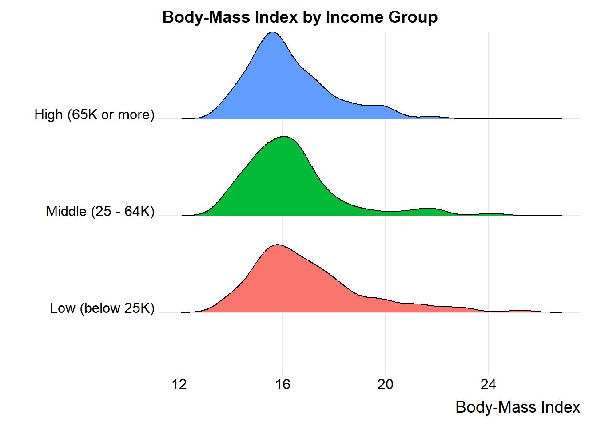

# Analysis of Variance

Recall the National Youth Fitness Survey, which we explored a small piece of in some detail earlier in these notes. We'll look at a different part of the same survey here - specifically the 280 children whose data are captured in the `nyfs2` file.


```r
nyfs2 <- read_csv("data/nyfs2.csv",
                  show_col_types = FALSE)

nyfs2
```

```
# A tibble: 280 x 21
   subject.id sex    age.exam race.eth   english income.cat3
        <dbl> <chr>     <dbl> <chr>        <dbl> <chr>      
 1      73228 Male          4 5 Other o~       1 Low (below~
 2      72393 Male          4 2 Non-His~       1 Low (below~
 3      73303 Male          3 2 Non-His~       1 Low (below~
 4      72786 Male          5 1 Non-His~       1 Low (below~
 5      73048 Male          3 2 Non-His~       1 Low (below~
 6      72556 Female        4 2 Non-His~       1 Low (below~
 7      72580 Female        5 2 Non-His~       1 Low (below~
 8      72532 Female        4 4 Other H~       0 Low (below~
 9      73012 Male          4 1 Non-His~       1 Low (below~
10      72099 Male          6 1 Non-His~       1 Low (below~
# ... with 270 more rows, and 15 more variables:
#   income.detail <chr>, inc.to.pov <dbl>, weight.kg <dbl>,
#   height.cm <dbl>, bmi <dbl>, bmi.group <dbl>,
#   bmi.cat <chr>, arm.length <dbl>, arm.circ <dbl>,
#   waist.circ <dbl>, calf.circ <dbl>, calf.skinfold <dbl>,
#   triceps.skinfold <dbl>, subscap.skinfold <dbl>,
#   GMQ <dbl>
```

## Comparing Gross Motor Quotient Scores by Income Level (3 Categories)


```r
nyfs2a <- nyfs2 %>%
    select(subject.id, income.cat3, GMQ) %>%
    arrange(subject.id)
```

In this first analysis, we'll compare the population mean on the Gross Motor Quotient evaluation of these kids across three groups defined by income level.  Higher values of this GMQ measure indicate improved levels of gross motor development, both in terms of locomotor and object control. See https://wwwn.cdc.gov/Nchs/Nnyfs/Y_GMX.htm for more details.


```r
nyfs2a %>%
    group_by(income.cat3) %>%
    summarise(n = n(), mean(GMQ), median(GMQ))
```

```
# A tibble: 3 x 4
  income.cat3            n `mean(GMQ)` `median(GMQ)`
  <chr>              <int>       <dbl>         <dbl>
1 High (65K or more)    92        95.7            97
2 Low (below 25K)       98        97.0            97
3 Middle (25 - 64K)     90        95.4            94
```

Uh, oh. We should rearrange those income categories to match a natural order from low to high.


```r
nyfs2a$income.cat3 <- 
    forcats::fct_relevel(nyfs2a$income.cat3,
                         "Low (below 25K)",
                         "Middle (25 - 64K)",
                         "High (65K or more)")
```

When working with three independent samples, I use graphs analogous to those we built for two independent samples.


```r
ggplot(nyfs2a, aes(x = income.cat3, y = GMQ, fill = income.cat3)) +
  geom_jitter(aes(color = income.cat3), alpha = 0.5, width = 0.25) +
  geom_boxplot(notch = TRUE, alpha = 0.75) +
  theme_bw() +
  coord_flip() +
  guides(fill = FALSE, col = FALSE) +
  labs(title = "GMQ Scores for 280 Children in NNYFS",
       y = "GMQ Score, in points", x = "Income Category")
```

```
Warning: `guides(<scale> = FALSE)` is deprecated. Please use
`guides(<scale> = "none")` instead.
```


In addition to this comparison boxplot, we might consider faceted plots, like these histograms.


```r
ggplot(nyfs2a, aes(x = GMQ, fill = income.cat3)) +
  geom_histogram(bins = 15, col = "white") +
  guides(fill = FALSE) +
  facet_wrap(~ income.cat3)
```

```
Warning: `guides(<scale> = FALSE)` is deprecated. Please use
`guides(<scale> = "none")` instead.
```


Or, if we want to ignore the (modest) sample size differences, we might consider density functions, perhaps through a ridgeline plot.


```r
ggplot(nyfs2a, aes(x = GMQ, y = income.cat3, fill = income.cat3)) +
    ggridges::geom_density_ridges(scale = 0.9) +
    guides(fill = FALSE) + 
    labs(title = "GMQ Score (in points) by Income Group",
         x = "GMQ Score", y = "") +
    ggridges::theme_ridges()
```

```
Warning: `guides(<scale> = FALSE)` is deprecated. Please use
`guides(<scale> = "none")` instead.
```


```r
by(nyfs2a$GMQ, nyfs2a$income.cat3, mosaic::favstats)
```

```
nyfs2a$income.cat3: Low (below 25K)
 min Q1 median  Q3 max     mean       sd  n missing
  55 91     97 106 130 97.03061 14.79444 98       0
--------------------------------------------- 
nyfs2a$income.cat3: Middle (25 - 64K)
 min Q1 median  Q3 max     mean       sd  n missing
  67 85     94 106 136 95.36667 14.15123 90       0
--------------------------------------------- 
nyfs2a$income.cat3: High (65K or more)
 min Q1 median  Q3 max     mean       sd  n missing
  64 85     97 103 145 95.72826 14.49525 92       0
```

## Alternative Procedures for Comparing More Than Two Means

Now, if we only had two independent samples, we'd be choosing between a pooled t test, a Welch t test, and a non-parametric procedure like the Wilcoxon-Mann-Whitney rank sum test, or even perhaps a bootstrap alternative.

In the case of more than two independent samples, we have methods analogous to the Welch test, and the rank sum test, and even the bootstrap, but we're going to be far more likely to select the **analysis of variance** (ANOVA) or an equivalent regression-based approach. These are the extensions of the pooled t test. Unless the sample outcome data are very clearly not Normally distributed, and no transformation is available which makes them appear approximately Normal in all of the groups we are comparing, we will stick with ANOVA.

### Extending the Welch Test to > 2 Independent Samples

It is possible to extend the Welch two-sample t test (not assuming equal population variances) into an analogous one-factor analysis for comparing population means based on independent samples from more than two groups. 

If we want to compare the population mean GMQ levels across those three income groups without assuming equal population variances, `oneway.test` is up to the task. The hypotheses being tested here are:

- H0: All three means are the same vs.
- HA: At least one of the population means is different than the others.


```r
oneway.test(GMQ ~ income.cat3, data = nyfs2a)
```

```

	One-way analysis of means (not assuming equal
	variances)

data:  GMQ and income.cat3
F = 0.3416, num df = 2.00, denom df = 184.41, p-value
= 0.7111
```

We get a p value, but this isn't much help, though, because we don't have any measure of effect size, nor do we have any confidence intervals. Like the analogous Welch t test, this approach allows us to forego the assumption of equal population variances in each of the three income groups, but it still requires us to assume that the populations are Normally distributed. 

That said, most of the time when we have more than two levels of the factor of interest, we won't bother worrying about the equal population variance assumption, and will just use the one-factor ANOVA approach (with pooled variances) described below, to make the comparisons of interest.

### Extending the Rank Sum Test to > 2 Independent Samples

It is also possible to extend the Wilcoxon-Mann-Whitney two-sample test into an analogous one-factor analysis called the **Kruskal-Wallis test** for comparing population measures of location based on independent samples from more than two groups. 

If we want to compare the centers of the distributions of population GMQ score across our three income groups without assuming Normality, we can use `kruskal.test`.

The hypotheses being tested here are still as before, but for a measure of location other than the population mean


```r
kruskal.test(GMQ ~ income.cat3, data = nyfs2a)
```

```

	Kruskal-Wallis rank sum test

data:  GMQ by income.cat3
Kruskal-Wallis chi-squared = 2.3202, df = 2, p-value
= 0.3135
```

Again, note that this isn't much help, though, because we don't have any measure of effect size, nor do we have any confidence intervals.

That said, most of the time when we have more than two levels of the factor of interest, we won't bother worrying about potential violations of the Normality assumption unless they are glaring, and will just use the usual one-factor ANOVA approach (with pooled variances) described below, to make the comparisons of interest.

### Can we use the bootstrap to compare more than two means?

Sure. There are both ANOVA and ANCOVA analogues using the bootstrap, and in fact, there are power calculations based on the bootstrap, too. If you want to see some example code, look at https://sammancuso.com/2017/11/01/model-based-bootstrapped-anova-and-ancova/ 

## The Analysis of Variance

Extending the two-sample t test (assuming equal population variances) into a comparison of more than two samples uses the **analysis of variance** or ANOVA. 

This is an analysis of a continuous outcome variable on the basis of a single categorical factor, in fact, it's often called one-factor ANOVA or one-way ANOVA to indicate that the outcome is being split up into the groups defined by a single factor. 

The null hypothesis is that the population means are all the same, and the alternative is that this is not the case. When there are just two groups, then this boils down to an F test that is equivalent to the Pooled t test.

### The `oneway.test` approach

R will produce some elements of a one-factor ANOVA using the `oneway.test` command:


```r
oneway.test(GMQ ~ income.cat3, data = nyfs2a, var.equal=TRUE)
```

```

	One-way analysis of means

data:  GMQ and income.cat3
F = 0.34687, num df = 2, denom df = 277, p-value =
0.7072
```

This isn't the full analysis, though, which would require a more complete ANOVA table. There are two equivalent approaches to obtaining the full ANOVA table when comparing a series of 2 or more population means based on independent samples.

### Using the `aov` approach and the `summary` function

Here's one possible ANOVA table, which doesn't require directly fitting a linear model.


```r
summary(aov(GMQ ~ income.cat3, data = nyfs2a))
```

```
             Df Sum Sq Mean Sq F value Pr(>F)
income.cat3   2    146   72.85   0.347  0.707
Residuals   277  58174  210.01               
```

### Using the `anova` function after fitting a linear model

An equivalent way to get identical results in a slightly different format runs the linear model behind the ANOVA approach directly.


```r
anova(lm(GMQ ~ income.cat3, data = nyfs2a))
```

```
Analysis of Variance Table

Response: GMQ
             Df Sum Sq Mean Sq F value Pr(>F)
income.cat3   2    146  72.848  0.3469 0.7072
Residuals   277  58174 210.014               
```

## Interpreting the ANOVA Table

### What are we Testing?

The null hypothesis for the ANOVA table is that the population means of the outcome across the various levels of the factor of interest are all the same, against a two-sided alternative hypothesis that the level-specific population means are not all the same.

Specifically, if we have a grouping factor with *k* levels, then we are testing:

- H0: All k population means are the same.
- HA: At least one of the population means is different from the others.

### Elements of the ANOVA Table

The ANOVA table breaks down the variation in the outcome explained by the k levels of the factor of interest, and the variation in the outcome which remains (the Residual, or Error).

Specifically, the elements of the ANOVA table are:

1. the degrees of freedom (labeled Df) for the factor of interest and for the Residuals
2. the sums of squares (labeled Sum Sq) for the factor of interest and for the Residuals
3. the mean square (labeled Mean Sq) for the factor of interest and for the Residuals
4. the ANOVA F test statistic (labeled F value), which is used to generate
5. the *p* value for the comparison assessed by the ANOVA model, labeled Pr(>F)

### The Degrees of Freedom


```r
anova(lm(GMQ ~ income.cat3, data = nyfs2a))
```

```
Analysis of Variance Table

Response: GMQ
             Df Sum Sq Mean Sq F value Pr(>F)
income.cat3   2    146  72.848  0.3469 0.7072
Residuals   277  58174 210.014               
```

- The **degrees of freedom** attributable to the factor of interest (here, Income category) is the number of levels of the factor minus 1. Here, we have three Income categories (levels), so df(income.cat3) = 2.
- The total degrees of freedom are the number of observations (across all levels of the factor) minus 1. We have 280 GMQ scores in the `nyfs2a` data, so the df(Total) must be 279, although the Total row isn't shown by R in its output.
- The Residual degrees of freedom are the Total df - Factor df. So, here, that's 279 - 2 = 277.

### The Sums of Squares


```r
anova(lm(GMQ ~ income.cat3, data = nyfs2a))
```

```
Analysis of Variance Table

Response: GMQ
             Df Sum Sq Mean Sq F value Pr(>F)
income.cat3   2    146  72.848  0.3469 0.7072
Residuals   277  58174 210.014               
```

- The sum of squares (often abbreviated SS or Sum Sq) represents variation explained. 
- The factor SS is the sum across all levels of the factor of the sample size for the level multiplied by the squared difference between the level mean and the overall mean across all levels. Here, SS(`income.cat3`) = 146
- The total SS is the sum across all observations of the square of the difference between the individual values and the overall mean. Here, that is 146 + 58174 = 58320 
- Residual SS = Total SS - Factor SS.
- Also of interest is a calculation called $\eta^2$, ("eta-squared"), which is equivalent to $R^2$ in a linear model.
    - SS(Factor) / SS(Total) = the proportion of variation in our outcome (here, GMQ) explained by the variation between groups (here, income groups)
    - In our case, $\eta^2$ = 146 / (146 + 58174) = 146 / 58320 = 0.0025
    - So, Income Category alone accounts for about 0.25% of the variation in GMQ levels observed in these data.

### The Mean Square


```r
anova(lm(GMQ ~ income.cat3, data = nyfs2a))
```

```
Analysis of Variance Table

Response: GMQ
             Df Sum Sq Mean Sq F value Pr(>F)
income.cat3   2    146  72.848  0.3469 0.7072
Residuals   277  58174 210.014               
```

- The Mean Square is the Sum of Squares divided by the degrees of freedom, so MS(Factor) = SS(Factor)/df(Factor). 
- In our case, MS(`income.cat3`) = SS(`income.cat3`)/df(`income.cat3`) = 146 / 2 = 72.848 (notice that R maintains more decimal places than it shows for these calculations) and 
- MS(Residuals) = SS(Residuals) / df(Residuals) = 58174 / 277 = 210.014.
    - MS(Residuals) or MS(Error) is an estimate of the residual variance which corresponds to $\sigma^2$ in the underlying linear model for the outcome of interest, here `GMQ`.

### The F Test Statistic and *p* Value


```r
anova(lm(GMQ ~ income.cat3, data = nyfs2a))
```

```
Analysis of Variance Table

Response: GMQ
             Df Sum Sq Mean Sq F value Pr(>F)
income.cat3   2    146  72.848  0.3469 0.7072
Residuals   277  58174 210.014               
```

- The ANOVA F test is obtained by calculating MS(Factor) / MS(Residuals). So in our case, F = 72.848 / 210.014 = 0.3469
- The F test statistic is then compared to a specific F distribution to obtain a *p* value, which is shown here to be 0.7072
- Specifically, the observed F test statistic is compared to an F distribution with numerator df = Factor df, and denominator df = Residual df to obtain the *p* value.
    + Here, we have SS(Factor) = 146 (approximately), and df(Factor) = 2, leaving MS(Factor) = 72.848
    + We have SS(Residual) = 58174, and df(Residual) = 277, leaving MS(Residual) = 210.014
    + MS(Factor) / MS(Residual) = F value = 0.3469, which, when compared to an F distribution with 2 and 277 degrees of freedom, yields a *p* value of 0.7072

## The Residual Standard Error

The residual standard error is simply the square root of the variance estimate MS(Residual). Here, MS(Residual) = 210.014, so the Residual standard error = 14.49 points. 

## The Proportion of Variance Explained by the Factor

We will often summarize the proportion of the variation explained by the factor. The summary statistic is called eta-squared ($\eta^2$), and is equivalent to the $R^2$ value we have seen previously in linear regression models.

Again, $\eta^2$ = SS(Factor) / SS(Total) 

Here, we have 
    - SS(`income.cat3`) = 146 and SS(Residuals) = 58174, so SS(Total) = 58320
    - Thus, $\eta^2$ = SS(Factor)/SS(Total) = 146/58320 = 0.0025

The income category accounts for 0.25% of the variation in GMQ levels: only a tiny fraction.

## The Regression Approach to Compare Population Means based on Independent Samples

This approach is equivalent to the ANOVA approach, and thus also (when there are just two samples to compare) to the pooled-variance t test. We run a linear regression model to predict the outcome (here, `GMQ`) on the basis of the categorical factor with three levels (here, `income.cat3`)


```r
summary(lm(GMQ ~ income.cat3, data=nyfs2a))
```

```

Call:
lm(formula = GMQ ~ income.cat3, data = nyfs2a)

Residuals:
    Min      1Q  Median      3Q     Max 
-42.031  -9.031  -0.031   8.969  49.272 

Coefficients:
                              Estimate Std. Error t value
(Intercept)                     97.031      1.464  66.282
income.cat3Middle (25 - 64K)    -1.664      2.116  -0.786
income.cat3High (65K or more)   -1.302      2.104  -0.619
                              Pr(>|t|)    
(Intercept)                     <2e-16 ***
income.cat3Middle (25 - 64K)     0.432    
income.cat3High (65K or more)    0.536    
---
Signif. codes:  
0 '***' 0.001 '**' 0.01 '*' 0.05 '.' 0.1 ' ' 1

Residual standard error: 14.49 on 277 degrees of freedom
Multiple R-squared:  0.002498,	Adjusted R-squared:  -0.004704 
F-statistic: 0.3469 on 2 and 277 DF,  p-value: 0.7072
```

### Interpreting the Regression Output

This output tells us many things, but for now, we'll focus just on the coefficients output, which tells us that:

- the point estimate for the population mean GMQ score across "Low" income subjects is 97.03
- the point estimate (sample mean difference) for the difference in population mean GMQ level between the "Middle" and "Low" income subjects is -1.66 (in words, the Middle income kids have lower GMQ scores than the Low income kids by 1.66 points on average.)
- the point estimate (sample mean difference) for the difference in population mean GMQ level between the "High" and "Low" income subjects is -1.30 (in words, the High income kids have lower GMQ scores than the Low income kids by 1.30 points on average.)

Of course, we knew all of this already from a summary of the sample means.


```r
nyfs2a %>%
    group_by(income.cat3) %>%
    summarise(n = n(), mean(GMQ))
```

```
# A tibble: 3 x 3
  income.cat3            n `mean(GMQ)`
  <fct>              <int>       <dbl>
1 Low (below 25K)       98        97.0
2 Middle (25 - 64K)     90        95.4
3 High (65K or more)    92        95.7
```

The model for predicting GMQ is based on two binary (1/0) indicator variables, specifically, we have:

- Estimated GMQ = 97.03 - 1.66 x [1 if Middle income or 0 if not] - 1.30 x [1 if High income or 0 if not] 

The coefficients section also provides a standard error and t statistic and two-sided *p* value for each coefficient.

### The Full ANOVA Table

To see the full ANOVA table corresponding to any linear regression model, we run...


```r
anova(lm(GMQ ~ income.cat3, data=nyfs2a))
```

```
Analysis of Variance Table

Response: GMQ
             Df Sum Sq Mean Sq F value Pr(>F)
income.cat3   2    146  72.848  0.3469 0.7072
Residuals   277  58174 210.014               
```

### ANOVA Assumptions

The assumptions behind analysis of variance are the same as those behind a linear model. Of specific interest are:

- The samples obtained from each group are independent.
- Ideally, the samples from each group are a random sample from the population described by that group.
- In the population, the variance of the outcome in each group is equal. (This is less of an issue if our study involves a balanced design.)
- In the population, we have Normal distributions of the outcome in each group.

Happily, the F test is fairly robust to violations of the Normality assumption.

## Equivalent approach to get ANOVA Results


```r
summary(aov(GMQ ~ income.cat3, data = nyfs2a))
```

```
             Df Sum Sq Mean Sq F value Pr(>F)
income.cat3   2    146   72.85   0.347  0.707
Residuals   277  58174  210.01               
```

So which of the pairs of means are driving the differences we see?

## The Problem of Multiple Comparisons

1. Suppose we compare High to Low, using a test with $\alpha$ = 0.05
2. Then we compare Middle to Low on the same outcome, also using  $\alpha$ = 0.05
3. Then we compare High to Middle, also with $\alpha$ = 0.05

What is our overall $\alpha$ level across these three comparisons?

- It could be as bad as 0.05 + 0.05 + 0.05, or 0.15.
- Rather than our nominal 95% confidence, we have something as low as 85% confidence across this set of simultaneous comparisons.

### The Bonferroni solution

1. Suppose we compare High to Low, using a test with $\alpha$ = 0.05/3
2. Then we compare Middle to Low on the same outcome, also using  $\alpha$ = 0.05/3
3. Then we compare High to Middle, also with $\alpha$ = 0.05/3

Then across these three comparisons, our overall $\alpha$ can be (at worst) 

- 0.05/3 + 0.05/3 + 0.05/3 = 0.05
- So by changing our nominal confidence level from 95% to 98.333% in each comparison, we wind up with at least 95% confidence across this set of simultaneous comparisons.
- This is a conservative (worst case) approach.

Goal: Simultaneous comparisons of White vs AA, AA vs Other and White vs Other


```r
pairwise.t.test(nyfs2a$GMQ, nyfs2a$income.cat3, p.adjust="bonferroni")
```

```

	Pairwise comparisons using t tests with pooled SD 

data:  nyfs2a$GMQ and nyfs2a$income.cat3 

                   Low (below 25K) Middle (25 - 64K)
Middle (25 - 64K)  1               -                
High (65K or more) 1               1                

P value adjustment method: bonferroni 
```

These *p* values are very large.

### Pairwise Comparisons using Tukey's HSD Method

Goal: Simultaneous (less conservative) confidence intervals and *p* values for our three pairwise comparisons (High vs. Low, High vs. Middle, Middle vs. Low)


```r
TukeyHSD(aov(GMQ ~ income.cat3, data = nyfs2a))
```

```
  Tukey multiple comparisons of means
    95% family-wise confidence level

Fit: aov(formula = GMQ ~ income.cat3, data = nyfs2a)

$income.cat3
                                           diff       lwr
Middle (25 - 64K)-Low (below 25K)    -1.6639456 -6.649518
High (65K or more)-Low (below 25K)   -1.3023514 -6.259595
High (65K or more)-Middle (25 - 64K)  0.3615942 -4.701208
                                          upr     p adj
Middle (25 - 64K)-Low (below 25K)    3.321627 0.7116745
High (65K or more)-Low (below 25K)   3.654892 0.8098084
High (65K or more)-Middle (25 - 64K) 5.424396 0.9845073
```

### Plotting the Tukey HSD results


```r
plot(TukeyHSD(aov(GMQ ~ income.cat3, data = nyfs2a)))
```


Note that the default positioning of the y axis in the plot of Tukey HSD results can be problematic. If we have longer names, in particular, for the levels of our factor, R will leave out some of the labels. We can alleviate that problem either by using the `fct_recode` function in the `forcats` package to rename the factor levels, or we can use the following code to reconfigure the margins of the plot.


```r
mar.default <- c(5,6,4,2) + 0.1 # save default plotting margins

par(mar = mar.default + c(0, 12, 0, 0)) 
plot(TukeyHSD(aov(GMQ ~ income.cat3, data = nyfs2a)), las = 2)
```


```r
par(mar = mar.default) # return to normal plotting margins
```

## What if we consider another outcome, BMI?

We'll look at the full data set in `nyfs2` now, so we can look at BMI as a function of income.


```r
nyfs2$income.cat3 <- 
    forcats::fct_relevel(nyfs2$income.cat3,
                         "Low (below 25K)",
                         "Middle (25 - 64K)",
                         "High (65K or more)")

ggplot(nyfs2, aes(x = bmi, y = income.cat3, fill = income.cat3)) +
    ggridges::geom_density_ridges(scale = 0.9) +
    guides(fill = FALSE) + 
    labs(title = "Body-Mass Index by Income Group",
         x = "Body-Mass Index", y = "") +
    ggridges::theme_ridges()
```

```
Warning: `guides(<scale> = FALSE)` is deprecated. Please use
`guides(<scale> = "none")` instead.
```




```r
ggplot(nyfs2, aes(x = income.cat3, y = bmi, fill = income.cat3)) +
  geom_jitter(aes(color = income.cat3), alpha = 0.5, width = 0.25) +
  geom_boxplot(notch = TRUE, alpha = 0.75) +
  theme_bw() +
  coord_flip() +
  guides(fill = FALSE, col = FALSE) +
  labs(title = "BMI for 280 Children in NNYFS",
       y = "Body-Mass Index", x = "Income Category")
```

```
Warning: `guides(<scale> = FALSE)` is deprecated. Please use
`guides(<scale> = "none")` instead.
```


Here are the descriptive numerical summaries:


```r
mosaic::favstats(bmi ~ income.cat3, data = nyfs2)
```

```
         income.cat3  min     Q1 median   Q3  max     mean
1    Low (below 25K) 13.8 15.500  16.50 17.9 25.2 16.98163
2  Middle (25 - 64K) 13.7 15.225  16.05 16.9 24.1 16.37111
3 High (65K or more) 13.8 15.300  15.85 17.2 21.8 16.27065
        sd  n missing
1 2.194574 98       0
2 1.898920 90       0
3 1.614395 92       0
```

Here is the ANOVA table.


```r
anova(lm(bmi ~ income.cat3, data = nyfs2))
```

```
Analysis of Variance Table

Response: bmi
             Df  Sum Sq Mean Sq F value  Pr(>F)  
income.cat3   2   28.32 14.1583  3.8252 0.02298 *
Residuals   277 1025.26  3.7013                  
---
Signif. codes:  
0 '***' 0.001 '**' 0.01 '*' 0.05 '.' 0.1 ' ' 1
```

Let's consider the Tukey HSD results. First, we'll create a factor with shorter labels.


```r
nyfs2$inc.new <- 
    forcats::fct_recode(nyfs2$income.cat3,
                        "Low" = "Low (below 25K)",
                        "Middle" = "Middle (25 - 64K)",
                        "High" = "High (65K or more)")

plot(TukeyHSD(aov(bmi ~ inc.new, data = nyfs2),
                  conf.level = 0.90))
```


It appears that there is a detectable difference between the `bmi` means of the "Low" group and both the "High" and "Middle" group at the 90% confidence level, but no detectable difference between "Middle" and "High." Details of those confidence intervals for those pairwise comparisons follow.


```r
TukeyHSD(aov(bmi ~ inc.new, data = nyfs2),
                  conf.level = 0.90)
```

```
  Tukey multiple comparisons of means
    90% family-wise confidence level

Fit: aov(formula = bmi ~ inc.new, data = nyfs2)

$inc.new
                  diff        lwr         upr     p adj
Middle-Low  -0.6105215 -1.1893722 -0.03167084 0.0775491
High-Low    -0.7109805 -1.2865420 -0.13541892 0.0306639
High-Middle -0.1004589 -0.6882764  0.48735849 0.9339289
```


